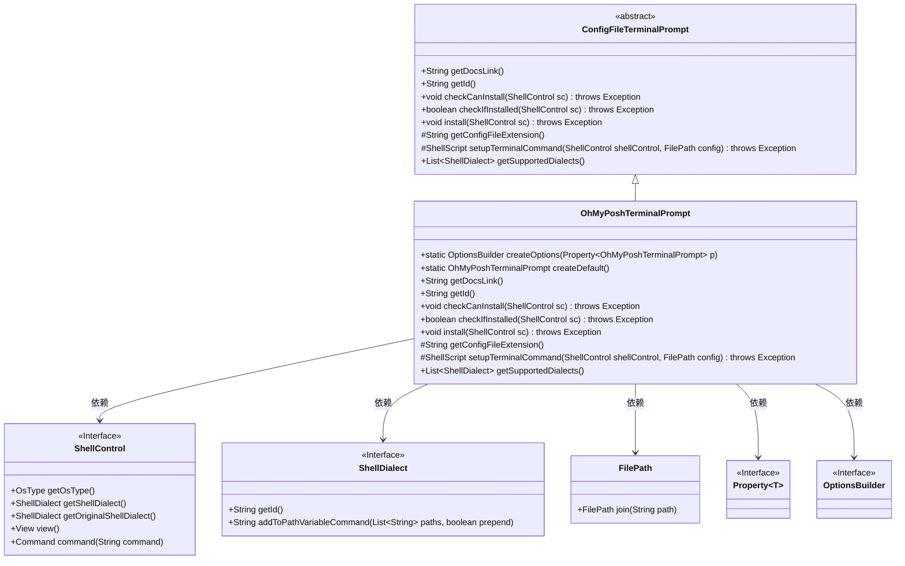
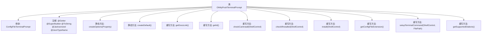

# 基础信息

|      |      |
|------|------|
| 名称 | OhMyPoshTerminalPrompt |
| 编码语言 | .java |
| 代码路径 | xpipe/app/src/main/java/io/xpipe/app/terminal/OhMyPoshTerminalPrompt.java |
| 包名 | io.xpipe.app.terminal |
| 依赖项 | ['io.xpipe.app.util.CommandSupport', 'io.xpipe.app.util.GithubReleaseDownloader', 'io.xpipe.app.util.OptionsBuilder', 'io.xpipe.core.process', 'io.xpipe.core.store.FilePath', 'javafx.beans.property.Property', 'com.fasterxml.jackson.annotation.JsonTypeName', 'lombok.Getter', 'lombok.ToString', 'lombok.experimental.SuperBuilder', 'lombok.extern.jackson.Jacksonized', 'java.util.ArrayList', 'java.util.List'] |
| 概述说明 | OhMyPosh终端提示类，支持多Shell，含默认配置和安装逻辑。 |

# 说明

这是一个名为OhMyPoshTerminalPrompt的终端提示配置类，继承自ConfigFileTerminalPrompt。它使用Lombok注解生成getter、builder和toString方法，并通过Jackson处理JSON序列化。该类提供了创建默认配置的方法，包含时间、用户名、路径、Git状态等终端提示块。实现了检查安装状态、安装程序、生成终端命令等功能，支持多种Shell环境如Bash、Zsh、Fish、CMD和PowerShell。安装过程会根据操作系统类型下载对应版本的oh-my-posh可执行文件，并为CMD环境配置Clink插件。配置以JSON格式存储，包含丰富的样式和模板定义。

# 类列表 Class Summary

| 名称   | 类型  | 说明 |
|-------|------|-------------|
| OhMyPoshTerminalPrompt | class | OhMyPosh终端提示配置类，支持多Shell，含安装检查与初始化脚本。 |

## 类 OhMyPoshTerminalPrompt

|      |      |
|------|------|
| 访问范围 | @Getter;@SuperBuilder;@ToString;@Jacksonized;@JsonTypeName("ohmyposh");public |
| 类型 | class |
| 名称 | OhMyPoshTerminalPrompt |
| 说明 | OhMyPosh终端提示配置类，支持多Shell，含安装检查与初始化脚本。 |

### UML类图

这段类图展示了OhMyPoshTerminalPrompt继承自ConfigFileTerminalPrompt，并实现了终端提示配置功能。它通过ShellControl与操作系统交互，支持多种ShellDialect类型，使用FilePath处理路径，通过Property和OptionsBuilder进行配置管理。该类主要提供oh-my-posh工具的安装、配置和终端集成功能，支持Windows/Linux/macOS多平台和多种shell环境。

### 内部方法调用关系图

这段代码定义了一个OhMyPoshTerminalPrompt类，用于配置和管理oh-my-posh终端提示工具。该类继承自ConfigFileTerminalPrompt，使用Lombok注解简化代码，包含创建配置选项、默认配置生成、安装检查、安装执行等核心方法。流程图展示了类继承关系、注解使用以及所有重写和自定义方法的调用层级，反映了该工具对多种shell环境（Bash/Zsh/Fish/CMD/PowerShell）的支持能力。

### 字段列表 Field List

| 名称  | 类型  | 说明 |
|-------|-------|------|

### 方法列表 Method List

| 名称  | 类型  | 说明 |
|-------|-------|------|
| checkCanInstall | void | 检查系统类型，非Windows需确保curl在路径中。 |
| getConfigFileExtension | String | 重写方法返回配置扩展名"json"。 |
| getDocsLink | String | 重写方法返回文档链接"https://ohmyposh.dev/docs"。 |
| createOptions | OptionsBuilder | 静态方法创建选项构建器，根据属性生成终端提示配置。 |
| createDefault | OhMyPoshTerminalPrompt | 创建默认终端提示，含时间、用户、路径、Git状态和系统状态模块。 |
| getId | String | 重写getId方法，返回字符串"oh-my-posh"。 |
| install | void | 安装oh-my-posh工具，适配CMD和Windows/Linux环境，自动下载并配置。 |
| checkIfInstalled | boolean | 检查oh-my-posh是否安装：验证CMD环境、Clink安装及程序或文件存在性。 |
| setupTerminalCommand | ShellScript | 根据Shell类型配置oh-my-posh终端命令，处理CMD、PowerShell等不同环境。 |
| getSupportedDialects | List<ShellDialect> | 重写方法返回支持的Shell方言列表，包括Bash、Zsh、Fish、Cmd、PowerShell及其核心版。 |

