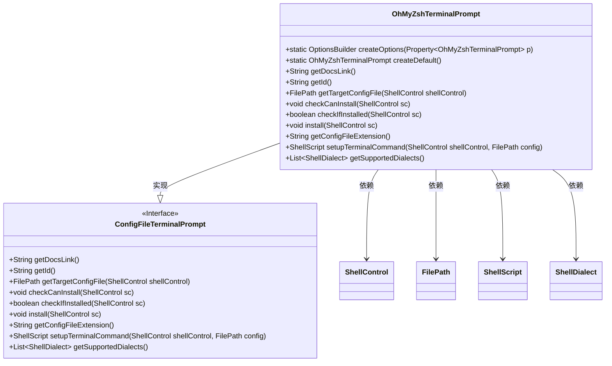

# 基础信息

|      |      |
|------|------|
| 名称 | OhMyZshTerminalPrompt |
| 编码语言 | .java |
| 代码路径 | xpipe/app/src/main/java/io/xpipe/app/terminal/OhMyZshTerminalPrompt.java |
| 包名 | io.xpipe.app.terminal |
| 依赖项 | ['io.xpipe.app.util.CommandSupport', 'io.xpipe.app.util.OptionsBuilder', 'io.xpipe.core.process', 'io.xpipe.core.store.FilePath', 'javafx.beans.property.Property', 'com.fasterxml.jackson.annotation.JsonTypeName', 'lombok.Getter', 'lombok.ToString', 'lombok.experimental.SuperBuilder', 'lombok.extern.jackson.Jacksonized', 'java.util.List'] |
| 概述说明 | OhMyZsh终端提示配置类，支持安装、检查和自定义主题插件。 |

# 说明

这是一个名为OhMyZshTerminalPrompt的Java类，用于配置和管理Oh My Zsh终端提示。类继承自ConfigFileTerminalPrompt，使用Lombok注解生成getter、builder和toString方法，并支持JSON序列化。主要功能包括创建默认配置、检查安装状态、执行安装脚本以及设置终端命令。默认配置包含ZSH_THEME设置和插件列表。安装过程通过curl下载并执行官方安装脚本完成。该类仅支持ZSH shell方言，配置文件扩展名为.sh。

# 类列表 Class Summary

| 名称   | 类型  | 说明 |
|-------|------|-------------|
| OhMyZshTerminalPrompt | class | OhMyZsh终端提示配置类，支持安装、检查和自定义主题插件。 |

## 类 OhMyZshTerminalPrompt

|      |      |
|------|------|
| 访问范围 | @Getter;@SuperBuilder;@ToString;@Jacksonized;@JsonTypeName("ohmyzsh");public |
| 类型 | class |
| 名称 | OhMyZshTerminalPrompt |
| 说明 | OhMyZsh终端提示配置类，支持安装、检查和自定义主题插件。 |

### UML类图

这段代码定义了一个`OhMyZshTerminalPrompt`类，用于管理Oh My Zsh终端提示的配置和安装。该类实现了`ConfigFileTerminalPrompt`接口，提供了创建默认配置、检查安装状态、执行安装以及设置终端命令等功能。通过注解如`@Getter`和`@SuperBuilder`简化了代码，同时支持JSON序列化。类图展示了其继承关系和依赖的核心类，如`ShellControl`和`FilePath`。

### 内部方法调用关系图

```mermaid
graph TD
    A["类OhMyZshTerminalPrompt"]
    B["继承: ConfigFileTerminalPrompt"]
    C["注解: @Getter @SuperBuilder @ToString @Jacksonized @JsonTypeName"]
    D["静态方法: createOptions(Property<OhMyZshTerminalPrompt>)"]
    E["静态方法: createDefault()"]
    F["重写方法: getDocsLink()"]
    G["重写方法: getId()"]
    H["重写方法: getTargetConfigFile(ShellControl)"]
    I["重写方法: checkCanInstall(ShellControl)"]
    J["重写方法: checkIfInstalled(ShellControl)"]
    K["重写方法: install(ShellControl)"]
    L["重写方法: getConfigFileExtension()"]
    M["重写方法: setupTerminalCommand(ShellControl, FilePath)"]
    N["重写方法: getSupportedDialects()"]

    A --> B
    A --> C
    A --> D
    A --> E
    A --> F
    A --> G
    A --> H
    A --> I
    A --> J
    A --> K
    A --> L
    A --> M
    A --> N
```

这段代码定义了一个OhMyZshTerminalPrompt类，继承自ConfigFileTerminalPrompt，用于管理Oh My Zsh终端提示的配置。类包含创建选项、默认配置、安装检查等核心功能，通过多个重写方法实现了配置文件的获取、安装验证、插件管理等操作。流程图清晰展示了类继承关系和主要方法调用链，突出了其作为终端配置管理工具的核心职责。

### 字段列表 Field List

| 名称  | 类型  | 说明 |
|-------|-------|------|

### 方法列表 Method List

| 名称  | 类型  | 说明 |
|-------|-------|------|
| getTargetConfigFile | FilePath | 重写方法返回配置文件路径，路径由配置目录、ID和扩展名组成。 |
| getDocsLink | String | 重写方法返回Oh My Zsh的GitHub链接。 |
| install | void | 覆盖安装方法，删除配置目录后执行Oh My Zsh自动安装脚本。 |
| checkIfInstalled | boolean | 检查是否安装oh-my-zsh |
| getConfigFileExtension | String | 重写方法返回配置文件扩展名"sh"。 |
| checkCanInstall | void | 检查系统是否安装curl命令。 |
| getId | String | 重写getId方法，返回字符串"oh-my-zsh"。 |
| createOptions | OptionsBuilder | 静态方法创建选项构建器，基于属性配置终端提示。 |
| createDefault | OhMyZshTerminalPrompt | 创建默认OhMyZsh终端提示，使用robbyrussell主题和git插件。 |
| setupTerminalCommand | ShellScript | 覆盖方法设置终端命令，处理配置文件并调整ZSH路径。 |
| getSupportedDialects | List<ShellDialect> | 重写方法返回支持的Shell方言列表，仅包含ZSH。 |

