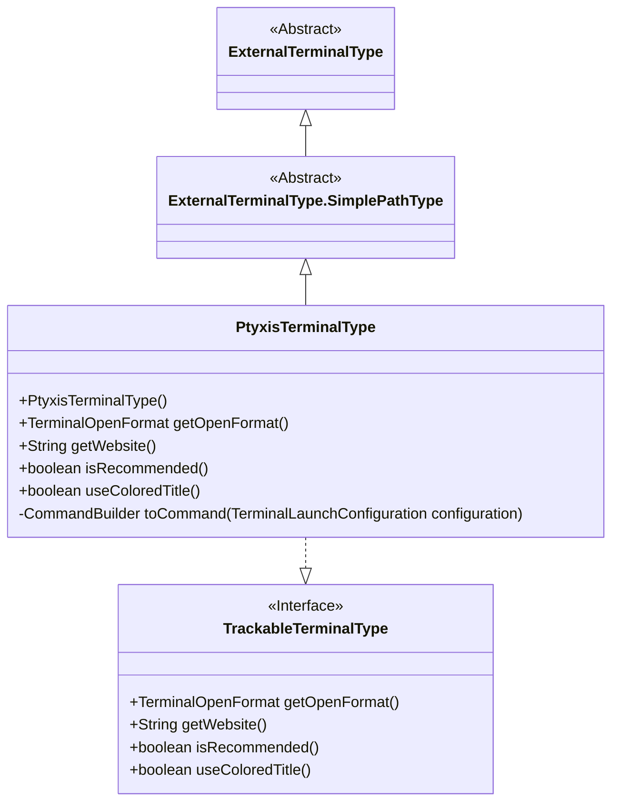
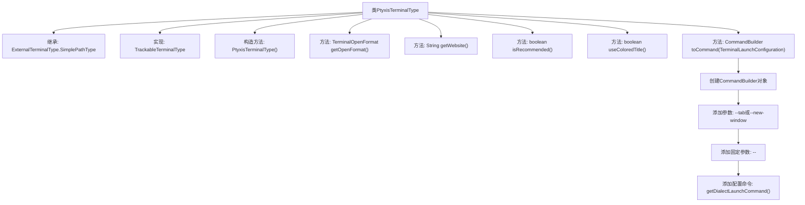

# 基础信息

|      |      |
|------|------|
| 名称 | PtyxisTerminalType |
| 编码语言 | .java |
| 代码路径 | xpipe/app/src/main/java/io/xpipe/app/terminal/PtyxisTerminalType.java |
| 包名 | io.xpipe.app.terminal |
| 依赖项 | ['io.xpipe.core.process.CommandBuilder'] |
| 概述说明 | Ptyxis终端类型类，支持新窗口或标签页打开，推荐使用彩色标题，提供GitLab网址。 |

# 说明

PtyxisTerminalType是一个继承自ExternalTerminalType.SimplePathType的可追踪终端类型类。其构造函数初始化了终端类型标识符为"app.ptyxis"，显示名称为"ptyxis"，并标记为可用。该类重写了多个方法：getOpenFormat返回新窗口或标签页的打开格式；getWebsite提供项目GitLab地址；isRecommended标记该终端为推荐使用；useColoredTitle启用彩色标题显示。toCommand方法根据配置生成启动命令，支持通过--tab或--new-window参数控制窗口模式，并附加方言启动命令。

# 类列表 Class Summary

| 名称   | 类型  | 说明 |
|-------|------|-------------|
| PtyxisTerminalType | class | Ptyxis终端类型类，支持新窗口或标签页，推荐使用彩色标题，命令构建灵活。 |

## 类 PtyxisTerminalType

|      |      |
|------|------|
| 访问范围 | public |
| 类型 | class |
| 名称 | PtyxisTerminalType |
| 说明 | Ptyxis终端类型类，支持新窗口或标签页，推荐使用彩色标题，命令构建灵活。 |

### UML类图

该类图展示了PtyxisTerminalType继承自ExternalTerminalType.SimplePathType并实现TrackableTerminalType接口的层级关系。PtyxisTerminalType是一个具体的终端类型实现，提供了新建窗口/标签页、获取网站URL、推荐状态判断等功能。通过CommandBuilder构建终端启动命令，支持根据配置选择标签页或新窗口模式。所有公共方法都覆盖了父类或接口的定义，体现了多态特性。

### 内部方法调用关系图

这段代码描述了一个名为PtyxisTerminalType的类，它继承自ExternalTerminalType.SimplePathType并实现了TrackableTerminalType接口。该类主要用于配置终端启动行为，包含构造方法初始化基础属性，以及多个重写方法用于获取终端打开格式、官网链接、推荐状态和标题颜色设置。核心方法toCommand()通过CommandBuilder动态构建启动命令，根据配置选择标签页或新窗口模式，并附加启动命令参数。整体设计体现了终端类型配置的灵活性和可扩展性。

### 字段列表 Field List

| 名称  | 类型  | 说明 |
|-------|-------|------|

### 方法列表 Method List

| 名称  | 类型  | 说明 |
|-------|-------|------|
| isRecommended | boolean | 方法重写，返回推荐状态为真。 |
| useColoredTitle | boolean | 重写方法，返回真值启用彩色标题。 |
| toCommand | CommandBuilder | 根据配置生成终端启动命令，支持标签页或新窗口选项。 |
| getWebsite | String | 重写getWebsite方法，返回指定GitLab网址。 |
| getOpenFormat | TerminalOpenFormat | 重写getOpenFormat方法，返回新窗口或标签页打开方式。 |

