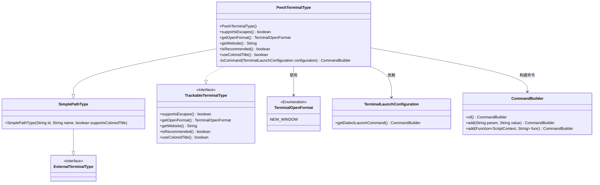
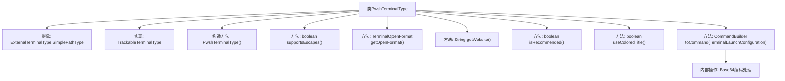

# 基础信息

|      |      |
|------|------|
| 名称 | PwshTerminalType |
| 编码语言 | .java |
| 代码路径 | xpipe/app/src/main/java/io/xpipe/app/terminal/PwshTerminalType.java |
| 包名 | io.xpipe.app.terminal |
| 依赖项 | ['io.xpipe.core.process.CommandBuilder', 'java.nio.charset.StandardCharsets', 'java.util.Base64'] |
| 概述说明 | PwshTerminalType类定义PowerShell终端类型，支持新窗口启动，禁用转义和彩色标题，非推荐终端。 |

# 说明

该代码定义了一个名为PwshTerminalType的类，继承自ExternalTerminalType.SimplePathType并实现TrackableTerminalType接口。该类用于配置PowerShell终端类型，包含以下特性：标识符为app.pwsh，显示名称为pwsh，不支持转义字符，以新窗口格式打开，提供PowerShell官方文档链接，标记为非推荐终端类型，不使用彩色标题。核心功能是通过toCommand方法构建启动命令，包含执行策略绕过和Base64编码的模块路径重置逻辑，以解决特定兼容性问题。

# 类列表 Class Summary

| 名称   | 类型  | 说明 |
|-------|------|-------------|
| PwshTerminalType | class | Pwsh终端类型类，支持新窗口启动，不支持转义和彩色标题，执行策略绕过，编码命令处理。 |

## 类 PwshTerminalType

|      |      |
|------|------|
| 访问范围 | public |
| 类型 | class |
| 名称 | PwshTerminalType |
| 说明 | Pwsh终端类型类，支持新窗口启动，不支持转义和彩色标题，执行策略绕过，编码命令处理。 |

### UML类图

这段代码描述了一个PwshTerminalType类，它继承自SimplePathType并实现了TrackableTerminalType接口，用于配置PowerShell终端的行为。该类通过CommandBuilder构建PowerShell启动命令，处理编码参数和模块路径设置，并定义了终端窗口格式、网站链接等元信息。其核心功能是将终端配置转换为可执行的PowerShell命令，同时实现了接口要求的各种终端特性控制方法。

### 内部方法调用关系图

这段代码描述了一个PowerShell终端类型类，继承自ExternalTerminalType.SimplePathType并实现TrackableTerminalType接口。主要功能包括构造方法初始化、终端特性配置（如转义支持、窗口打开格式）、网站链接获取、推荐标识设置、标题颜色控制，以及核心的终端命令构建逻辑。命令构建过程中会对PowerShell启动命令进行UTF-16LE编码和Base64转换，以解决特定环境下的模块路径问题。

### 字段列表 Field List

| 名称  | 类型  | 说明 |
|-------|-------|------|

### 方法列表 Method List

| 名称  | 类型  | 说明 |
|-------|-------|------|
| useColoredTitle | boolean | 重写方法，返回false禁用彩色标题。 |
| getOpenFormat | TerminalOpenFormat | 重写方法返回新窗口打开格式。 |
| getWebsite | String | 重写方法返回PowerShell安装文档网址。 |
| isRecommended | boolean | 方法isRecommended返回false，表示不推荐。 |
| supportsEscapes | boolean | Java方法重写，返回false表示不支持转义。 |
| toCommand | CommandBuilder | 覆盖方法生成PowerShell命令，绕过执行策略并使用Base64编码UTF-16LE格式命令。 |

