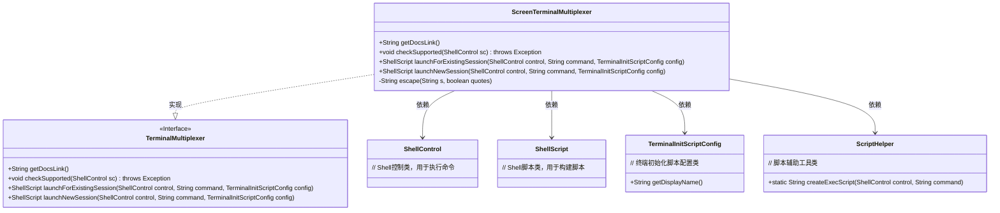
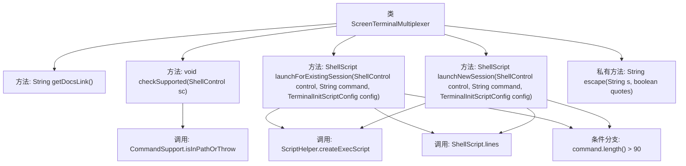

# 基础信息

|      |      |
|------|------|
| 名称 | ScreenTerminalMultiplexer |
| 编码语言 | .java |
| 代码路径 | xpipe/app/src/main/java/io/xpipe/app/terminal/ScreenTerminalMultiplexer.java |
| 包名 | io.xpipe.app.terminal |
| 依赖项 | ['io.xpipe.app.util.CommandSupport', 'io.xpipe.app.util.ScriptHelper', 'io.xpipe.core.process.ShellControl', 'io.xpipe.core.process.ShellScript', 'io.xpipe.core.process.TerminalInitScriptConfig', 'com.fasterxml.jackson.annotation.JsonTypeName', 'lombok.Builder', 'lombok.extern.jackson.Jacksonized'] |
| 概述说明 | Screen终端复用器实现，支持新会话和现有会话启动，处理命令长度限制和转义。 |

# 说明

该内容描述了一个名为ScreenTerminalMultiplexer的类，实现了TerminalMultiplexer接口，用于管理GNU Screen终端会话。类包含获取文档链接、检查支持性、启动现有会话和新会话的方法。命令长度超过90字符时会生成执行脚本。方法涉及会话名称转义处理，确保特殊字符正确转义。新会话启动前会清理同名现有会话。

# 类列表 Class Summary

| 名称   | 类型  | 说明 |
|-------|------|-------------|
| ScreenTerminalMultiplexer | class | Screen终端复用类，支持启动新会话和现有会话，处理命令长度限制，提供文档链接和路径检查。 |

## 类 ScreenTerminalMultiplexer

|      |      |
|------|------|
| 访问范围 | @Builder;@Jacksonized;@JsonTypeName("screen");public |
| 类型 | class |
| 名称 | ScreenTerminalMultiplexer |
| 说明 | Screen终端复用类，支持启动新会话和现有会话，处理命令长度限制，提供文档链接和路径检查。 |

### UML类图

该类图展示了ScreenTerminalMultiplexer实现TerminalMultiplexer接口的结构，包含4个公共方法和1个私有方法。该类通过ShellControl执行命令，使用ShellScript构建脚本，依赖TerminalInitScriptConfig获取配置信息，并调用ScriptHelper处理长命令。核心功能是管理GNU screen会话，包括检查环境支持、启动新会话和附加现有会话，同时处理命令长度限制和特殊字符转义。

### 内部方法调用关系图

这段代码流程图展示了ScreenTerminalMultiplexer类的核心结构和调用关系。该类实现了终端复用功能，主要包含获取文档链接、检查支持性、启动现有会话和新会话等方法。关键流程涉及命令长度判断（超过90字符时生成脚本文件）、字符串转义处理，以及通过screen命令管理终端会话。图中清晰呈现了方法间的调用链和条件分支，特别是launchForExistingSession和launchNewSession都共享相同的命令处理逻辑。

### 字段列表 Field List

| 名称  | 类型  | 说明 |
|-------|-------|------|

### 方法列表 Method List

| 名称  | 类型  | 说明 |
|-------|-------|------|
| checkSupported | void | 检查系统是否支持screen命令，不在路径中则抛出异常。 |
| launchForExistingSession | ShellScript | 重写方法，处理长命令并生成screen会话脚本。 |
| escape | String | Java方法：转义字符串中的反斜杠和引号，可选是否处理引号。 |
| launchNewSession | ShellScript | 启动新会话：检查命令长度，过长则生成脚本；清理现有screen会话并创建新会话。 |
| getDocsLink | String | 重写方法返回GNU Screen手册链接。 |

