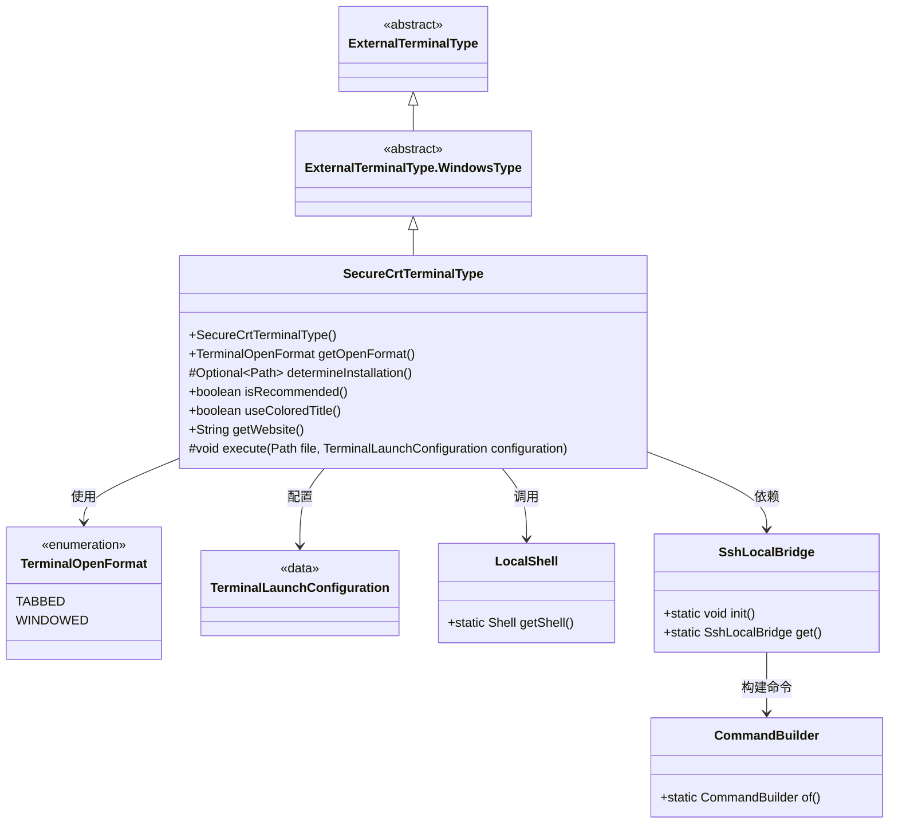
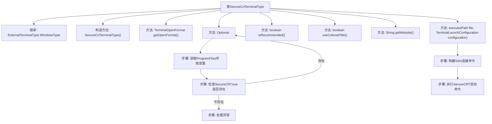

# 基础信息

|      |      |
|------|------|
| 名称 | SecureCrtTerminalType |
| 编码语言 | .java |
| 代码路径 | xpipe/app/src/main/java/io/xpipe/app/terminal/SecureCrtTerminalType.java |
| 包名 | io.xpipe.app.terminal |
| 依赖项 | ['io.xpipe.app.issue.ErrorEvent', 'io.xpipe.app.util.LocalShell', 'io.xpipe.app.util.SshLocalBridge', 'io.xpipe.core.process.CommandBuilder', 'java.nio.file.Files', 'java.nio.file.Path', 'java.util.Optional'] |
| 概述说明 | SecureCrtTerminalType类扩展Windows终端类型，实现SecureCRT终端配置与启动逻辑。 |

# 说明

SecureCrtTerminalType类继承自ExternalTerminalType.WindowsType，用于管理SecureCRT终端。构造函数设置标识符和名称。getOpenFormat方法返回TABBED格式。determineInstallation方法通过检查ProgramFiles环境变量定位SecureCRT.exe，不存在则返回空。isRecommended和useColoredTitle方法返回false。getWebsite提供官网链接。execute方法通过LocalShell执行命令，使用SshLocalBridge建立SSH连接，构建包含文件路径、SSH参数、端口、用户等信息的命令并执行。异常时记录错误并返回空。

# 类列表 Class Summary

| 名称   | 类型  | 说明 |
|-------|------|-------------|
| SecureCrtTerminalType | class | SecureCrtTerminalType类继承WindowsType，实现SecureCRT终端配置，检查安装路径并执行连接命令。 |

## 类 SecureCrtTerminalType

|      |      |
|------|------|
| 访问范围 | public |
| 类型 | class |
| 名称 | SecureCrtTerminalType |
| 说明 | SecureCrtTerminalType类继承WindowsType，实现SecureCRT终端配置，检查安装路径并执行连接命令。 |

### UML类图

该代码实现了一个SecureCRT终端类型类，继承自Windows终端类型基类。主要功能包括检测SecureCRT安装路径、配置终端打开方式、执行SSH连接命令等。通过LocalShell执行系统命令，使用SshLocalBridge建立SSH连接，并采用建造者模式构造命令行参数。类结构体现了终端类型的层次关系，并与多个辅助类协作完成终端启动流程。

### 内部方法调用关系图

这段代码描述了一个SecureCRT终端类型的实现类，继承自Windows终端类型基类。主要功能包括检测SecureCRT安装路径、配置终端打开格式、构建SSH连接命令并启动SecureCRT。流程图展示了类继承关系、核心方法调用链，特别是安装路径检测和命令执行的详细步骤，以及异常处理流程。该类通过本地Shell操作实现与SecureCRT的集成，适用于SSH连接场景。

### 字段列表 Field List

| 名称  | 类型  | 说明 |
|-------|-------|------|

### 方法列表 Method List

| 名称  | 类型  | 说明 |
|-------|-------|------|
| execute | void | 覆盖execute方法，通过SSH本地桥接执行命令，包含文件路径、身份密钥、端口和用户参数。 |
| determineInstallation | Optional<Path> | 检查SecureCRT.exe是否安装于ProgramFiles路径，存在返回路径，否则返回空。异常处理返回空。 |
| isRecommended | boolean | Java方法覆写，返回false表示不推荐。 |
| useColoredTitle | boolean | 重写方法，返回false表示不使用彩色标题。 |
| getWebsite | String | 重写getWebsite方法，返回SecureCRT官网链接。 |
| getOpenFormat | TerminalOpenFormat | 重写方法返回TABBED终端打开格式。 |

