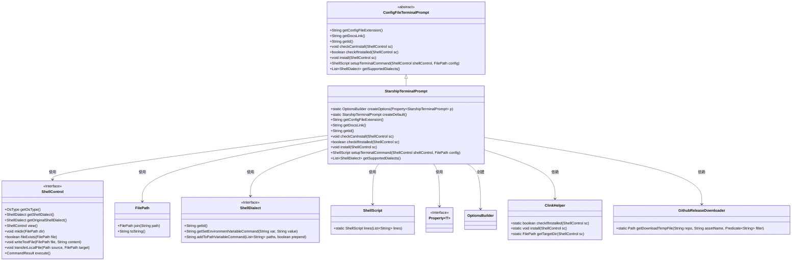
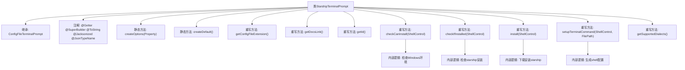

# 基础信息

|      |      |
|------|------|
| 名称 | StarshipTerminalPrompt |
| 编码语言 | .java |
| 代码路径 | xpipe/app/src/main/java/io/xpipe/app/terminal/StarshipTerminalPrompt.java |
| 包名 | io.xpipe.app.terminal |
| 依赖项 | ['io.xpipe.app.util.CommandSupport', 'io.xpipe.app.util.GithubReleaseDownloader', 'io.xpipe.app.util.OptionsBuilder', 'io.xpipe.core.process', 'io.xpipe.core.store.FilePath', 'javafx.beans.property.Property', 'com.fasterxml.jackson.annotation.JsonTypeName', 'lombok.Getter', 'lombok.ToString', 'lombok.experimental.SuperBuilder', 'lombok.extern.jackson.Jacksonized', 'java.nio.file.FileSystems', 'java.util.ArrayList', 'java.util.List'] |
| 概述说明 | Starship终端提示配置类，支持多Shell环境，含安装检查与初始化逻辑。 |

# 说明

StarshipTerminalPrompt类是一个配置终端提示的Java类，继承自ConfigFileTerminalPrompt。它使用Lombok注解生成getter、builder和toString方法，并支持JSON序列化。类中包含创建默认配置的方法，配置以TOML格式存储，定义了Starship提示符的样式和行为。类提供了检查安装状态、安装Starship以及设置终端命令的方法，支持多种Shell环境，包括Bash、Zsh、Fish、CMD、PowerShell等。安装过程根据不同操作系统和Shell类型进行适配，Windows系统使用Github下载，其他系统通过curl脚本安装。配置通过环境变量或脚本初始化应用到终端。

# 类列表 Class Summary

| 名称   | 类型  | 说明 |
|-------|------|-------------|
| StarshipTerminalPrompt | class | Starship终端提示配置类，支持多Shell，含安装检查与初始化脚本。 |

## 类 StarshipTerminalPrompt

|      |      |
|------|------|
| 访问范围 | @Getter;@SuperBuilder;@ToString;@Jacksonized;@JsonTypeName("starship");public |
| 类型 | class |
| 名称 | StarshipTerminalPrompt |
| 说明 | Starship终端提示配置类，支持多Shell，含安装检查与初始化脚本。 |

### UML类图

这段类图展示了StarshipTerminalPrompt类及其相关依赖关系。StarshipTerminalPrompt继承自抽象类ConfigFileTerminalPrompt，实现了终端提示配置功能，支持多种Shell方言（CMD、PowerShell等）。它通过ShellControl与操作系统交互，使用FilePath处理文件路径，依赖ClinkHelper和GithubReleaseDownloader完成安装逻辑。该类提供了创建默认配置、检查安装状态、执行安装以及设置终端命令等核心功能，是一个完整的终端提示配置解决方案。

### 内部方法调用关系图

这段代码是StarshipTerminalPrompt类的实现，继承自ConfigFileTerminalPrompt，主要用于管理starship终端提示工具的配置和安装。类通过多个注解提供自动生成getter、builder等功能，包含创建配置选项、默认配置、检查安装状态、执行安装以及生成shell配置命令等方法。特别处理了Windows环境下的安装逻辑，支持多种shell方言，并通过重写父类方法实现特定功能。整体流程包括环境检查、安装验证、文件下载和配置生成等步骤。

### 字段列表 Field List

| 名称  | 类型  | 说明 |
|-------|-------|------|

### 方法列表 Method List

| 名称  | 类型  | 说明 |
|-------|-------|------|
| setupTerminalCommand | ShellScript | 重写Shell脚本以配置终端命令，支持多种shell类型，包括CMD、PowerShell和Fish，并处理环境变量和路径设置。 |
| getId | String | 重写getId方法，返回字符串"starship"。 |
| getDocsLink | String | 重写getDocsLink方法，返回指定文档链接。 |
| createOptions | OptionsBuilder | 静态方法创建选项构建器，基于属性构建星际终端提示。 |
| checkCanInstall | void | 检查系统是否支持安装：非Windows需有curl。 |
| createDefault | StarshipTerminalPrompt | 创建默认Starship终端提示，含换行、成功符号➜和禁用包模块。 |
| install | void | 根据系统类型安装starship：Windows下载解压exe，其他系统通过curl脚本安装。 |
| checkIfInstalled | boolean | 检查是否安装starship：验证CMD环境、ClinkHelper及starship程序或文件存在。 |
| getConfigFileExtension | String | 重写方法返回配置扩展名"toml"。 |
| getSupportedDialects | List<ShellDialect> | 重写方法返回支持的Shell方言列表，包括Bash、Zsh、Fish、Cmd、PowerShell及其核心版。 |

