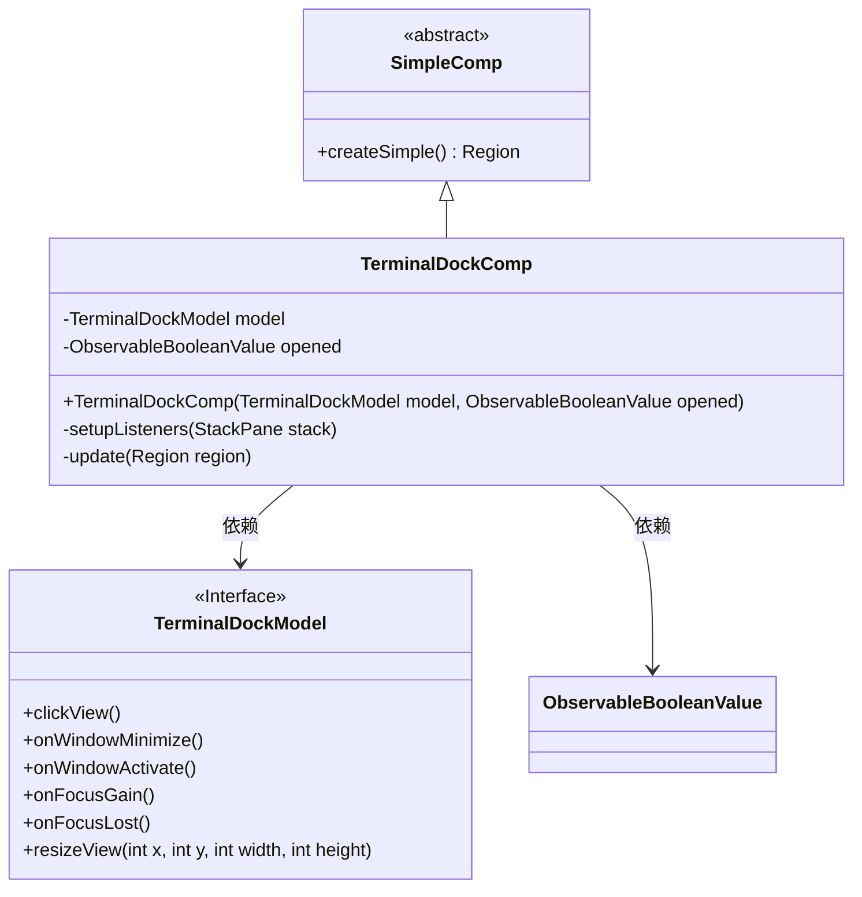
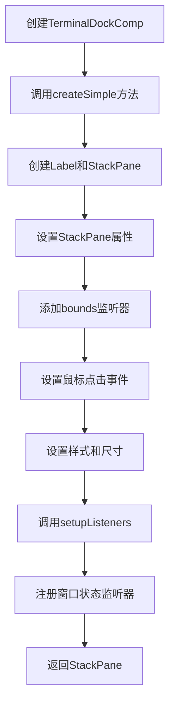
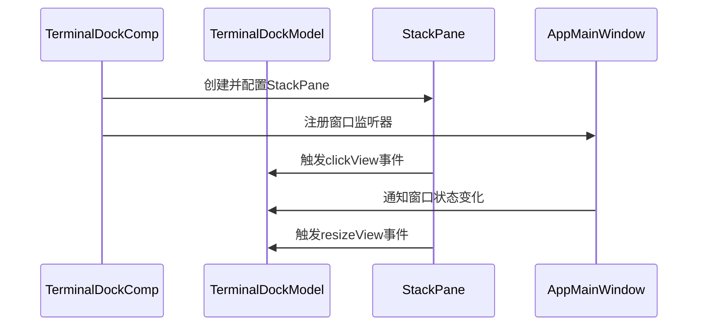
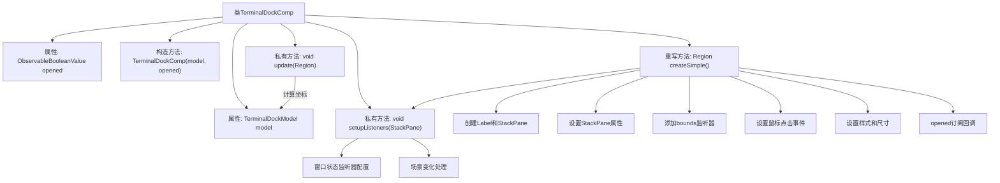

# 基础信息

|      |      |
|------|------|
| 名称 | TerminalDockComp |
| 编码语言 | .java |
| 代码路径 | xpipe/app/src/main/java/io/xpipe/app/terminal/TerminalDockComp.java |
| 包名 | io.xpipe.app.terminal |
| 依赖项 | ['io.xpipe.app.comp.SimpleComp', 'io.xpipe.app.core.AppFontSizes', 'io.xpipe.app.core.AppI18n', 'io.xpipe.app.core.window.AppMainWindow', 'io.xpipe.app.prefs.AppPrefs', 'io.xpipe.app.util.PlatformThread', 'javafx.beans.value.ChangeListener', 'javafx.beans.value.ObservableBooleanValue', 'javafx.beans.value.ObservableValue', 'javafx.css.PseudoClass', 'javafx.event.EventHandler', 'javafx.geometry.Bounds', 'javafx.geometry.Pos', 'javafx.scene.Cursor', 'javafx.scene.Parent', 'javafx.scene.control.Label', 'javafx.scene.layout.Region', 'javafx.scene.layout.StackPane', 'javafx.stage.WindowEvent', 'atlantafx.base.controls.RingProgressIndicator', 'org.kordamp.ikonli.javafx.FontIcon', 'java.util.concurrent.atomic.AtomicReference'] |
| 概述说明 | 终端组件类，管理界面交互与状态更新。 |

# 说明

TerminalDockComp是一个继承自SimpleComp的JavaFX组件，用于创建终端停靠面板。它包含TerminalDockModel模型和opened可观察布尔值作为构造参数。组件核心是一个StackPane，包含一个Label和可选的图标或进度指示器。根据opened状态变化，Label会显示不同文本和图标：打开时显示"clickToDock"和停靠图标，关闭时显示"terminalStarting"和环形进度条（非性能模式下）。组件设置了鼠标点击事件处理，会触发模型的clickView方法。通过setupListeners方法，组件监听了主窗口的位置、尺寸、最小化、焦点等状态变化，并相应更新模型。update方法负责计算组件在屏幕上的实际位置和尺寸，并通知模型调整视图。组件还处理了场景变化时的监听器管理，确保资源正确释放。

# 类列表 Class Summary

| 名称   | 类型  | 说明 |
|-------|------|-------------|
| TerminalDockComp | class | 终端停靠组件，包含状态切换和窗口监听功能。 |

## 类 TerminalDockComp

|      |      |
|------|------|
| 访问范围 | public |
| 类型 | class |
| 名称 | TerminalDockComp |
| 说明 | 终端停靠组件，包含状态切换和窗口监听功能。 |

### UML类图

这段代码实现了一个终端停靠组件TerminalDockComp，继承自SimpleComp抽象类。主要功能包括：1) 创建可交互的UI组件StackPane；2) 监听窗口状态变化并通知TerminalDockModel；3) 根据opened状态动态更新UI显示。类图展示了TerminalDockComp与TerminalDockModel接口的依赖关系，以及从SimpleComp继承的层次结构。流程图描述了组件初始化过程，时序图展示了组件与模型间的交互逻辑。

### 内部方法调用关系图

这段代码实现了一个可停靠的终端组件，主要功能包括：创建带标签的面板、响应鼠标点击、根据打开状态切换显示内容、监听窗口变化并更新模型。流程图展示了类结构、主要方法和它们之间的调用关系，特别是createSimple()方法构建UI元素并设置事件监听，setupListeners()管理窗口状态变化，update()处理坐标计算和模型更新。

### 字段列表 Field List

| 名称  | 类型  | 说明 |
|-------|-------|------|
| opened | ObservableBooleanValue | 私有可观察布尔值opened |
| model | TerminalDockModel | 私有终端的模型对象 |

### 方法列表 Method List

| 名称  | 类型  | 说明 |
|-------|-------|------|
| setupListeners | void | 设置窗口监听器，处理尺寸、位置、最小化、焦点等变化，动态更新界面。 |
| createSimple | Region | 创建可点击面板，含标签和图标，根据状态切换文本和图形，支持悬停和点击事件。 |
| update | void | 更新区域视图尺寸，考虑缩放和边距。 |

