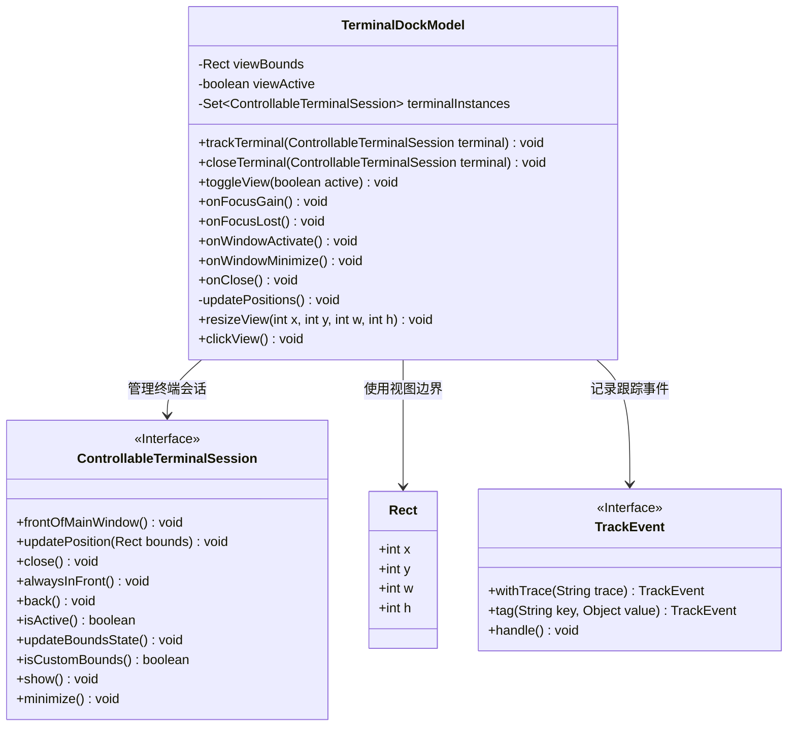

# 基础信息

|      |      |
|------|------|
| 名称 | TerminalDockModel |
| 编码语言 | .java |
| 代码路径 | xpipe/app/src/main/java/io/xpipe/app/terminal/TerminalDockModel.java |
| 包名 | io.xpipe.app.terminal |
| 依赖项 | ['io.xpipe.app.issue.TrackEvent', 'io.xpipe.app.util.Rect', 'lombok.Getter', 'java.util.HashSet', 'java.util.Set'] |
| 概述说明 | 终端管理类，跟踪会话实例，控制窗口位置、焦点及状态切换。 |

# 说明

TerminalDockModel类管理终端会话实例的视图状态和位置。它维护一组ControllableTerminalSession实例，提供跟踪、关闭终端的方法。当视图激活时，所有终端实例置顶显示；非激活时则置底。类中包含处理窗口焦点变化、最小化、关闭等事件的方法，确保终端位置与视图边界同步。通过resizeView调整视图大小时会更新所有终端位置，clickView方法则用于置顶显示所有终端并更新位置。所有操作都进行同步处理，并记录跟踪事件。

# 类列表 Class Summary

| 名称   | 类型  | 说明 |
|-------|------|-------------|
| TerminalDockModel | class | 终端管理类，控制会话窗口位置、焦点及开关。 |

## 类 TerminalDockModel

|      |      |
|------|------|
| 访问范围 | public |
| 类型 | class |
| 名称 | TerminalDockModel |
| 说明 | 终端管理类，控制会话窗口位置、焦点及开关。 |

### UML类图

类图描述：
TerminalDockModel 是一个终端管理类，负责跟踪、控制多个 ControllableTerminalSession 终端会话实例。它通过 Rect 类管理视图边界，并使用 TrackEvent 接口记录操作事件。主要功能包括添加/关闭终端、切换视图状态、处理窗口焦点变化、调整视图大小等。所有方法都通过 synchronized 保证线程安全，并通过事件跟踪实现操作监控。

### 内部方法调用关系图

```mermaid
graph TD
    A["类TerminalDockModel"]
    B["属性: Rect viewBounds"]
    C["属性: boolean viewActive"]
    D["属性: Set<ControllableTerminalSession> terminalInstances"]
    E["方法: trackTerminal(ControllableTerminalSession)"]
    F["方法: closeTerminal(ControllableTerminalSession)"]
    G["方法: toggleView(boolean)"]
    H["方法: onFocusGain()"]
    I["方法: onFocusLost()"]
    J["方法: onWindowActivate()"]
    K["方法: onWindowMinimize()"]
    L["方法: onClose()"]
    M["方法: updatePositions()"]
    N["方法: resizeView(int, int, int, int)"]
    O["方法: clickView()"]

    A --> B
    A --> C
    A --> D
    A --> E
    A --> F
    A --> G
    A --> H
    A --> I
    A --> J
    A --> K
    A --> L
    A --> M
    A --> N
    A --> O

    E -->|"terminalInstances.add(terminal)"| D
    E -->|"terminal.frontOfMainWindow()"| ControllableTerminalSession
    E -->|"terminal.updatePosition(viewBounds)"| ControllableTerminalSession

    F -->|"terminal.close()"| ControllableTerminalSession
    F -->|"terminalInstances.remove(terminal)"| D

    G -->|"TrackEvent.withTrace()"| TrackEvent
    G -->|"terminalInstances.forEach(alwaysInFront/back)"| ControllableTerminalSession
    G -->|"updatePositions()"| M

    H -->|"TrackEvent.withTrace()"| TrackEvent
    H -->|"terminalInstances.forEach(updateBoundsState/show/alwaysInFront)"| ControllableTerminalSession

    I -->|"TrackEvent.withTrace()"| TrackEvent
    I -->|"terminalInstances.forEach(updateBoundsState/frontOfMainWindow)"| ControllableTerminalSession

    J -->|"TrackEvent.withTrace()"| TrackEvent
    J -->|"terminalInstances.forEach(updateBoundsState/show/alwaysInFront/back)"| ControllableTerminalSession

    K -->|"TrackEvent.withTrace()"| TrackEvent
    K -->|"terminalInstances.forEach(updateBoundsState/minimize)"| ControllableTerminalSession

    L -->|"TrackEvent.withTrace()"| TrackEvent
    L -->|"terminalInstances.forEach(updateBoundsState/close)"| ControllableTerminalSession
    L -->|"terminalInstances.clear()"| D

    M -->|"terminalInstances.forEach(updateBoundsState/updatePosition)"| ControllableTerminalSession

    N -->|"new Rect(x, y, w, h)"| B
    N -->|"updatePositions()"| M

    O -->|"TrackEvent.withTrace()"| TrackEvent
    O -->|"terminalInstances.forEach(show/alwaysInFront/updatePosition)"| ControllableTerminalSession
```

这段代码是TerminalDockModel类的实现，主要用于管理多个ControllableTerminalSession终端实例。它提供了跟踪、关闭、切换视图状态、处理焦点变化、窗口激活/最小化/关闭事件、更新位置和调整视图大小等功能。所有方法都通过synchronized关键字保证线程安全，并通过TrackEvent记录关键操作日志。核心逻辑围绕terminalInstances集合展开，对每个终端实例执行位置更新、显示/隐藏、置顶/置底等操作，同时维护viewBounds和viewActive状态来控制终端窗口的布局和显示行为。

### 字段列表 Field List

| 名称  | 类型  | 说明 |
|-------|-------|------|
| viewBounds | Rect | 视图边界矩形区域 |
| terminalInstances = new HashSet<>() | Set<ControllableTerminalSession> | 私有终态集合存储终端会话实例 |
| viewActive | boolean | 私有布尔变量，表示视图是否激活。 |

### 方法列表 Method List

| 名称  | 类型  | 说明 |
|-------|-------|------|
| closeTerminal | void | 同步方法关闭终端会话，检查存在后关闭并移除实例。 |
| onWindowMinimize | void | 终端窗口最小化时更新边界状态并处理非自定义边界实例的最小化操作。 |
| resizeView | void | 调整视图大小，若宽高小于100则忽略，否则更新视图边界并重定位。 |
| toggleView | void | 同步方法切换终端视图状态，激活时置顶并更新位置，否则恢复默认。记录事件。 |
| onWindowActivate | void | 终端窗口激活时更新边界状态并调整显示顺序。 |
| clickView | void | 点击视图时追踪事件并显示所有终端实例，置顶并更新位置。 |
| onFocusGain | void | 终端视图获焦时更新活动终端实例状态并显示。 |
| trackTerminal | void | 同步方法跟踪终端会话，添加实例并调整窗口位置。 |
| updatePositions | void | 更新终端实例位置：检查视图边界，非自定义边界则更新位置。 |
| onClose | void | 同步方法onClose关闭终端视图，更新边界状态并清理实例。 |
| onFocusLost | void | 终端视图失去焦点时，非活跃视图直接返回；活跃终端更新边界状态，非自定义边界则前置主窗口。 |

