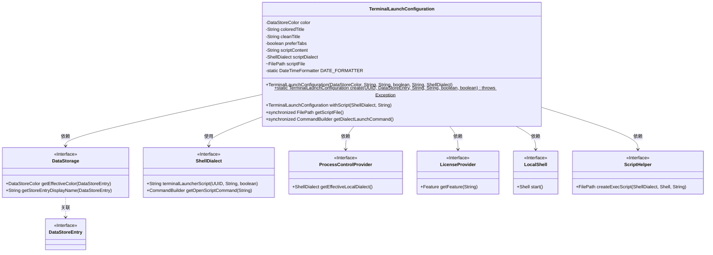
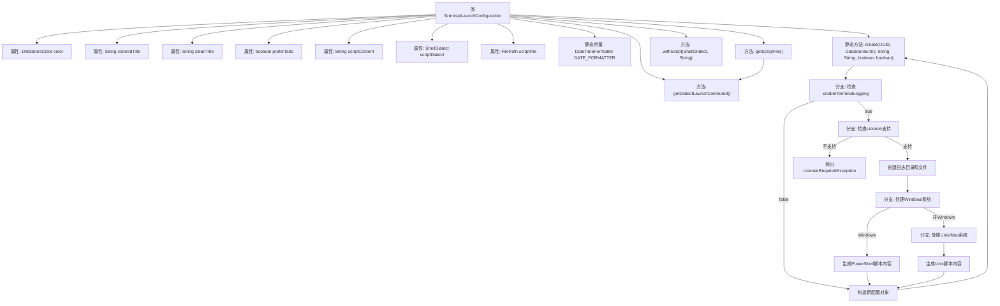

# 基础信息

|      |      |
|------|------|
| 名称 | TerminalLaunchConfiguration |
| 编码语言 | .java |
| 代码路径 | xpipe/app/src/main/java/io/xpipe/app/terminal/TerminalLaunchConfiguration.java |
| 包名 | io.xpipe.app.terminal |
| 依赖项 | ['io.xpipe.app.core.AppProperties', 'io.xpipe.app.ext.ProcessControlProvider', 'io.xpipe.app.issue.ErrorEvent', 'io.xpipe.app.prefs.AppPrefs', 'io.xpipe.app.storage.DataStorage', 'io.xpipe.app.storage.DataStoreColor', 'io.xpipe.app.storage.DataStoreEntry', 'io.xpipe.app.util.LicenseProvider', 'io.xpipe.app.util.LicenseRequiredException', 'io.xpipe.app.util.LocalShell', 'io.xpipe.app.util.ScriptHelper', 'io.xpipe.core.process.CommandBuilder', 'io.xpipe.core.process.OsType', 'io.xpipe.core.process.ShellDialect', 'io.xpipe.core.process.ShellDialects', 'io.xpipe.core.store.FilePath', None, 'lombok.experimental.NonFinal', 'java.nio.file.Files', 'java.time.Instant', 'java.time.ZoneId', 'java.time.format.DateTimeFormatter', 'java.util.UUID'] |
| 概述说明 | 终端启动配置类，含颜色、标题、脚本等属性，支持日志记录和跨平台脚本生成。 |

# 说明

TerminalLaunchConfiguration类用于配置终端启动参数，包含颜色、标题、标签偏好、脚本内容等属性。提供静态方法create根据请求、数据存储条目等生成配置实例，处理不同操作系统下的日志记录需求。支持Windows和Unix系统，分别使用PowerShell和script命令实现日志记录。类还提供脚本文件生成和启动命令构建功能，确保线程安全。

# 类列表 Class Summary

| 名称   | 类型  | 说明 |
|-------|------|-------------|
| TerminalLaunchConfiguration | class | 终端启动配置类，含颜色、标题、脚本等属性，支持日志记录和跨平台脚本生成。 |

## 类 TerminalLaunchConfiguration

|      |      |
|------|------|
| 访问范围 | @Value;@RequiredArgsConstructor;@AllArgsConstructor;public |
| 类型 | class |
| 名称 | TerminalLaunchConfiguration |
| 说明 | 终端启动配置类，含颜色、标题、脚本等属性，支持日志记录和跨平台脚本生成。 |

### UML类图

类图描述：
该图展示了TerminalLaunchConfiguration类及其相关依赖关系。TerminalLaunchConfiguration是一个配置类，用于管理终端启动参数，包含颜色、标题、脚本内容等属性，并通过静态工厂方法create()处理不同操作系统下的脚本生成逻辑。它依赖DataStorage获取颜色配置，通过ProcessControlProvider获取本地Shell方言，使用LicenseProvider检查日志功能许可，并借助LocalShell和ScriptHelper执行脚本操作。ShellDialect接口定义了终端脚本生成的核心方法，体现了策略模式的应用。

### 内部方法调用关系图

该流程图展示了TerminalLaunchConfiguration类的完整结构和工作流程。类包含多个属性和方法，核心是静态create方法，该方法根据系统环境和配置创建终端启动配置。流程从检查日志功能是否启用开始，分Windows和Unix/Mac两种路径处理脚本生成，最终构造配置对象返回。图中清晰呈现了条件分支、异常处理以及方法调用关系，完整覆盖了从参数校验到最终配置生成的全过程。

### 字段列表 Field List

| 名称  | 类型  | 说明 |
|-------|-------|------|
| DATE_FORMATTER =            DateTimeFormatter.ofPattern("yyyy-MM-dd_HH-mm-ss").withZone(ZoneId.systemDefault()) | DateTimeFormatter | 定义私有静态日期格式化器，格式为"年-月-日_时-分-秒"，使用系统默认时区。 |
| scriptContent | String | 脚本内容变量声明 |
| cleanTitle | String | {{cleanTitle}} |
| preferTabs | boolean | 布尔变量preferTabs |
| scriptFile = null | FilePath | 非终态文件路径变量scriptFile初始化为空。 |
| coloredTitle | String | {{coloredTitle}} |
| scriptDialect | ShellDialect | 定义ShellDialect脚本方言变量。 |
| color | DataStoreColor | 定义DataStoreColor颜色变量。 |

### 方法列表 Method List

| 名称  | 类型  | 说明 |
|-------|-------|------|
| create | TerminalLaunchConfiguration | 创建终端启动配置，处理日志和脚本，支持不同操作系统。 |
| withScript | TerminalLaunchConfiguration | 公开方法用脚本创建终端启动配置，参数为Shell方言和内容字符串。 |
| getScriptFile | FilePath | 同步方法获取脚本文件，若为空则创建后返回。 |
| getDialectLaunchCommand | CommandBuilder | 同步方法返回方言启动命令，调用脚本方言接口生成打开脚本命令。 |

