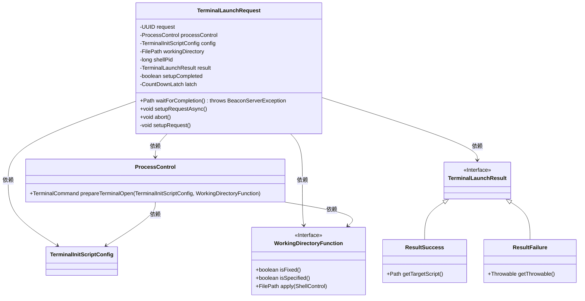
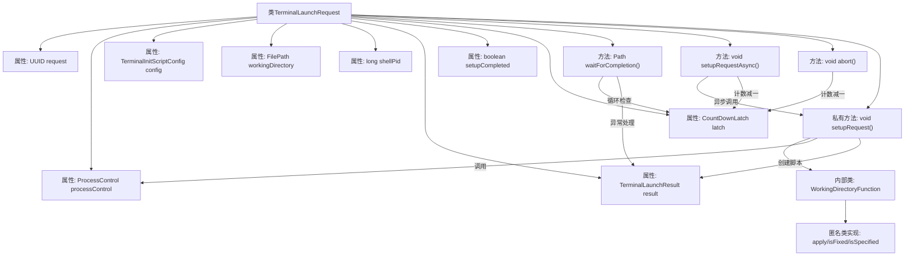

# 基础信息

|      |      |
|------|------|
| 名称 | TerminalLaunchRequest |
| 编码语言 | .java |
| 代码路径 | xpipe/app/src/main/java/io/xpipe/app/terminal/TerminalLaunchRequest.java |
| 包名 | io.xpipe.app.terminal |
| 依赖项 | ['io.xpipe.app.util.ScriptHelper', 'io.xpipe.app.util.ThreadHelper', 'io.xpipe.beacon.BeaconServerException', 'io.xpipe.core.process', 'io.xpipe.core.store.FilePath', 'lombok.Setter', 'lombok.Value', 'lombok.experimental.NonFinal', 'java.nio.file.Path', 'java.util.UUID', 'java.util.concurrent.CountDownLatch'] |
| 概述说明 | 终端启动请求类，含UUID、进程控制、配置等字段，支持异步设置和等待完成。 |

# 说明

该代码定义了一个名为TerminalLaunchRequest的类，用于处理终端启动请求。类中包含请求ID、进程控制对象、终端初始化配置和工作目录等关键字段。通过setupRequestAsync方法异步执行启动请求，waitForCompletion方法等待请求完成并返回结果路径。若请求失败会抛出异常。内部使用CountDownLatch进行线程同步，并提供了abort方法中止请求。setupRequest方法负责实际准备终端启动命令，成功时返回脚本路径，失败时记录异常。整个流程支持自定义工作目录和异常处理机制。

# 类列表 Class Summary

| 名称   | 类型  | 说明 |
|-------|------|-------------|
| TerminalLaunchRequest | class | 终端启动请求类，含UUID、进程控制、脚本配置等字段，提供异步设置和完成等待功能。 |

## 类 TerminalLaunchRequest

|      |      |
|------|------|
| 访问范围 | @Value;public |
| 类型 | class |
| 名称 | TerminalLaunchRequest |
| 说明 | 终端启动请求类，含UUID、进程控制、脚本配置等字段，提供异步设置和完成等待功能。 |

### UML类图

这段代码描述了一个终端启动请求的处理流程。TerminalLaunchRequest类封装了终端启动所需的配置、工作目录和进程控制等参数，通过setupRequestAsync()异步执行启动流程，并使用CountDownLatch同步等待结果。核心逻辑包括：准备终端命令、创建执行脚本、处理成功/失败结果。类图中展示了与ProcessControl、TerminalInitScriptConfig等组件的依赖关系，以及TerminalLaunchResult的两种实现类（成功/失败）。整个设计支持异步操作和异常处理，适用于需要等待终端启动结果的场景。

### 内部方法调用关系图

该流程图展示了TerminalLaunchRequest类的完整结构，包含8个属性和4个主要方法。核心逻辑体现在waitForCompletion()的循环等待机制和setupRequest()的异步初始化过程，其中setupRequest()通过匿名内部类WorkingDirectoryFunction处理工作目录逻辑。异常处理路径通过TerminalLaunchResult的两种子类型(ResultSuccess/ResultFailure)实现，整个流程通过CountDownLatch实现线程同步控制，体现了典型的异步任务处理模式。

### 字段列表 Field List

| 名称  | 类型  | 说明 |
|-------|-------|------|
| latch | CountDownLatch | 非final的CountDownLatch锁存器 |
| setupCompleted | boolean | 非终态布尔变量setupCompleted，带Setter注解。 |
| result | TerminalLaunchResult | 终端启动结果变量，可修改非final |
| processControl | ProcessControl | 进程控制对象 |
| request | UUID | UUID请求生成唯一标识符。 |
| shellPid | long | 设置非终态长整型shell进程ID |
| config | TerminalInitScriptConfig | 终端初始化脚本配置对象 |
| workingDirectory | FilePath | 工作目录的文件路径变量。 |

### 方法列表 Method List

| 名称  | 类型  | 说明 |
|-------|-------|------|
| waitForCompletion | Path | 方法等待任务完成，成功返回脚本路径，失败抛出异常。 |
| setupRequestAsync | void | 异步执行setupRequest，完成后释放锁存器。 |
| abort | void | 方法abort()调用latch.countDown()释放锁存器。 |
| setupRequest | void | 设置终端请求，处理工作目录并返回成功或失败结果。 |

