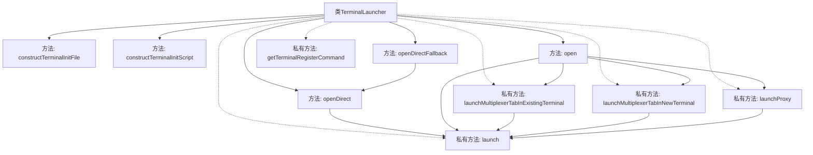
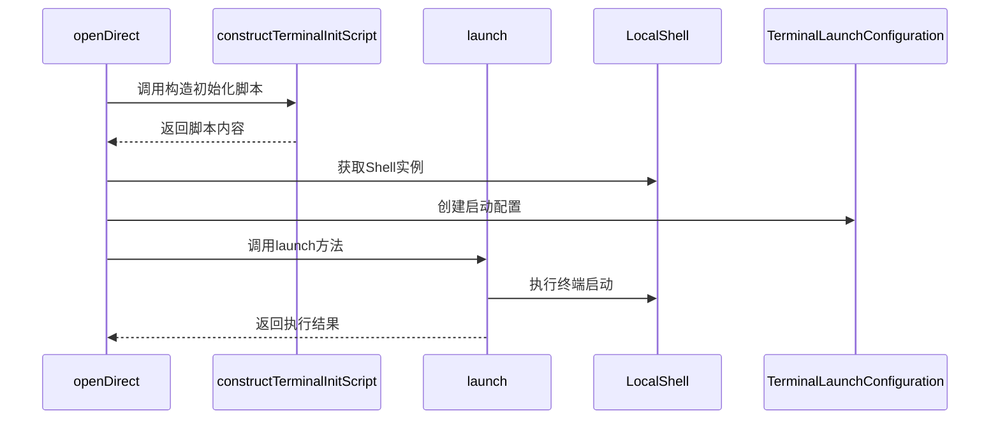

# 基础信息

|      |      |
|------|------|
| 名称 | TerminalLauncher |
| 编码语言 | .java |
| 代码路径 | xpipe/app/src/main/java/io/xpipe/app/terminal/TerminalLauncher.java |
| 包名 | io.xpipe.app.terminal |
| 依赖项 | ['io.xpipe.app.core.AppI18n', 'io.xpipe.app.ext.ProcessControlProvider', 'io.xpipe.app.issue.ErrorEvent', 'io.xpipe.app.prefs.AppPrefs', 'io.xpipe.app.storage.DataStorage', 'io.xpipe.app.storage.DataStoreEntry', 'io.xpipe.app.util.LocalShell', 'io.xpipe.app.util.ScriptHelper', 'io.xpipe.core.process', 'io.xpipe.core.store.FilePath', 'io.xpipe.core.util.FailableFunction', 'io.xpipe.core.util.XPipeInstallation', 'java.io.IOException', 'java.util.List', 'java.util.Optional', 'java.util.UUID', 'java.util.concurrent.CountDownLatch', 'java.util.stream.Collectors'] |
| 概述说明 | 终端启动器类，提供构造初始化脚本、直接打开终端及管理终端会话功能。 |

# 说明

TerminalLauncher类提供终端启动与管理功能，包含构造初始化脚本、处理工作目录、标题设置及多路复用支持。核心方法constructTerminalInitScript生成跨平台终端初始化脚本，支持清屏、目录切换等操作。open系列方法处理终端启动逻辑，支持标签页偏好、代理配置及多路复用器集成。异常处理涵盖终端类型检测失败等场景，确保可靠启动。通过UUID跟踪会话，结合CountDownLatch实现异步操作同步化。

# 类列表 Class Summary

| 名称   | 类型  | 说明 |
|-------|------|-------------|
| TerminalLauncher | class | TerminalLauncher类提供终端启动功能，包括初始化脚本构建、直接打开终端及多路复用支持。 |

## 类 TerminalLauncher

|      |      |
|------|------|
| 访问范围 | public |
| 类型 | class |
| 名称 | TerminalLauncher |
| 说明 | TerminalLauncher类提供终端启动功能，包括初始化脚本构建、直接打开终端及多路复用支持。 |

### UML类图

```mermaid
classDiagram
    class TerminalLauncher {
        +constructTerminalInitFile(ShellDialect t, ShellControl processControl, WorkingDirectoryFunction workingDirectory, List~String~ preInit, List~String~ postInit, TerminalInitScriptConfig config, boolean exit) FilePath
        +constructTerminalInitScript(ShellDialect t, ShellControl processControl, WorkingDirectoryFunction workingDirectory, List~String~ preInit, List~String~ postInit, TerminalInitScriptConfig config, boolean exit) String
        +openDirect(String title, ShellScript command) void
        +openDirectFallback(String title, FailableFunction~ShellControl, ShellScript, Exception~ command) void
        +openDirect(String title, FailableFunction~ShellControl, ShellScript, Exception~ command) void
        +openDirect(String title, FailableFunction~ShellControl, ShellScript, Exception~ command, ExternalTerminalType type) void
        +open(String title, ProcessControl cc) void
        +open(String title, ProcessControl cc, UUID request) void
        +open(DataStoreEntry entry, String title, FilePath directory, ProcessControl cc) void
        +open(DataStoreEntry entry, String title, FilePath directory, ProcessControl cc, UUID request, boolean preferTabs) void
        -launch(ExternalTerminalType type, TerminalLaunchConfiguration config, CountDownLatch latch) void
        -getTerminalRegisterCommand(UUID request) String
        -launchMultiplexerTabInExistingTerminal(UUID request, TerminalInitScriptConfig initScriptConfig, TerminalLaunchConfiguration launchConfiguration) boolean
        -launchMultiplexerTabInNewTerminal(UUID request, TerminalInitScriptConfig initScriptConfig, TerminalLaunchConfiguration launchConfiguration) Optional~TerminalLaunchConfiguration~
        -launchProxy(UUID request, TerminalLaunchConfiguration launchConfiguration) Optional~TerminalLaunchConfiguration~
    }

    class ShellDialect {
        <<Interface>>
        +getNewLine() NewLine
        +clearDisplayCommand() String
        +applyInitFileCommand(ShellControl processControl) String
        +changeTitleCommand(String displayName) String
        +getCdCommand(String path) String
        +getPassthroughExitCommand() String
        +prepareScriptContent(String content) String
        +getInitFileName(ShellControl processControl, String hash) String
    }

    class ShellControl {
        <<Interface>>
        +getShellDialect() ShellDialect
        +command(String command) CommandBuilder
        +prepareIntermediateTerminalOpen(TerminalInitFunction initFunction, TerminalInitScriptConfig config, WorkingDirectoryFunction workingDirectory) String
        +start() void
    }

    class TerminalLaunchConfiguration {
        +TerminalLaunchConfiguration(UUID request, String cleanTitle, String adjustedTitle, boolean preferTabs, String scriptContent, ShellDialect scriptDialect)
        +withScript(ShellDialect dialect, String scriptContent) TerminalLaunchConfiguration
        +getDialectLaunchCommand() CommandBuilder
        +getScriptContent() String
        +getScriptDialect() ShellDialect
    }

    class TerminalMultiplexerManager {
        +getEffectiveMultiplexer() Optional~TerminalMultiplexer~
        +getActiveTerminalSession(UUID request) Optional~TerminalSession~
        +submitAsync(UUID request, ProcessControl cc, TerminalInitScriptConfig config, FilePath directory) CountDownLatch
        +synchronizeMultiplexerLaunchTiming() void
        +registerMultiplexerLaunch(UUID request) void
    }

    class TerminalProxyManager {
        +getProxy() Optional~ShellControl~
    }

    class LocalShell {
        +getShell() ShellControl
    }

    class ProcessControlProvider {
        +getEffectiveLocalDialect() ShellDialect
    }

    TerminalLauncher --> ShellDialect : 依赖
    TerminalLauncher --> ShellControl : 依赖
    TerminalLauncher --> TerminalLaunchConfiguration : 创建
    TerminalLauncher --> TerminalMultiplexerManager : 调用
    TerminalLauncher --> TerminalProxyManager : 调用
    TerminalLauncher --> LocalShell : 调用
    TerminalLauncher --> ProcessControlProvider : 调用
    ShellControl --|> ShellDialect : 实现
```

这段类图展示了TerminalLauncher及其相关类的结构和关系。TerminalLauncher是一个核心类，负责终端初始化和启动，通过ShellDialect接口处理不同shell方言的差异，依赖ShellControl执行命令。TerminalLaunchConfiguration封装启动配置，TerminalMultiplexerManager和TerminalProxyManager分别处理终端复用和代理功能。整体设计体现了终端操作的抽象和扩展性，支持多种终端类型和复用场景。

### 内部方法调用关系图

这段代码是TerminalLauncher类的实现，主要负责终端启动和管理的功能。流程图展示了类的方法结构，其中核心方法包括constructTerminalInitFile用于构建初始化文件，constructTerminalInitScript用于构建初始化脚本，openDirect/open用于直接打开终端，以及多个私有辅助方法。时序图则展示了openDirect方法的典型调用流程，包括脚本构造、Shell获取、配置创建和最终启动的过程。代码处理了多种终端启动场景，包括直接启动、代理启动和复用现有终端等复杂情况。

### 字段列表 Field List

| 名称  | 类型  | 说明 |
|-------|-------|------|

### 方法列表 Method List

| 名称  | 类型  | 说明 |
|-------|-------|------|
| openDirectFallback | void | 静态方法openDirectFallback用于直接打开终端，不依赖SSH桥接，根据配置选择终端类型并执行命令。 |
| constructTerminalInitFile | FilePath | 构建终端初始化文件，包含脚本内容、哈希和文件名处理。 |
| openDirect | void | 静态方法openDirect，接受标题和命令函数，调用终端类型执行。 |
| getTerminalRegisterCommand | String | 生成终端注册命令，使用本地CLI工具和请求UUID。 |
| launchMultiplexerTabInExistingTerminal | boolean | 在现有终端启动多路复用器标签页，检查支持后执行命令并聚焦会话。 |
| open | void | 公开静态方法open，接收标题和进程控制参数，可能抛出异常。 |
| openDirect | void | 静态方法openDirect启动终端，执行命令并处理异常。 |
| open | void | 静态方法open，接收DataStoreEntry、String、FilePath、ProcessControl参数，调用重载方法并生成随机UUID。 |
| open | void | 公开静态方法open，接收标题、流程控制和请求UUID，可能抛出异常。 |
| launch | void | 私有方法启动外部终端，处理异常并提示错误信息。 |
| open | void | 静态方法打开终端，处理配置、标题、颜色，支持多标签和代理启动，同步多路复用器时序。 |
| openDirect | void | 静态方法openDirect，通过标题和ShellScript命令打开终端，可能抛出异常。 |
| launchMultiplexerTabInNewTerminal | Optional<TerminalLaunchConfiguration> | 方法启动新终端多路复用器标签页，处理代理和本地命令配置，返回启动配置。 |
| constructTerminalInitScript | String | 生成终端初始化脚本，包含清屏、预初始化、应用配置文件、设置标题、切换目录、后初始化及退出命令。 |
| launchProxy | Optional<TerminalLaunchConfiguration> | 启动代理终端配置，检查代理并生成启动命令。 |

