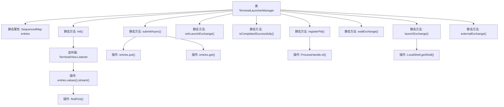

# 基础信息

|      |      |
|------|------|
| 名称 | TerminalLauncherManager |
| 编码语言 | .java |
| 代码路径 | xpipe/app/src/main/java/io/xpipe/app/terminal/TerminalLauncherManager.java |
| 包名 | io.xpipe.app.terminal |
| 依赖项 | ['io.xpipe.app.ext.ProcessControlProvider', 'io.xpipe.app.ext.ShellStore', 'io.xpipe.app.issue.TrackEvent', 'io.xpipe.app.storage.DataStoreEntryRef', 'io.xpipe.app.util.LocalShell', 'io.xpipe.app.util.ScriptHelper', 'io.xpipe.beacon.BeaconClientException', 'io.xpipe.beacon.BeaconServerException', 'io.xpipe.core.process', 'io.xpipe.core.store.FilePath', 'java.nio.file.Path', 'java.util', 'java.util.concurrent.CountDownLatch'] |
| 概述说明 | 终端启动管理器类，管理终端会话请求和异步处理。 |

# 说明

TerminalLauncherManager是一个管理终端启动请求的类，使用UUID标识请求并通过LinkedHashMap存储。主要功能包括初始化终端会话监听、异步提交启动请求、等待请求完成、检查请求状态、注册进程ID以及处理本地和外部终端交换。类中通过同步块确保线程安全，提供异常处理和日志跟踪。支持SSH启动、脚本生成和命令执行，并能处理未知请求和错误状态。

# 类列表 Class Summary

| 名称   | 类型  | 说明 |
|-------|------|-------------|
| TerminalLauncherManager | class | 终端启动管理器，处理会话、异步提交和脚本交换。 |


## 类 TerminalLauncherManager

|      |      |
|------|------|
| 访问范围 | public |
| 类型 | class |
| 名称 | TerminalLauncherManager |
| 说明 | 终端启动管理器，处理会话、异步提交和脚本交换。 |


### UML类图

```mermaid
classDiagram
    class TerminalLauncherManager {
        -SequencedMap~UUID, TerminalLaunchRequest~ entries
        +init() void
        +submitAsync(UUID request, ProcessControl processControl, TerminalInitScriptConfig config, FilePath directory) CountDownLatch
        +sshLaunchExchange() Path
        +isCompletedSuccessfully(UUID request) boolean
        +registerPid(UUID request, long pid) void
        +waitExchange(UUID request) void
        +launchExchange(UUID request) Path
        +externalExchange(DataStoreEntryRef~ShellStore~ ref, List~String~ arguments) List~String~
    }

    class TerminalView {
        <<Interface>>
        +addListener(Listener listener) void
    }

    class TerminalView$Listener {
        <<Interface>>
        +onSessionClosed(ShellSession session) void
    }

    class TerminalLaunchRequest {
        -UUID request
        -ProcessControl processControl
        -TerminalInitScriptConfig config
        -FilePath directory
        -long shellPid
        -Object result
        -boolean setupCompleted
        -Object other
        +TerminalLaunchRequest(UUID request, ProcessControl processControl, TerminalInitScriptConfig config, FilePath directory, long shellPid, Object result, boolean setupCompleted, Object other)
        +abort() void
        +setupRequestAsync() void
        +getLatch() CountDownLatch
        +waitForCompletion() Path
        // ...其他getter/setter方法
    }

    class TerminalInitScriptConfig {
        -String name
        -boolean flag
        -TerminalInitFunction function
        // ...构造方法和其他方法
    }

    class ProcessControl {
        <<Interface>>
        // ...接口方法
    }

    class ShellControl {
        <<Interface>>
        // ...接口方法
    }

    class DataStoreEntryRef~T~ {
        <<Interface>>
        +getStore() T
    }

    TerminalLauncherManager --> TerminalView : 监听
    TerminalLauncherManager --> TerminalLaunchRequest : 管理
    TerminalLauncherManager --> TerminalInitScriptConfig : 使用
    TerminalLauncherManager --> ProcessControl : 使用
    TerminalLauncherManager --> DataStoreEntryRef~ShellStore~ : 使用
    TerminalView ..|> TerminalView$Listener : 实现
    TerminalLaunchRequest --> ProcessControl : 包含
    TerminalLaunchRequest --> TerminalInitScriptConfig : 包含
```

这段代码展示了一个终端启动管理器TerminalLauncherManager，它负责管理终端会话的创建、监控和销毁。核心功能包括异步提交启动请求(submitAsync)、等待结果(waitExchange)、获取启动脚本(launchExchange)等。通过TerminalView监听会话关闭事件，使用TerminalLaunchRequest封装每个启动请求的状态，并支持进程PID注册和结果验证。类图清晰地展示了各组件间的依赖关系，包括与配置类(TerminalInitScriptConfig)、控制接口(ProcessControl/ShellControl)的交互。


### 内部方法调用关系图



该流程图展示了TerminalLauncherManager类的核心结构和主要方法调用关系。该类通过静态方法管理终端启动请求，包含初始化监听器、异步提交请求、SSH启动交换、PID注册等功能。关键操作包括对entries映射的流处理、查找和更新，以及通过ProcessHandle和LocalShell进行进程控制。方法间通过同步块保证线程安全，形成完整的终端生命周期管理链条。

### 字段列表 Field List

| 名称  | 类型  | 说明 |
|-------|-------|------|
| entries = new LinkedHashMap<>() | SequencedMap<UUID, TerminalLaunchRequest> | 私有静态终态序列映射存储UUID与终端启动请求的键值对。 |

### 方法列表 Method List

| 名称  | 类型  | 说明 |
|-------|-------|------|
| submitAsync | CountDownLatch | 静态方法submitAsync同步处理终端启动请求，更新或创建请求后返回倒计时锁。 |
| externalExchange | List<String> | 外部交换方法：获取会话，执行命令，提交异步请求，处理脚本结果。异常时抛出BeaconServerException。 |
| waitExchange | void | 静态方法等待请求完成，处理完成后提交异步任务并标记完成。 |
| init | void | 静态方法init监听终端会话关闭，匹配请求后终止对应条目。 |
| launchExchange | Path | 同步方法处理启动请求：未找到请求返回本地Shell，成功则返回目标脚本，失败抛异常。 |
| registerPid | void | 注册进程ID，验证终端子进程及父进程，更新请求的shell进程ID。 |
| isCompletedSuccessfully | boolean | 检查请求是否成功完成，返回布尔值。 |
| sshLaunchExchange | Path | 静态方法sshLaunchExchange同步获取最新终端启动请求，若无则抛异常，最后返回请求结果。 |


