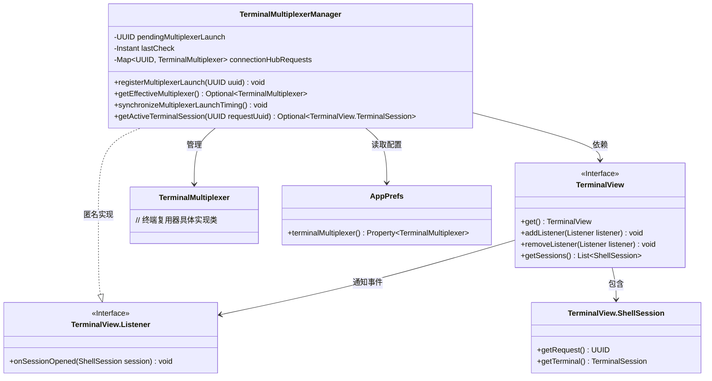
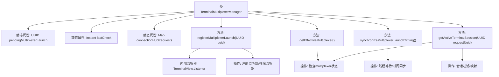

# 基础信息

|      |      |
|------|------|
| 名称 | TerminalMultiplexerManager |
| 编码语言 | .java |
| 代码路径 | xpipe/app/src/main/java/io/xpipe/app/terminal/TerminalMultiplexerManager.java |
| 包名 | io.xpipe.app.terminal |
| 依赖项 | ['io.xpipe.app.prefs.AppPrefs', 'io.xpipe.app.util.ThreadHelper', 'java.time.Duration', 'java.time.Instant', 'java.util'] |
| 概述说明 | 管理终端复用器，处理启动同步、会话注册和活动会话获取。 |

# 说明

该代码定义了一个终端多路复用管理器类，主要功能包括管理多路复用器启动注册、同步启动时序以及获取活动终端会话。类中维护了待启动的多路复用器UUID、最后检查时间戳和连接请求映射表。提供了注册多路复用器启动的方法，通过监听器处理会话打开事件。同步方法确保多路复用器启动间隔至少1秒，并处理并发启动等待逻辑。获取活动会话时会检查运行状态并更新请求映射。整个设计用于协调终端多路复用器的启动和会话管理。

# 类列表 Class Summary

| 名称   | 类型  | 说明 |
|-------|------|-------------|
| TerminalMultiplexerManager | class | 终端复用管理器类，处理会话注册、同步和获取活动会话。 |

## 类 TerminalMultiplexerManager

|      |      |
|------|------|
| 访问范围 | public |
| 类型 | class |
| 名称 | TerminalMultiplexerManager |
| 说明 | 终端复用管理器类，处理会话注册、同步和获取活动会话。 |

### UML类图

类图描述：
该图展示了终端复用管理器TerminalMultiplexerManager的核心结构，它通过静态方法管理终端会话的创建和同步。主要依赖TerminalView接口监听会话事件，使用AppPrefs获取配置，并维护与TerminalMultiplexer的关联关系。包含三个关键操作：注册复用器启动、获取有效复用器、同步启动时序。通过HashMap存储请求UUID与复用器的映射，采用监听器模式处理会话打开事件，体现了多线程环境下的时序控制机制。

### 内部方法调用关系图

流程图描述了TerminalMultiplexerManager类的核心结构和交互逻辑。该类通过静态属性管理多路复用器状态，包含四个关键方法：注册多路复用器启动、获取有效多路复用器、同步启动时序、获取活动终端会话。其中registerMultiplexerLaunch方法会创建并注册监听器，synchronizeMultiplexerLaunchTiming实现精确的时间控制逻辑，getActiveTerminalSession则负责会话过滤和状态映射。整体流程展现了多线程环境下的状态管理和事件驱动处理机制。

### 字段列表 Field List

| 名称  | 类型  | 说明 |
|-------|-------|------|
| pendingMultiplexerLaunch | UUID | 私有静态UUID变量pendingMultiplexerLaunch |
| connectionHubRequests = new HashMap<>() | Map<UUID, TerminalMultiplexer> | 私有静态终态映射，UUID键TerminalMultiplexer值，存储连接请求。 |
| lastCheck = Instant.now() | Instant | 私有静态变量记录最后检查时间 |

### 方法列表 Method List

| 名称  | 类型  | 说明 |
|-------|-------|------|
| getEffectiveMultiplexer | Optional<TerminalMultiplexer> | 获取终端复用器配置，返回可选值。 |
| registerMultiplexerLaunch | void | 注册终端复用器启动监听器，会话打开时检查并清除待处理请求。 |
| synchronizeMultiplexerLaunchTiming | void | 同步多路复用器启动时间，检查并等待当前启动完成，确保间隔至少1秒。 |
| getActiveTerminalSession | Optional<TerminalView.TerminalSession> | 获取活动终端会话，若无则返回空，否则返回匹配的终端会话。 |

