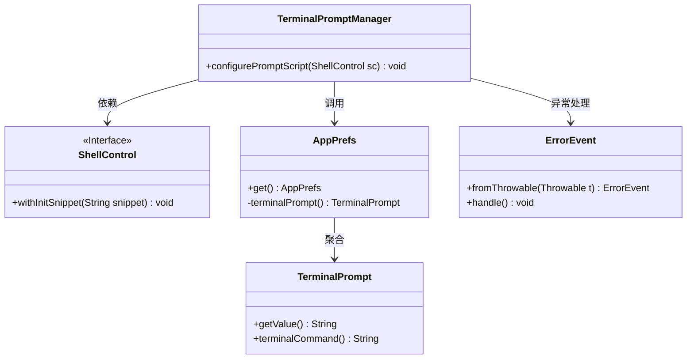
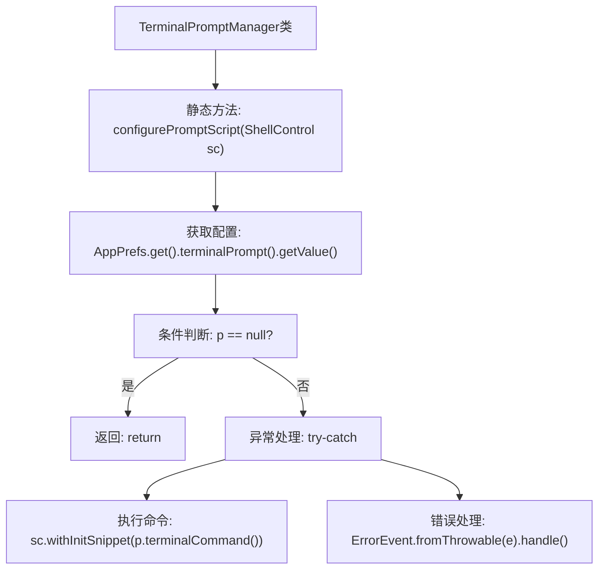

# 基础信息

|      |      |
|------|------|
| 名称 | TerminalPromptManager |
| 编码语言 | .java |
| 代码路径 | xpipe/app/src/main/java/io/xpipe/app/terminal/TerminalPromptManager.java |
| 包名 | io.xpipe.app.terminal |
| 依赖项 | ['io.xpipe.app.issue.ErrorEvent', 'io.xpipe.app.prefs.AppPrefs', 'io.xpipe.core.process.ShellControl'] |
| 概述说明 | 终端提示管理器配置终端命令片段，异常时处理错误。 |

# 说明

TerminalPromptManager类包含一个静态方法configurePromptScript，用于配置终端提示脚本。该方法接收ShellControl对象作为参数，首先从应用偏好设置中获取终端提示配置值。若配置值为空则直接返回，否则尝试通过ShellControl对象执行终端命令初始化片段。若执行过程中发生异常，会通过ErrorEvent处理异常情况。整个过程实现了终端提示脚本的动态配置与错误处理。

# 类列表 Class Summary

| 名称   | 类型  | 说明 |
|-------|------|-------------|
| TerminalPromptManager | class | 终端提示管理器配置脚本，处理异常。 |

## 类 TerminalPromptManager

|      |      |
|------|------|
| 访问范围 | public |
| 类型 | class |
| 名称 | TerminalPromptManager |
| 说明 | 终端提示管理器配置脚本，处理异常。 |

### UML类图

这段类图展示了TerminalPromptManager的核心交互关系。TerminalPromptManager通过静态方法configurePromptScript依赖ShellControl接口来执行终端命令，同时调用AppPrefs获取终端提示配置。AppPrefs聚合了TerminalPrompt类来处理具体提示内容，当执行异常时会通过ErrorEvent进行错误处理。整体结构清晰地呈现了配置加载、命令执行和异常处理的完整流程。

### 内部方法调用关系图

该流程图描述了TerminalPromptManager类的终端提示配置过程。首先获取终端提示配置值，若为空则直接返回；否则尝试执行终端命令，捕获异常时进行错误处理。流程清晰展示了配置加载、条件分支和异常处理逻辑，体现了健壮的错误处理机制和配置驱动的设计思想。

### 字段列表 Field List

| 名称  | 类型  | 说明 |
|-------|-------|------|

### 方法列表 Method List

| 名称  | 类型  | 说明 |
|-------|-------|------|
| configurePromptScript | void | 静态方法配置终端提示脚本，若无设置则返回，否则执行终端命令并处理异常。 |

