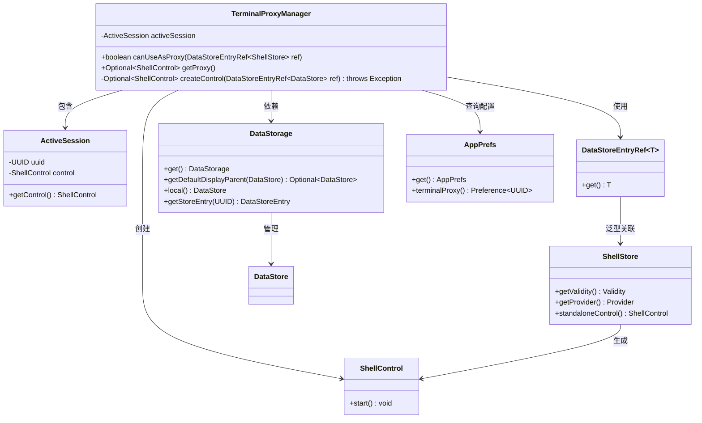
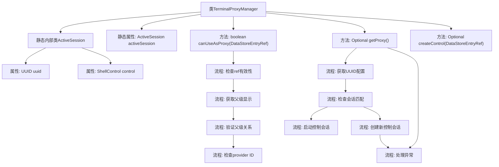

# 基础信息

|      |      |
|------|------|
| 名称 | TerminalProxyManager |
| 编码语言 | .java |
| 代码路径 | xpipe/app/src/main/java/io/xpipe/app/terminal/TerminalProxyManager.java |
| 包名 | io.xpipe.app.terminal |
| 依赖项 | ['io.xpipe.app.ext.ShellStore', 'io.xpipe.app.issue.ErrorEvent', 'io.xpipe.app.prefs.AppPrefs', 'io.xpipe.app.storage.DataStorage', 'io.xpipe.app.storage.DataStoreEntryRef', 'io.xpipe.core.process.ShellControl', 'io.xpipe.core.store.DataStore', 'lombok.Value', 'java.util.Optional', 'java.util.UUID'] |
| 概述说明 | 终端代理管理器类，检查WSL有效性并管理活动会话控制。 |

# 说明

TerminalProxyManager类管理终端代理会话，包含ActiveSession内部类记录UUID和控制对象。canUseAsProxy方法验证ShellStore引用有效性，检查父级显示关系及提供者ID是否为wsl。getProxy方法根据UUID获取代理控制对象，处理会话创建、启动及异常情况。createControl方法验证引用有效性并创建ShellControl实例。整个过程涉及数据存储验证、会话状态管理和错误处理。

# 类列表 Class Summary

| 名称   | 类型  | 说明 |
|-------|------|-------------|
| TerminalProxyManager | class | 终端代理管理器类，检查WSL有效性并管理ShellControl会话。 |

## 类 TerminalProxyManager

|      |      |
|------|------|
| 访问范围 | public |
| 类型 | class |
| 名称 | TerminalProxyManager |
| 说明 | 终端代理管理器类，检查WSL有效性并管理ShellControl会话。 |

### UML类图

类图描述：该图展示了终端代理管理器的核心结构。TerminalProxyManager作为主类，通过ActiveSession管理活动会话，依赖DataStorage进行数据存储操作，使用AppPrefs获取配置。它通过DataStoreEntryRef泛型类访问ShellStore，后者能生成ShellControl实例。整个设计实现了对终端会话的代理管理和控制功能，包含会话有效性检查、代理获取和异常处理等关键逻辑。

### 内部方法调用关系图

该流程图展示了TerminalProxyManager类的核心结构和主要方法调用关系。静态内部类ActiveSession包含会话标识和控制接口，主类通过canUseAsProxy方法验证代理可用性（包括存储有效性、父级显示验证和提供商标识检查），getProxy方法处理代理会话的获取逻辑（包括配置检查、会话匹配和异常处理），createControl方法负责创建新的控制会话。异常处理流程贯穿整个代理获取过程。

### 字段列表 Field List

| 名称  | 类型  | 说明 |
|-------|-------|------|
| activeSession | ActiveSession | 私有静态ActiveSession活动会话实例。 |

### 方法列表 Method List

| 名称  | 类型  | 说明 |
|-------|-------|------|
| canUseAsProxy | boolean | 检查ShellStore引用是否可作为代理：需有效、默认父显示存在且符合层级条件，且提供者ID为"wsl"。 |
| getProxy | Optional<ShellControl> | 获取代理ShellControl，检查UUID匹配后返回控制实例，失败则处理异常并返回空。 |
| createControl | Optional<ShellControl> | 创建ShellControl实例，检查引用有效性后返回控制对象。 |

