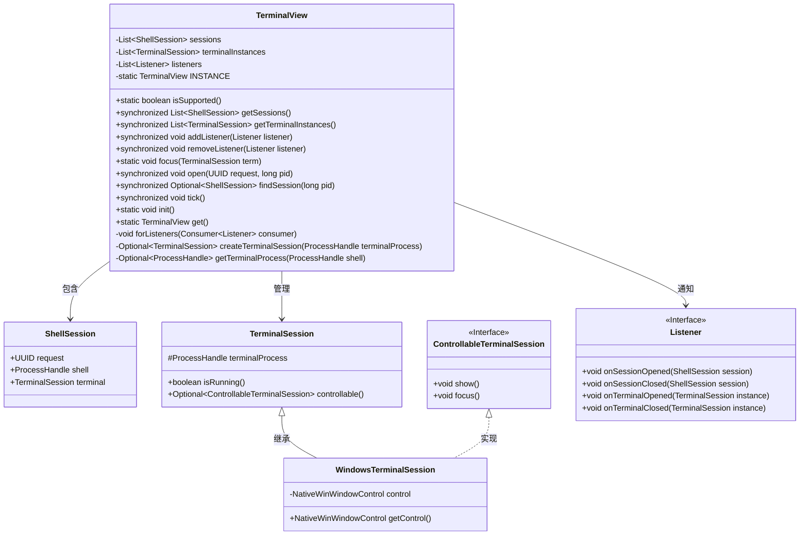
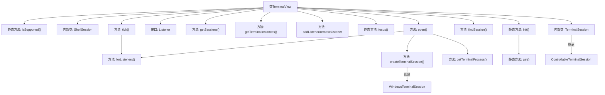

# 基础信息

|      |      |
|------|------|
| 名称 | TerminalView |
| 编码语言 | .java |
| 代码路径 | xpipe/app/src/main/java/io/xpipe/app/terminal/TerminalView.java |
| 包名 | io.xpipe.app.terminal |
| 依赖项 | ['io.xpipe.app.core.window.NativeWinWindowControl', 'io.xpipe.app.issue.TrackEvent', 'io.xpipe.app.prefs.AppPrefs', 'io.xpipe.app.prefs.ExternalApplicationType', 'io.xpipe.app.util.ThreadHelper', 'io.xpipe.core.process.OsType', 'lombok.Getter', 'lombok.Value', 'java.util.ArrayList', 'java.util.List', 'java.util.Optional', 'java.util.UUID', 'java.util.function.Consumer'] |
| 概述说明 | 终端视图管理类，支持Windows系统，包含会话管理、监听器及终端进程控制功能。 |

# 说明

TerminalView类是一个管理终端会话的组件，支持Windows、Linux和MacOS系统。它包含ShellSession和TerminalSession两个核心类，分别表示Shell会话和终端实例。TerminalSession可检查运行状态，并支持可控会话扩展。类通过Listener接口提供会话和终端状态变化的回调通知。主要功能包括：通过open()方法创建会话、定期检查会话存活状态(tick)、支持查找会话(findSession)以及聚焦终端窗口(focus)。初始化时启动后台线程定期轮询会话状态。该类采用单例模式，通过get()获取实例。

# 类列表 Class Summary

| 名称   | 类型  | 说明 |
|-------|------|-------------|
| TerminalView | class | 终端视图类，管理Shell和终端会话，支持Windows，含监听器和会话状态检查。 |

## 类 TerminalView

|      |      |
|------|------|
| 访问范围 | public |
| 类型 | class |
| 名称 | TerminalView |
| 说明 | 终端视图类，管理Shell和终端会话，支持Windows，含监听器和会话状态检查。 |

### UML类图

这段代码实现了一个终端视图管理模块，主要功能包括：检测操作系统支持性、管理Shell会话和终端实例、通过监听器模式实现事件通知、支持跨平台终端控制（Windows/MacOS/Linux）。核心类TerminalView采用单例模式，通过定时tick()方法监控会话状态，使用泛型集合管理会话和终端实例，并通过Optional处理可能为空的值。Windows平台通过NativeWinWindowControl实现特殊控制功能，整体设计体现了良好的扩展性和平台兼容性。

### 内部方法调用关系图

该流程图展示了TerminalView类的核心结构和主要方法调用关系。类包含两个内部类(ShellSession和TerminalSession)和一个监听器接口，提供了终端会话管理的完整功能。主要流程包括初始化实例、打开终端会话、定期检查会话状态、查找会话以及事件通知机制。特别值得注意的是createTerminalSession方法会根据不同操作系统创建特定类型的终端会话实例，而tick方法则负责定期维护会话状态。

### 字段列表 Field List

| 名称  | 类型  | 说明 |
|-------|-------|------|
| listeners = new ArrayList<>() | List<Listener> | 私有监听器列表初始化。 |
| terminalInstances = new ArrayList<>() | List<TerminalSession> | 私有终端会话列表实例初始化。 |
| INSTANCE | TerminalView | 私有静态TerminalView实例变量 |
| sessions = new ArrayList<>() | List<ShellSession> | 私有会话列表初始化 |

### 方法列表 Method List

| 名称  | 类型  | 说明 |
|-------|-------|------|
| init | void | 静态方法初始化终端视图实例，创建线程循环执行tick并休眠500ms。 |
| get | TerminalView | 获取TerminalView单例实例。 |
| forListeners | void | 私有方法遍历监听器列表并执行操作。 |
| open | void | 同步方法open检查进程存活性，追踪shell和终端会话，创建终端实例并通知监听器。 |
| getSessions | List<ShellSession> | 同步方法返回会话列表副本。 |
| getTerminalInstances | List<TerminalSession> | 同步方法返回终端会话列表副本。 |
| getTerminalProcess | Optional<ProcessHandle> | 获取终端进程：根据终端类型偏移量从shell进程向上查找父进程，返回结果。 |
| isSupported | boolean | 检查当前操作系统是否为Windows。 |
| createTerminalSession | Optional<TerminalSession> | 根据操作系统创建终端会话，Linux/Mac直接创建，Windows需检查进程和控制项。 |
| addListener | void | 同步方法，添加监听器到列表。 |
| focus | void | 静态方法`focus`检查终端会话控制权，存在则显示并聚焦；否则在MacOS时聚焦外部应用。 |
| removeListener | void | 同步方法移除监听器 |
| findSession | Optional<ShellSession> | 同步方法通过PID查找Shell会话，未找到则返回空。 |
| tick | void | 同步方法tick()检查并清理失效的Shell和Terminal会话，触发关闭事件。 |

