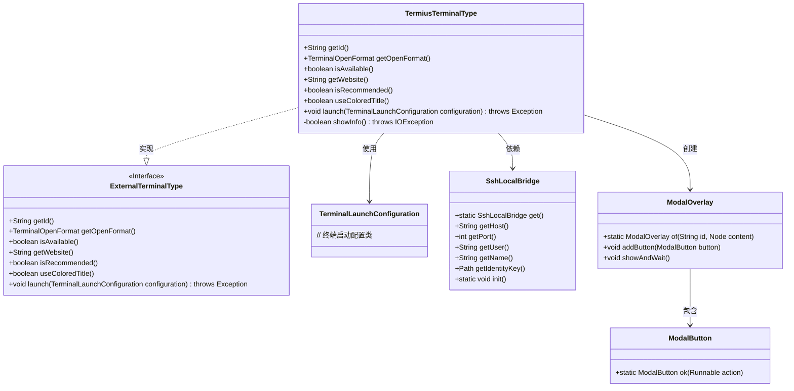
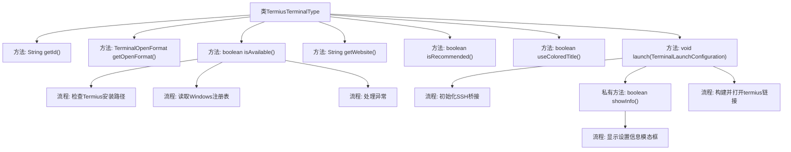
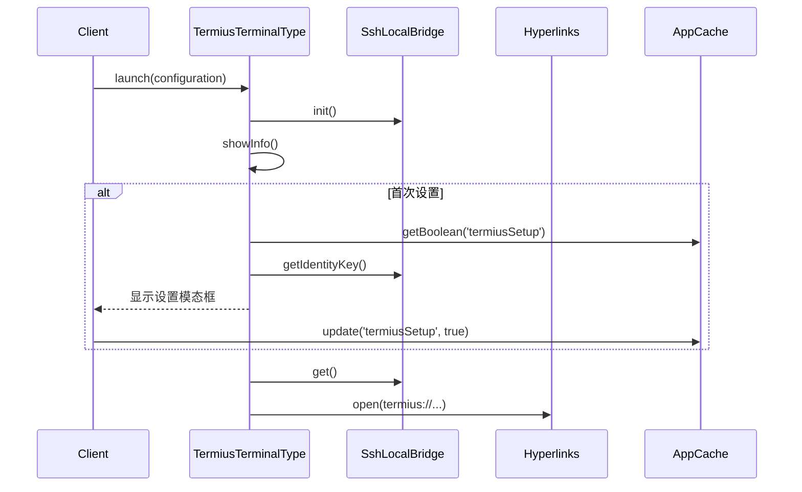

# 基础信息

|      |      |
|------|------|
| 名称 | TermiusTerminalType |
| 编码语言 | .java |
| 代码路径 | xpipe/app/src/main/java/io/xpipe/app/terminal/TermiusTerminalType.java |
| 包名 | io.xpipe.app.terminal |
| 依赖项 | ['io.xpipe.app.comp.base.MarkdownComp', 'io.xpipe.app.comp.base.ModalButton', 'io.xpipe.app.comp.base.ModalOverlay', 'io.xpipe.app.core.AppCache', 'io.xpipe.app.core.AppI18n', 'io.xpipe.app.issue.ErrorEvent', 'io.xpipe.app.util', 'io.xpipe.core.process.OsType', 'java.io.IOException', 'java.net.URLEncoder', 'java.nio.charset.StandardCharsets', 'java.nio.file.Files', 'java.nio.file.Path'] |
| 概述说明 | Termius终端类实现，检查系统安装状态并支持SSH启动。 |

# 说明

该代码定义了一个TermiusTerminalType类，实现了ExternalTerminalType接口，用于支持Termius终端应用。主要功能包括获取唯一标识符、确定打开格式为标签页、检查Termius在不同操作系统上的安装状态、提供官网链接、标记为非推荐终端、启用彩色标题。启动时会初始化SSH本地桥接，通过特定URL格式打开Termius应用并传递主机、端口、用户名等连接参数。首次使用时显示包含SSH密钥信息的设置向导，确认后缓存设置状态避免重复提示。

# 类列表 Class Summary

| 名称   | 类型  | 说明 |
|-------|------|-------------|
| TermiusTerminalType | class | Termius终端类，检查系统路径存在性，支持标签页格式，通过URL启动SSH连接。 |

## 类 TermiusTerminalType

|      |      |
|------|------|
| 访问范围 | public |
| 类型 | class |
| 名称 | TermiusTerminalType |
| 说明 | Termius终端类，检查系统路径存在性，支持标签页格式，通过URL启动SSH连接。 |

### UML类图

类图描述：
该图展示了TermiusTerminalType类实现ExternalTerminalType接口的结构，包含7个主要类。TermiusTerminalType通过SshLocalBridge处理SSH连接，使用ModalOverlay显示交互界面，并依赖TerminalLaunchConfiguration进行终端配置。图中清晰体现了接口实现关系（TermiusTerminalType → ExternalTerminalType）、类依赖关系（如与SshLocalBridge的交互）和组合关系（ModalOverlay包含ModalButton）。

### 内部方法调用关系图

流程图描述：该流程图展示了TermiusTerminalType类的核心方法调用关系，重点描述了终端类型检测、SSH桥接初始化和用户界面交互流程。isAvailable()方法包含多平台路径检查逻辑，launch()方法通过showInfo()控制首次使用时的信息展示，最终构建termius协议链接实现终端连接。时序图则详细呈现了配置加载、SSH初始化和用户交互的完整过程。

### 字段列表 Field List

| 名称  | 类型  | 说明 |
|-------|-------|------|

### 方法列表 Method List

| 名称  | 类型  | 说明 |
|-------|-------|------|
| getOpenFormat | TerminalOpenFormat | 重写方法返回标签页终端打开格式。 |
| isRecommended | boolean | 方法重写，返回不推荐。 |
| getId | String | 重写getId方法，返回字符串"app.termius"。 |
| getWebsite | String | 重写getWebsite方法，返回Termius官网URL。 |
| isAvailable | boolean | 检查Termius应用是否安装：Linux查/opt/Termius，Mac查/Applications，Windows查注册表。异常返回false。 |
| useColoredTitle | boolean | 重写方法，返回真值启用彩色标题。 |
| launch | void | 启动SSH本地桥接并打开Termius链接。 |
| showInfo | boolean | 检查是否显示设置信息，若未设置则展示SSH密钥文档并更新缓存状态。 |

