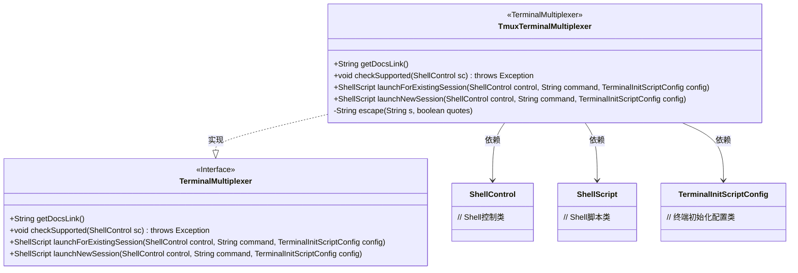
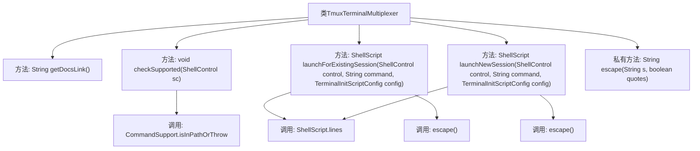

# 基础信息

|      |      |
|------|------|
| 名称 | TmuxTerminalMultiplexer |
| 编码语言 | .java |
| 代码路径 | xpipe/app/src/main/java/io/xpipe/app/terminal/TmuxTerminalMultiplexer.java |
| 包名 | io.xpipe.app.terminal |
| 依赖项 | ['io.xpipe.app.util.CommandSupport', 'io.xpipe.core.process.ShellControl', 'io.xpipe.core.process.ShellScript', 'io.xpipe.core.process.TerminalInitScriptConfig', 'com.fasterxml.jackson.annotation.JsonTypeName', 'lombok.Builder', 'lombok.extern.jackson.Jacksonized'] |
| 概述说明 | Tmux终端复用类，含启动会话、检查支持及文档链接功能。 |

# 说明

这是一个名为TmuxTerminalMultiplexer的Java类，实现了TerminalMultiplexer接口，用于管理tmux终端复用器的操作。类中包含四个主要方法：getDocsLink返回tmux使用文档链接；checkSupported检查系统是否支持tmux；launchForExistingSession为现有会话创建新窗口；launchNewSession创建新tmux会话并执行命令。还包含一个私有方法escape用于字符串转义处理。

# 类列表 Class Summary

| 名称   | 类型  | 说明 |
|-------|------|-------------|
| TmuxTerminalMultiplexer | class | Tmux终端复用器实现，支持启动新会话和现有会话，包含文档链接和命令检查。 |

## 类 TmuxTerminalMultiplexer

|      |      |
|------|------|
| 访问范围 | @Builder;@Jacksonized;@JsonTypeName("tmux");public |
| 类型 | class |
| 名称 | TmuxTerminalMultiplexer |
| 说明 | Tmux终端复用器实现，支持启动新会话和现有会话，包含文档链接和命令检查。 |

### UML类图

这段代码展示了一个Tmux终端复用器的实现类TmuxTerminalMultiplexer，它实现了TerminalMultiplexer接口。该类提供了检查tmux支持、启动新会话和附加到现有会话的功能，包含字符串转义等辅助方法。通过ShellControl和ShellScript等依赖类，实现了与tmux进程的交互和脚本生成功能，主要用于管理tmux会话和窗口。

### 内部方法调用关系图

这段代码流程图展示了TmuxTerminalMultiplexer类的核心结构，该类实现了终端复用器功能。主要包含获取文档链接、检查支持性、启动现有会话和新会话的方法，以及字符串转义辅助方法。关键流程包括：通过CommandSupport验证tmux命令可用性，使用ShellScript构建tmux命令脚本，并通过escape方法处理特殊字符转义。类方法间存在清晰的调用关系，特别是launch方法都会依赖escape进行参数安全处理。

### 字段列表 Field List

| 名称  | 类型  | 说明 |
|-------|-------|------|

### 方法列表 Method List

| 名称  | 类型  | 说明 |
|-------|-------|------|
| checkSupported | void | 检查系统是否支持tmux命令。 |
| getDocsLink | String | 重写getDocsLink方法，返回tmux入门指南链接。 |
| launchNewSession | ShellScript | 创建tmux会话，设置窗口名，执行命令并附加会话。 |
| launchForExistingSession | ShellScript | 重写方法，用tmux新建窗口执行命令。 |
| escape | String | Java方法：转义字符串中的反斜杠和引号。 |

