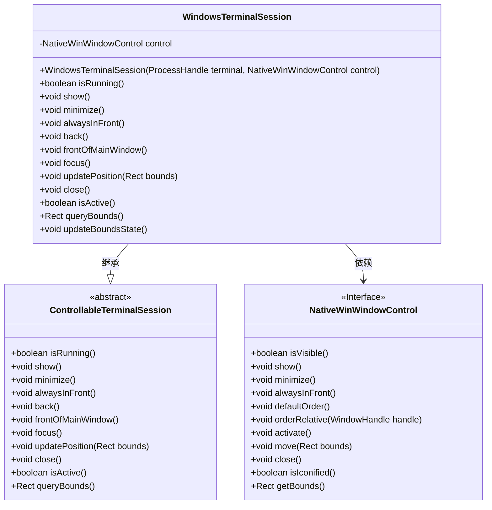

# 基础信息

|      |      |
|------|------|
| 名称 | WindowsTerminalSession |
| 编码语言 | .java |
| 代码路径 | xpipe/app/src/main/java/io/xpipe/app/terminal/WindowsTerminalSession.java |
| 包名 | io.xpipe.app.terminal |
| 依赖项 | ['io.xpipe.app.core.window.NativeWinWindowControl', 'io.xpipe.app.util.Rect', 'lombok.AccessLevel', 'lombok.Getter', 'lombok.experimental.FieldDefaults'] |
| 概述说明 | Windows终端会话类，封装窗口控制操作如显示、最小化、置顶等。 |

# 说明

WindowsTerminalSession是一个继承自ControllableTerminalSession的final类，用于控制Windows终端会话。它包含一个NativeWinWindowControl对象，通过构造函数初始化。类提供了多种窗口操作方法，如显示、最小化、置顶、返回默认位置、主窗口前显示、获取焦点、更新位置、关闭等。还包含状态检查方法，如判断是否运行、是否激活、获取窗口边界等。updateBoundsState方法用于更新窗口边界状态，处理窗口最小化或不可见情况，并跟踪自定义边界变化。所有字段均为私有且final，通过getter方法访问。

# 类列表 Class Summary

| 名称   | 类型  | 说明 |
|-------|------|-------------|
| WindowsTerminalSession | class | Windows终端会话类，封装窗口控制操作如显示、最小化、置顶等。 |

## 类 WindowsTerminalSession

|      |      |
|------|------|
| 访问范围 | @FieldDefaults(makeFinal = true, level = AccessLevel.PRIVATE);@Getter;public final |
| 类型 | class |
| 名称 | WindowsTerminalSession |
| 说明 | Windows终端会话类，封装窗口控制操作如显示、最小化、置顶等。 |

### UML类图

这段类图展示了WindowsTerminalSession继承自抽象类ControllableTerminalSession，并依赖于NativeWinWindowControl接口的关系。WindowsTerminalSession实现了终端会话控制功能，包括窗口显示、最小化、置顶、位置更新等操作，同时通过NativeWinWindowControl接口与底层Windows窗口系统交互。类图清晰地呈现了继承关系和依赖关系，体现了面向对象设计中"组合优于继承"的原则。

### 内部方法调用关系图

```mermaid
graph TD
    A["类WindowsTerminalSession"]
    B["属性: NativeWinWindowControl control"]
    C["构造方法: WindowsTerminalSession(ProcessHandle, NativeWinWindowControl)"]
    D["方法: boolean isRunning()"]
    E["方法: void show()"]
    F["方法: void minimize()"]
    G["方法: void alwaysInFront()"]
    H["方法: void back()"]
    I["方法: void frontOfMainWindow()"]
    J["方法: void focus()"]
    K["方法: void updatePosition(Rect)"]
    L["方法: void close()"]
    M["方法: boolean isActive()"]
    N["方法: Rect queryBounds()"]
    O["方法: void updateBoundsState()"]

    A --> B
    A --> C
    A --> D
    A --> E
    A --> F
    A --> G
    A --> H
    A --> I
    A --> J
    A --> K
    A --> L
    A --> M
    A --> N
    A --> O
```

这段代码定义了一个WindowsTerminalSession类，继承自ControllableTerminalSession，主要用于控制Windows终端窗口的行为。类中包含多个方法用于管理窗口状态，如显示/隐藏窗口、最小化、置顶、调整位置、获取窗口边界等。核心功能通过NativeWinWindowControl对象实现，所有方法都围绕该控制对象展开操作。特别值得注意的是updateBoundsState方法，它会检测窗口位置变化并更新状态标记，体现了对窗口状态变化的精细控制。

### 字段列表 Field List

| 名称  | 类型  | 说明 |
|-------|-------|------|
| control | NativeWinWindowControl | 声明原生窗口控件变量。 |

### 方法列表 Method List

| 名称  | 类型  | 说明 |
|-------|-------|------|
| focus | void | 重写focus方法，调用control.activate激活控件。 |
| frontOfMainWindow | void | 重写方法，调用默认顺序并设置主窗口相对顺序。 |
| alwaysInFront | void | 重写方法，调用control的alwaysInFront保持窗口置顶。 |
| minimize | void | 重写方法，调用control的minimize功能。 |
| show | void | 重写show方法，调用control的show实现。 |
| isRunning | boolean | 检查父类运行状态及控件可见性。 |
| back | void | 重写back方法，重置窗口顺序并置顶主窗口。 |
| updatePosition | void | 重写方法，更新控件位置并重置边界状态。 |
| close | void | 重写close方法，调用control.close()关闭资源。 |
| isActive | boolean | 重写方法，返回控件未最小化状态。 |
| queryBounds | Rect | 重写方法返回控件边界矩形。 |
| updateBoundsState | void | 更新窗口边界状态：检查可见性，获取边界，若变化则标记自定义边界。 |

