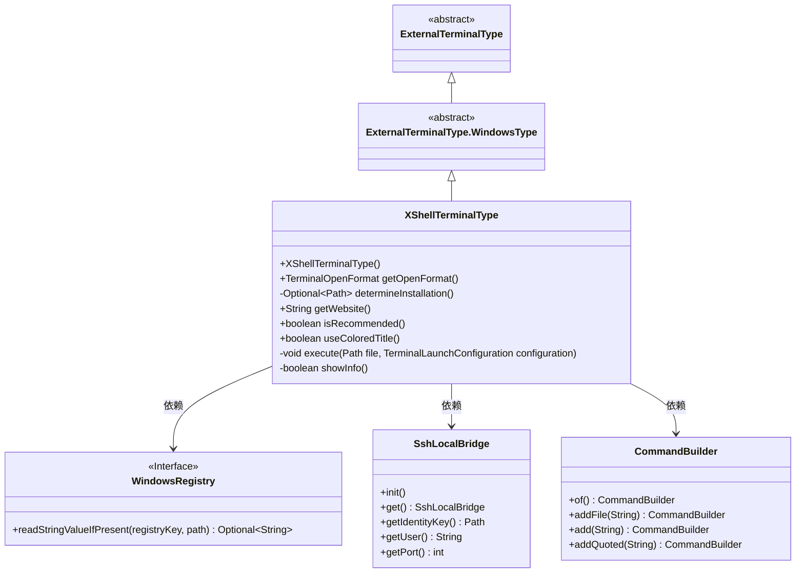
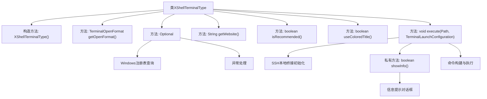

# 基础信息

|      |      |
|------|------|
| 名称 | XShellTerminalType |
| 编码语言 | .java |
| 代码路径 | xpipe/app/src/main/java/io/xpipe/app/terminal/XShellTerminalType.java |
| 包名 | io.xpipe.app.terminal |
| 依赖项 | ['io.xpipe.app.comp.base.MarkdownComp', 'io.xpipe.app.comp.base.ModalButton', 'io.xpipe.app.comp.base.ModalOverlay', 'io.xpipe.app.core.AppCache', 'io.xpipe.app.core.AppI18n', 'io.xpipe.app.issue.ErrorEvent', 'io.xpipe.app.util.LocalShell', 'io.xpipe.app.util.SshLocalBridge', 'io.xpipe.app.util.WindowsRegistry', 'io.xpipe.core.process.CommandBuilder', 'java.nio.file.Path', 'java.util.Optional'] |
| 概述说明 | XShell终端类，继承WindowsType，支持标签页，检查注册表安装路径，执行SSH连接命令。 |

# 说明

该代码定义了一个名为XShellTerminalType的类，继承自ExternalTerminalType.WindowsType，用于配置Xshell终端。类中设置了终端名称、打开格式为标签页，并通过Windows注册表检查Xshell安装路径。提供了官网链接，标记为非推荐终端且不使用彩色标题。执行方法会初始化SSH本地桥接，检查用户设置后构建并执行连接命令，包含URL、端口和密钥信息。首次使用时显示包含密钥详细信息的模态对话框，用户确认后缓存设置状态。

# 类列表 Class Summary

| 名称   | 类型  | 说明 |
|-------|------|-------------|
| XShellTerminalType | class | XShell终端类，继承WindowsType，支持标签页，检查注册表安装路径，执行SSH连接。 |

## 类 XShellTerminalType

|      |      |
|------|------|
| 访问范围 | public |
| 类型 | class |
| 名称 | XShellTerminalType |
| 说明 | XShell终端类，继承WindowsType，支持标签页，检查注册表安装路径，执行SSH连接。 |

### UML类图

这段代码描述了一个XShell终端类型的实现类XShellTerminalType，它继承自ExternalTerminalType.WindowsType抽象类。该类主要负责与XShell终端软件的交互，包括检测软件安装路径、执行终端命令、显示设置信息等功能。通过WindowsRegistry接口读取注册表信息，依赖SshLocalBridge处理SSH连接，使用CommandBuilder构建命令行参数。类中实现了抽象父类要求的核心方法，并提供了终端类型特有的属性和行为，如是否推荐使用、是否使用彩色标题等配置选项。

### 内部方法调用关系图

流程图描述了XShellTerminalType类的完整结构和工作流程。该类继承自ExternalTerminalType.WindowsType，主要功能包括通过Windows注册表检测Xshell安装路径、配置终端打开格式、执行SSH连接命令等核心操作。关键路径包含注册表查询异常处理、SSH本地桥接初始化、交互式信息提示对话框显示，以及带参数的命令行构建过程。私有方法showInfo()实现了首次使用时的引导提示功能，通过模态对话框展示SSH密钥信息并更新应用缓存状态。

### 字段列表 Field List

| 名称  | 类型  | 说明 |
|-------|-------|------|

### 方法列表 Method List

| 名称  | 类型  | 说明 |
|-------|-------|------|
| determineInstallation | Optional<Path> | 检查Windows注册表获取Xshell.exe安装路径，失败返回空。 |
| getWebsite | String | 重写getWebsite方法，返回Xshell官网链接。 |
| useColoredTitle | boolean | 覆盖方法，返回false禁用彩色标题。 |
| getOpenFormat | TerminalOpenFormat | 重写getOpenFormat方法，返回TABBED格式。 |
| isRecommended | boolean | 方法重写，返回false表示不推荐。 |
| execute | void | 覆盖方法执行SSH本地桥接操作，检查信息后通过本地Shell执行命令。 |
| showInfo | boolean | 检查Xshell设置状态，未设置则显示配置弹窗，确认后更新缓存状态。 |

