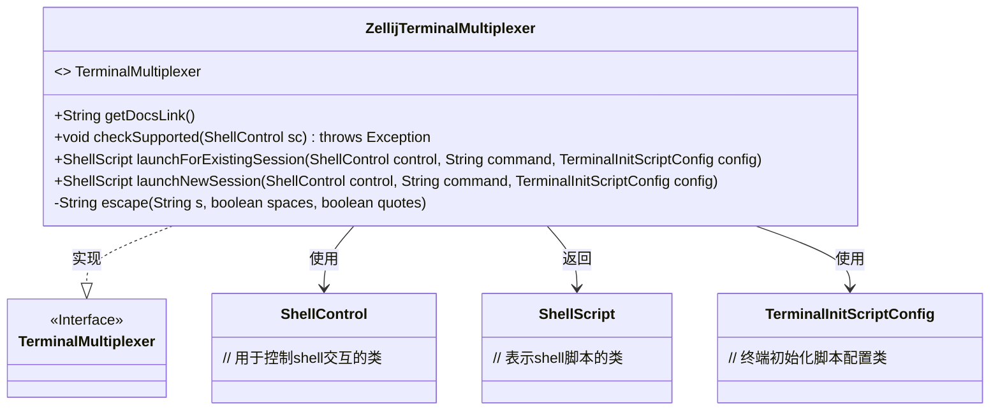
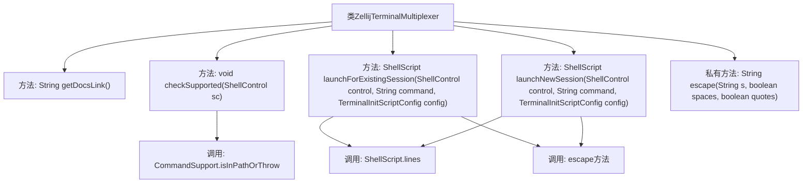

# 基础信息

|      |      |
|------|------|
| 名称 | ZellijTerminalMultiplexer |
| 编码语言 | .java |
| 代码路径 | xpipe/app/src/main/java/io/xpipe/app/terminal/ZellijTerminalMultiplexer.java |
| 包名 | io.xpipe.app.terminal |
| 依赖项 | ['io.xpipe.app.util.CommandSupport', 'io.xpipe.core.process.ShellControl', 'io.xpipe.core.process.ShellScript', 'io.xpipe.core.process.TerminalInitScriptConfig', 'com.fasterxml.jackson.annotation.JsonTypeName', 'lombok.Builder', 'lombok.extern.jackson.Jacksonized'] |
| 概述说明 | Zellij终端复用器实现，支持启动新会话和附加现有会话。 |

# 说明

该内容描述了一个名为ZellijTerminalMultiplexer的Java类，实现了TerminalMultiplexer接口，用于与Zellij终端复用器交互。类中包含获取文档链接、检查支持性、启动现有会话和新会话的方法。方法通过生成Shell脚本来执行Zellij命令，包括附加会话、创建标签页、写入命令等操作。还包含一个辅助方法用于字符串转义处理特殊字符。

# 类列表 Class Summary

| 名称   | 类型  | 说明 |
|-------|------|-------------|
| ZellijTerminalMultiplexer | class | Zellij终端复用器实现，支持启动新会话和附加现有会话，包含命令转义功能。 |

## 类 ZellijTerminalMultiplexer

|      |      |
|------|------|
| 访问范围 | @Builder;@Jacksonized;@JsonTypeName("zellij");public |
| 类型 | class |
| 名称 | ZellijTerminalMultiplexer |
| 说明 | Zellij终端复用器实现，支持启动新会话和附加现有会话，包含命令转义功能。 |

### UML类图

该类图展示了ZellijTerminalMultiplexer实现TerminalMultiplexer接口的结构，包含4个公共方法和1个私有方法。主要功能是通过zellij终端复用器管理会话，包括检查支持性、启动新会话和附加现有会话。依赖ShellControl执行命令，返回ShellScript对象，并使用TerminalInitScriptConfig配置会话参数。私有方法escape用于字符串转义处理。

### 内部方法调用关系图

这段代码流程图展示了ZellijTerminalMultiplexer类的结构和方法调用关系。该类实现了终端多路复用功能，主要包含获取文档链接、检查支持性、启动现有会话和新会话等方法。其中escape私有方法被多个公共方法调用，用于字符串转义处理。流程图清晰地呈现了类方法间的层级关系和调用链，特别是ShellScript.lines和escape方法的复用情况，以及外部工具CommandSupport的调用点。

### 字段列表 Field List

| 名称  | 类型  | 说明 |
|-------|-------|------|

### 方法列表 Method List

| 名称  | 类型  | 说明 |
|-------|-------|------|
| launchForExistingSession | ShellScript | 覆盖方法，使用Zellij创建后台会话并执行命令。 |
| getDocsLink | String | 重写getDocsLink方法，返回zellij.dev官网链接。 |
| checkSupported | void | 检查系统是否支持zellij命令。 |
| escape | String | Java方法：转义字符串中的反斜杠、引号和空格。 |
| launchNewSession | ShellScript | Java方法：使用Zellij创建后台终端会话并执行命令。 |

