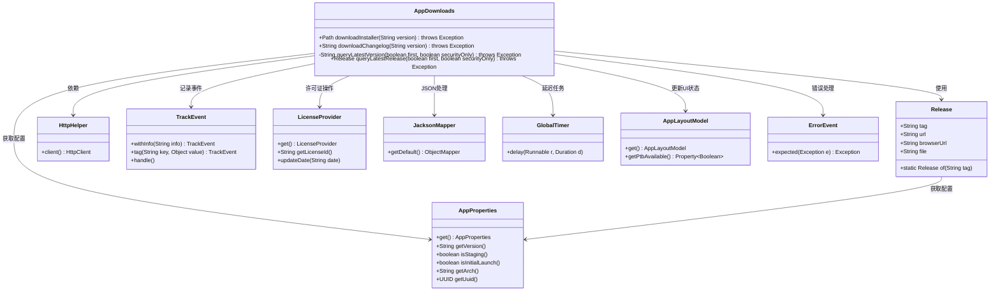

# 基础信息

|      |      |
|------|------|
| 名称 | AppDownloads |
| 编码语言 | .java |
| 代码路径 | xpipe/app/src/main/java/io/xpipe/app/update/AppDownloads.java |
| 包名 | io.xpipe.app.update |
| 依赖项 | ['io.xpipe.app.core.AppDistributionType', 'io.xpipe.app.core.AppLayoutModel', 'io.xpipe.app.core.AppProperties', 'io.xpipe.app.issue.ErrorEvent', 'io.xpipe.app.issue.TrackEvent', 'io.xpipe.app.util', 'io.xpipe.core.process.OsType', 'io.xpipe.core.util.JacksonMapper', 'com.fasterxml.jackson.databind.node.JsonNodeFactory', 'lombok.Value', 'org.apache.commons.io.FileUtils', 'java.io.IOException', 'java.net.URI', 'java.net.http.HttpRequest', 'java.net.http.HttpResponse', 'java.nio.charset.StandardCharsets', 'java.nio.file.Files', 'java.nio.file.Path', 'java.time.Duration'] |
| 概述说明 | 下载安装程序和变更日志，查询最新版本信息。 |

# 说明

该代码定义了一个AppDownloads类，主要用于处理应用程序下载相关功能。包含四个核心方法：downloadInstaller用于下载指定版本的安装程序文件，downloadChangelog获取版本更新日志，queryLatestVersion查询最新版本信息，queryLatestRelease获取最新发布版本。Release内部类封装了版本发布信息，包含标签、下载URL、浏览器URL和文件名。代码通过HTTP请求与API交互，处理响应数据，并包含错误处理和事件跟踪功能。所有方法都支持异常抛出，确保错误可被捕获处理。

# 类列表 Class Summary

| 名称   | 类型  | 说明 |
|-------|------|-------------|
| AppDownloads | class | Java类实现应用下载、更新日志获取及版本查询功能。 |

## 类 AppDownloads

|      |      |
|------|------|
| 访问范围 | public |
| 类型 | class |
| 名称 | AppDownloads |
| 说明 | Java类实现应用下载、更新日志获取及版本查询功能。 |

### UML类图

这段代码描述了一个应用下载管理器，主要功能包括下载安装程序、获取变更日志和查询最新版本。核心类AppDownloads通过HTTP请求与远程API交互，使用Release类封装版本信息，并依赖多个辅助类处理配置、许可证、JSON解析等任务。系统采用分层设计，业务逻辑与基础设施分离，通过事件跟踪和错误处理机制确保稳定性。代码展示了完善的版本控制、跨平台支持和异步处理能力。

### 内部方法调用关系图

```mermaid
graph TD
    A["类AppDownloads"]
    B["方法: downloadInstaller(String version)"]
    C["方法: downloadChangelog(String version)"]
    D["方法: queryLatestVersion(boolean first, boolean securityOnly)"]
    E["方法: queryLatestRelease(boolean first, boolean securityOnly)"]
    F["内部类: Release"]
    G["静态方法: Release.of(String tag)"]

    A --> B
    A --> C
    A --> D
    A --> E
    A --> F
    F --> G

    B --> B1["Release.of(version)"]
    B --> B2["构建HTTP请求"]
    B --> B3["发送请求获取响应"]
    B --> B4["检查状态码"]
    B --> B5["写入临时文件"]
    B --> B6["记录下载事件"]

    C --> C1["构建API请求URL"]
    C --> C2["发送请求获取响应"]
    C --> C3["检查状态码"]
    C --> C4["解析JSON获取changelog"]

    D --> D1["构建版本查询请求体"]
    D --> D2["发送POST请求"]
    D --> D3["检查状态码"]
    D --> D4["更新许可证日期"]
    D --> D5["解析JSON获取版本号"]
    D --> D6["处理PTB可用性"]

    E --> E1["调用queryLatestVersion"]
    E --> E2["通过Release.of创建Release对象"]
    E --> E3["异常处理"]

    G --> G1["确定平台类型"]
    G --> G2["构建下载URL"]
    G --> G3["构建浏览器URL"]
    G --> G4["创建Release对象"]
```

这段代码实现了一个应用程序下载管理器，主要功能包括下载安装程序、获取变更日志、查询最新版本信息等。流程图展示了类结构和方法调用关系，其中核心是HTTP请求处理和JSON数据解析。downloadInstaller方法负责下载安装包并记录事件，downloadChangelog获取版本变更信息，queryLatestVersion通过API查询最新版本，queryLatestRelease则封装版本查询过程。内部类Release用于构建下载资源信息。整个流程涉及网络请求、错误处理、数据解析和事件跟踪等多个环节。

### 字段列表 Field List

| 名称  | 类型  | 说明 |
|-------|-------|------|

### 方法列表 Method List

| 名称  | 类型  | 说明 |
|-------|-------|------|
| queryLatestRelease | Release | 查询最新版本并返回Release对象，异常时抛出ErrorEvent。 |
| downloadInstaller | Path | 静态方法下载安装包，处理HTTP请求，保存到临时文件并记录事件。 |
| downloadChangelog | String | 下载指定版本更新日志的静态方法，通过HTTP请求获取并返回变更内容。 |
| queryLatestVersion | String | 查询最新版本信息，包括安全更新、系统参数，并处理响应数据。 |

