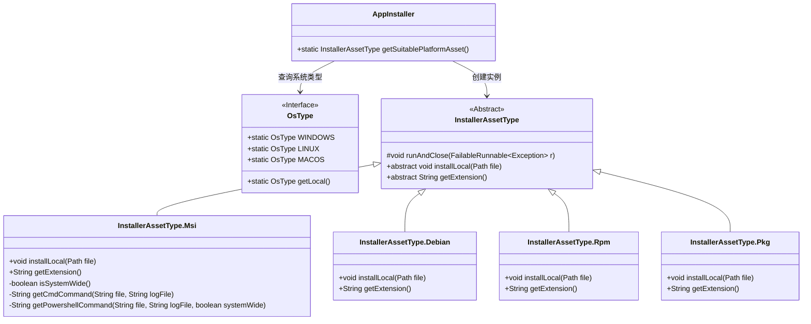
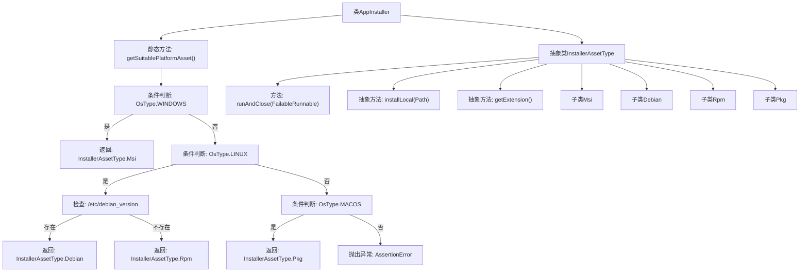
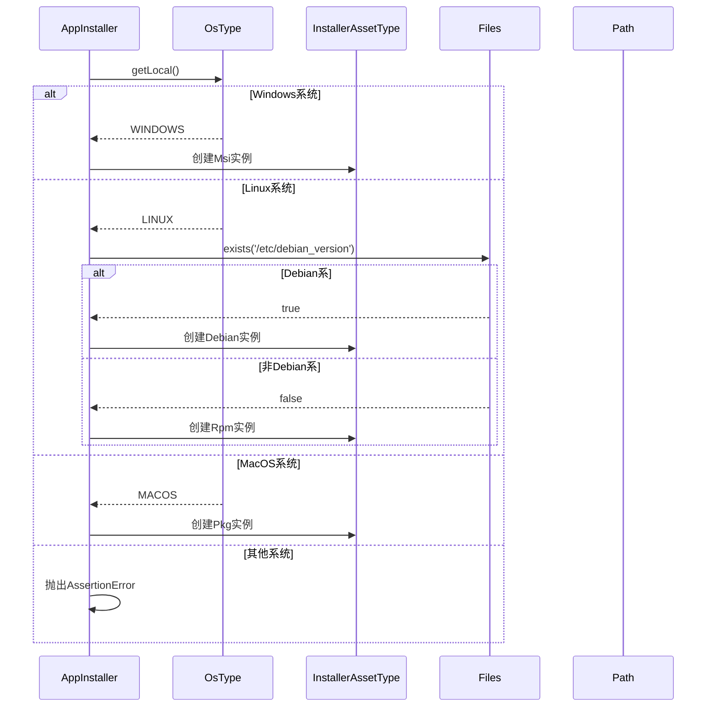

# 基础信息

|      |      |
|------|------|
| 名称 | AppInstaller |
| 编码语言 | .java |
| 代码路径 | xpipe/app/src/main/java/io/xpipe/app/update/AppInstaller.java |
| 包名 | io.xpipe.app.update |
| 依赖项 | ['io.xpipe.app.core.AppLogs', 'io.xpipe.app.core.AppRestart', 'io.xpipe.app.core.mode.OperationMode', 'io.xpipe.app.ext.ProcessControlProvider', 'io.xpipe.app.terminal.TerminalLauncher', 'io.xpipe.app.util.LocalShell', 'io.xpipe.app.util.ScriptHelper', 'io.xpipe.app.util.ThreadHelper', 'io.xpipe.core.process.OsType', 'io.xpipe.core.process.ShellDialects', 'io.xpipe.core.process.ShellScript', 'io.xpipe.core.store.FileNames', 'io.xpipe.core.util.FailableRunnable', 'io.xpipe.core.util.XPipeInstallation', 'com.fasterxml.jackson.annotation.JsonSubTypes', 'com.fasterxml.jackson.annotation.JsonTypeInfo', 'com.fasterxml.jackson.annotation.JsonTypeName', 'lombok.Getter', 'java.nio.file.Files', 'java.nio.file.Path'] |
| 概述说明 | 根据操作系统选择安装包类型并执行安装。 |

# 说明

该内容描述了一个跨平台软件安装器类AppInstaller，其核心功能是根据操作系统类型选择对应的安装包格式并执行安装。主要包含以下关键点：1. 通过getSuitablePlatformAsset方法自动检测当前操作系统（Windows/Linux/macOS）并返回对应安装包类型（MSI/Debian/RPM/PKG）；2. 抽象类InstallerAssetType定义了安装器基础结构，包含运行关闭处理、本地安装方法和扩展名获取；3. 具体实现了四种安装器类型：Windows使用MSI安装包通过命令行执行安装，Linux区分Debian和RPM包分别使用apt和rpm命令，macOS使用pkg格式通过installer命令安装；4. 所有安装过程都包含错误处理和日志记录，安装完成后会执行重启操作。

# 类列表 Class Summary

| 名称   | 类型  | 说明 |
|-------|------|-------------|
| AppInstaller | class | 跨平台安装器类，支持Windows、Linux、MacOS的MSI、Debian、RPM、PKG格式安装。 |

## 类 AppInstaller

|      |      |
|------|------|
| 访问范围 | public |
| 类型 | class |
| 名称 | AppInstaller |
| 说明 | 跨平台安装器类，支持Windows、Linux、MacOS的MSI、Debian、RPM、PKG格式安装。 |

### UML类图

这段代码展示了一个跨平台应用安装器系统，核心是`AppInstaller`类通过检测操作系统类型返回对应的安装包类型。系统包含一个抽象基类`InstallerAssetType`和四个具体实现类（MSI、Debian、RPM、PKG），每个实现类都提供了特定平台的安装逻辑和文件扩展名。类图清晰地展示了继承关系和依赖关系，其中`AppInstaller`依赖于`OsType`接口来获取系统信息，并根据不同系统类型创建相应的安装器实现类。

### 内部方法调用关系图

这段代码实现了一个跨平台应用安装器选择系统，根据操作系统类型返回对应的安装包类型。流程图展示了类结构和主要方法调用关系，时序图描述了getSuitablePlatformAsset()方法的执行流程。核心逻辑是通过检测操作系统类型来决定返回MSI(Windows)、DEB(Debian Linux)、RPM(其他Linux)或PKG(MacOS)安装器类型，每种类型都实现了特定的安装逻辑和文件扩展名获取方法。代码结构清晰，使用了工厂模式和多态来处理不同平台的安装需求。

### 字段列表 Field List

| 名称  | 类型  | 说明 |
|-------|-------|------|

### 方法列表 Method List

| 名称  | 类型  | 说明 |
|-------|-------|------|
| getSuitablePlatformAsset | InstallerAssetType | 根据操作系统返回对应安装包类型：Windows用MSI，Linux分Debian/RPM，macOS用PKG。 |

