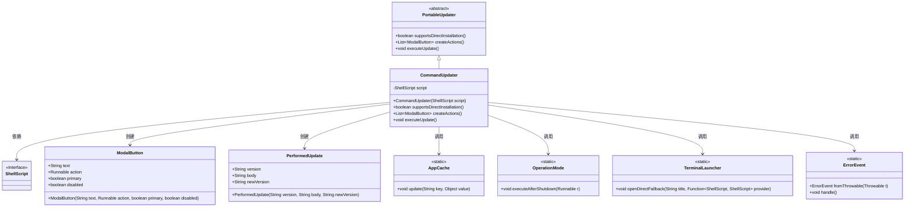
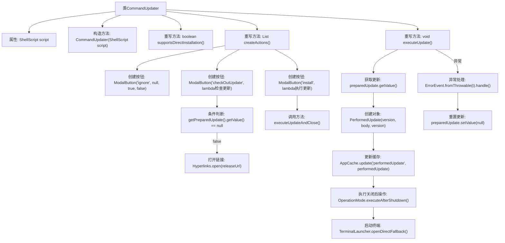

# 基础信息

|      |      |
|------|------|
| 名称 | CommandUpdater |
| 编码语言 | .java |
| 代码路径 | xpipe/app/src/main/java/io/xpipe/app/update/CommandUpdater.java |
| 包名 | io.xpipe.app.update |
| 依赖项 | ['io.xpipe.app.comp.base.ModalButton', 'io.xpipe.app.core.AppCache', 'io.xpipe.app.core.mode.OperationMode', 'io.xpipe.app.issue.ErrorEvent', 'io.xpipe.app.terminal.TerminalLauncher', 'io.xpipe.app.util.Hyperlinks', 'io.xpipe.core.process.ShellScript', 'java.util.ArrayList', 'java.util.List'] |
| 概述说明 | CommandUpdater类扩展PortableUpdater，支持直接安装，提供忽略、检查更新和安装按钮，执行更新后运行脚本。 |

# 说明

这是一个名为CommandUpdater的类，继承自PortableUpdater。它包含一个ShellScript类型的私有字段script，并通过构造函数初始化。该类重写了supportsDirectInstallation方法，返回true表示支持直接安装。createActions方法创建了三个模态按钮：忽略、检查更新和安装。检查更新按钮会打开预准备更新的发布URL，安装按钮会执行更新并关闭。executeUpdate方法执行更新操作，包括更新应用缓存和在关闭后通过终端启动器运行脚本。如果发生错误，会处理异常并重置预准备更新。

# 类列表 Class Summary

| 名称   | 类型  | 说明 |
|-------|------|-------------|
| CommandUpdater | class | CommandUpdater类扩展PortableUpdater，支持直接安装，提供忽略、检查更新和安装按钮，执行更新后重启应用。 |

## 类 CommandUpdater

|      |      |
|------|------|
| 访问范围 | public |
| 类型 | class |
| 名称 | CommandUpdater |
| 说明 | CommandUpdater类扩展PortableUpdater，支持直接安装，提供忽略、检查更新和安装按钮，执行更新后重启应用。 |

### UML类图

类图描述：该图展示了CommandUpdater类继承自抽象类PortableUpdater，实现了软件更新功能的核心结构。CommandUpdater通过ShellScript接口执行脚本，创建包含忽略、检查、安装等操作的ModalButton按钮列表。在执行更新时，会创建PerformedUpdate记录，调用AppCache进行缓存，通过OperationMode安排关机后操作，使用TerminalLauncher打开终端，并利用ErrorEvent处理异常。整个设计体现了更新流程的完整生命周期管理。

### 内部方法调用关系图

该流程图展示了CommandUpdater类的完整执行逻辑，从构造方法初始化到三个核心重写方法的调用链。重点描述了createActions()方法中三个模态按钮的创建过程，特别是带条件判断的'checkOutUpdate'按钮逻辑；以及executeUpdate()方法的更新执行流程，包括正常情况下的缓存更新、关闭后操作，和异常处理路径。类继承自PortableUpdater并实现了直接安装支持，通过ShellScript执行终端更新操作。

### 字段列表 Field List

| 名称  | 类型  | 说明 |
|-------|-------|------|
| script | ShellScript | 私有ShellScript脚本对象。 |

### 方法列表 Method List

| 名称  | 类型  | 说明 |
|-------|-------|------|
| supportsDirectInstallation | boolean | 支持直接安装，返回值为真。 |
| createActions | List<ModalButton> | 创建三个模态按钮：忽略、检查更新和安装。检查更新需验证更新内容，安装执行更新并关闭。 |
| executeUpdate | void | 重写executeUpdate方法，处理更新操作并缓存结果，出错时清空更新值。 |

