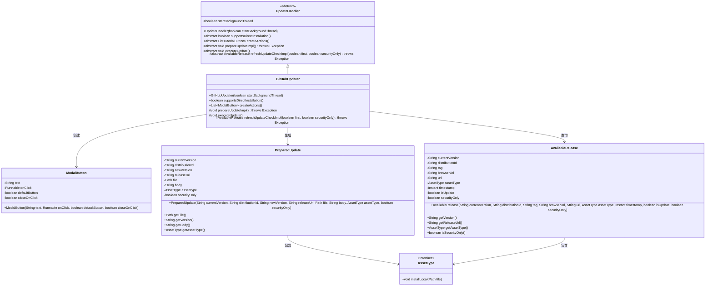
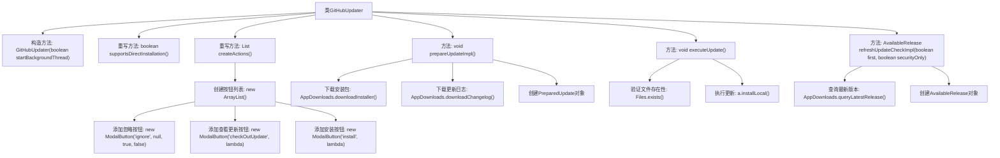

# 基础信息

|      |      |
|------|------|
| 名称 | GitHubUpdater |
| 编码语言 | .java |
| 代码路径 | xpipe/app/src/main/java/io/xpipe/app/update/GitHubUpdater.java |
| 包名 | io.xpipe.app.update |
| 依赖项 | ['io.xpipe.app.comp.base.ModalButton', 'io.xpipe.app.core.AppCache', 'io.xpipe.app.core.AppDistributionType', 'io.xpipe.app.core.AppProperties', 'io.xpipe.app.issue.ErrorEvent', 'io.xpipe.app.util.Hyperlinks', 'java.nio.file.Files', 'java.time.Instant', 'java.util.ArrayList', 'java.util.List'] |
| 概述说明 | GitHubUpdater类处理更新，支持直接安装，提供忽略、查看、安装按钮，检查并下载最新版本，执行本地安装。 |

# 说明

GitHubUpdater类继承自UpdateHandler，用于处理GitHub更新操作。支持直接安装，提供忽略、查看更新和安装三个按钮。prepareUpdateImpl方法下载安装包和更新日志并准备更新数据。executeUpdate方法执行安装并处理异常。refreshUpdateCheckImpl方法检查最新版本，判断是否为更新并记录相关信息。

# 类列表 Class Summary

| 名称   | 类型  | 说明 |
|-------|------|-------------|
| GitHubUpdater | class | GitHubUpdater类处理更新，支持直接安装，提供检查、忽略和安装按钮，实现下载、安装和版本检查功能。 |

## 类 GitHubUpdater

|      |      |
|------|------|
| 访问范围 | public |
| 类型 | class |
| 名称 | GitHubUpdater |
| 说明 | GitHubUpdater类处理更新，支持直接安装，提供检查、忽略和安装按钮，实现下载、安装和版本检查功能。 |

### UML类图

这段代码描述了一个GitHub更新处理器系统，其中GitHubUpdater继承自抽象类UpdateHandler，实现了检查更新、准备更新和执行更新的完整流程。系统通过ModalButton提供用户交互界面，使用PreparedUpdate封装准备就绪的更新包，通过AvailableRelease获取远程版本信息，并依赖AssetType接口处理不同平台的文件安装逻辑。整个设计采用分层架构，将核心逻辑与具体实现分离，支持后台线程操作和安全更新检查。

### 内部方法调用关系图

流程图描述：该流程图展示了GitHubUpdater类的核心结构和功能流程。从类定义开始，包含构造方法和三个重写方法，其中createActions()方法负责创建包含忽略、查看和安装三个按钮的列表。prepareUpdateImpl()方法处理更新准备工作，包括下载安装包和更新日志。executeUpdate()方法执行实际更新操作，而refreshUpdateCheckImpl()方法负责检查最新版本并返回可用发布信息。各方法间通过清晰的箭头连接，展示了完整的更新处理流程。

### 字段列表 Field List

| 名称  | 类型  | 说明 |
|-------|-------|------|

### 方法列表 Method List

| 名称  | 类型  | 说明 |
|-------|-------|------|
| supportsDirectInstallation | boolean | 支持直接安装，返回值为真。 |
| createActions | List<ModalButton> | 重写方法创建三个模态按钮：忽略、检查更新和安装。检查更新需验证URL，安装执行更新并关闭。 |
| executeUpdate | void | 执行更新检查文件存在性，安装本地资源并处理异常。 |
| prepareUpdateImpl | void | 下载更新文件及日志，创建更新对象并设置值。 |
| refreshUpdateCheckImpl | AvailableRelease | 同步方法刷新更新检查，查询最新版本并设置结果。 |

