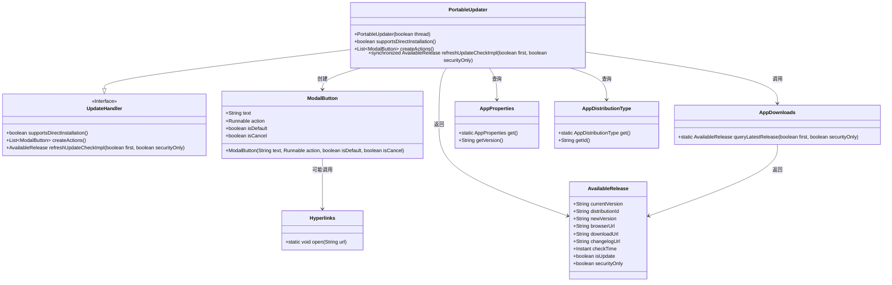
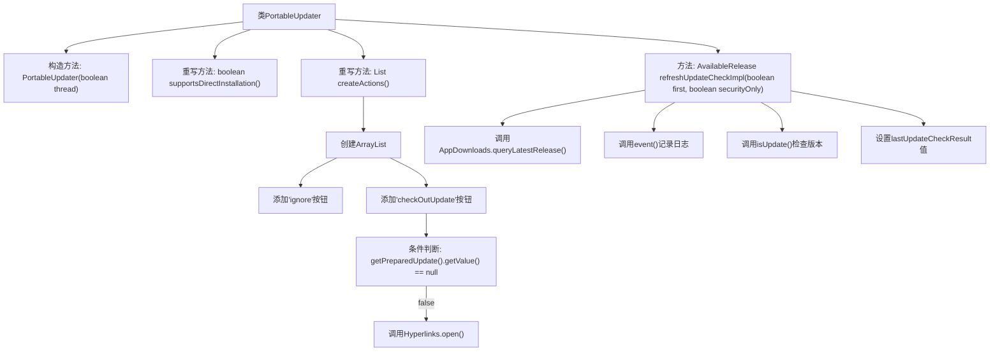

# 基础信息

|      |      |
|------|------|
| 名称 | PortableUpdater |
| 编码语言 | .java |
| 代码路径 | xpipe/app/src/main/java/io/xpipe/app/update/PortableUpdater.java |
| 包名 | io.xpipe.app.update |
| 依赖项 | ['io.xpipe.app.comp.base.ModalButton', 'io.xpipe.app.core.AppDistributionType', 'io.xpipe.app.core.AppProperties', 'io.xpipe.app.util.Hyperlinks', 'java.time.Instant', 'java.util.ArrayList', 'java.util.List'] |
| 概述说明 | 便携更新器类，继承UpdateHandler，不支持直接安装，提供忽略和检查更新按钮，可查询最新发布版本。 |

# 说明

PortableUpdater是UpdateHandler的子类，用于便携版应用的更新处理。它不支持直接安装，提供两个操作按钮：忽略更新和查看更新。查看更新会打开最新版本的发布页面。refreshUpdateCheckImpl方法负责检查最新版本，通过AppDownloads查询最新发布版本，判断是否为更新，并记录版本信息、发布时间等数据。该方法返回包含当前版本、最新版本、更新状态等信息的AvailableRelease对象。

# 类列表 Class Summary

| 名称   | 类型  | 说明 |
|-------|------|-------------|
| PortableUpdater | class | 便携更新器类，继承UpdateHandler，不支持直接安装，提供忽略和检查更新按钮，可查询最新版本并判断是否为更新。 |

## 类 PortableUpdater

|      |      |
|------|------|
| 访问范围 | public |
| 类型 | class |
| 名称 | PortableUpdater |
| 说明 | 便携更新器类，继承UpdateHandler，不支持直接安装，提供忽略和检查更新按钮，可查询最新版本并判断是否为更新。 |

### UML类图

这段类图展示了便携式更新器`PortableUpdater`的实现结构，它继承自`UpdateHandler`接口，主要功能包括创建更新操作按钮、检查更新实现。通过`ModalButton`提供用户交互选项，依赖`AppDownloads`查询最新版本，使用`AppProperties`和`AppDistributionType`获取当前应用信息，最终返回包含更新详情的`AvailableRelease`对象。整个设计体现了模块化更新检查流程，支持线程安全操作和多种分发类型处理。

### 内部方法调用关系图

这段代码流程图展示了PortableUpdater类的核心结构，包含构造方法和三个关键方法。createActions()方法创建包含两个按钮的操作列表，其中checkOutUpdate按钮会触发更新检查逻辑；refreshUpdateCheckImpl()方法实现了完整的更新检查流程，包括查询最新版本、日志记录、版本比较和结果存储。该流程图清晰地呈现了类方法的调用关系和条件分支，特别是按钮点击后的回调处理和更新检查的完整工作流。

### 字段列表 Field List

| 名称  | 类型  | 说明 |
|-------|-------|------|

### 方法列表 Method List

| 名称  | 类型  | 说明 |
|-------|-------|------|
| supportsDirectInstallation | boolean | 方法重写，不支持直接安装。 |
| createActions | List<ModalButton> | 重写方法创建两个模态按钮：忽略和检查更新，后者打开更新链接。 |
| refreshUpdateCheckImpl | AvailableRelease | 同步方法刷新更新检查，查询最新版本并设置结果，返回可用发布信息。 |

