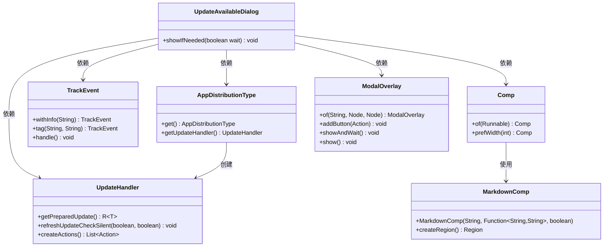
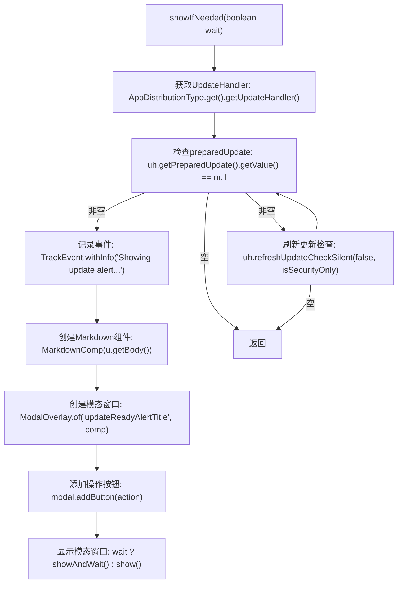

# 基础信息

|      |      |
|------|------|
| 名称 | UpdateAvailableDialog |
| 编码语言 | .java |
| 代码路径 | xpipe/app/src/main/java/io/xpipe/app/update/UpdateAvailableDialog.java |
| 包名 | io.xpipe.app.update |
| 依赖项 | ['io.xpipe.app.comp.Comp', 'io.xpipe.app.comp.base.MarkdownComp', 'io.xpipe.app.comp.base.ModalOverlay', 'io.xpipe.app.core.AppDistributionType', 'io.xpipe.app.issue.TrackEvent'] |
| 概述说明 | 检查更新并显示对话框，包含版本信息和操作按钮。 |

# 说明

该代码定义了一个名为UpdateAvailableDialog的类，包含一个静态方法showIfNeeded，用于在需要时显示更新对话框。方法首先检查是否有准备好的更新，若无则直接返回。然后静默刷新更新检查，确保仍持有最新版本。接着记录显示更新警报的事件，并获取更新详情。创建一个Markdown组件显示更新内容，生成一个宽度为600的模态对话框，标题为"updateReadyAlertTitle"。根据传入的布尔参数wait决定是否等待对话框关闭。最后为对话框添加由更新处理器创建的操作按钮。整个过程实现了条件性显示更新提醒的功能。

# 类列表 Class Summary

| 名称   | 类型  | 说明 |
|-------|------|-------------|
| UpdateAvailableDialog | class | 更新对话框类，检查并显示更新信息，含版本和操作按钮。 |

## 类 UpdateAvailableDialog

|      |      |
|------|------|
| 访问范围 | public |
| 类型 | class |
| 名称 | UpdateAvailableDialog |
| 说明 | 更新对话框类，检查并显示更新信息，含版本和操作按钮。 |

### UML类图

这段代码展示了一个更新可用对话框的显示逻辑。UpdateAvailableDialog类通过协调多个组件（包括UpdateHandler、TrackEvent、MarkdownComp和ModalOverlay）来实现功能。主要流程包括：检查更新状态、记录跟踪事件、创建Markdown格式的更新说明内容，最后通过模态对话框展示更新信息。整个过程支持同步和异步两种显示模式，并允许添加自定义操作按钮。

### 内部方法调用关系图

这段代码流程图展示了UpdateAvailableDialog类的showIfNeeded方法执行流程。该方法首先获取更新处理器，检查是否存在准备好的更新，若无则直接返回。存在更新时会静默刷新检查，再次验证更新有效性后记录事件日志。接着创建包含更新内容的Markdown组件和模态窗口，添加操作按钮后根据wait参数决定是否等待模态窗口关闭。整个过程实现了条件检查、更新验证、界面构建和交互控制的完整逻辑。

### 字段列表 Field List

| 名称  | 类型  | 说明 |
|-------|-------|------|

### 方法列表 Method List

| 名称  | 类型  | 说明 |
|-------|-------|------|
| showIfNeeded | void | 检查更新并显示弹窗，包含版本信息和操作按钮，可选等待或立即显示。 |

