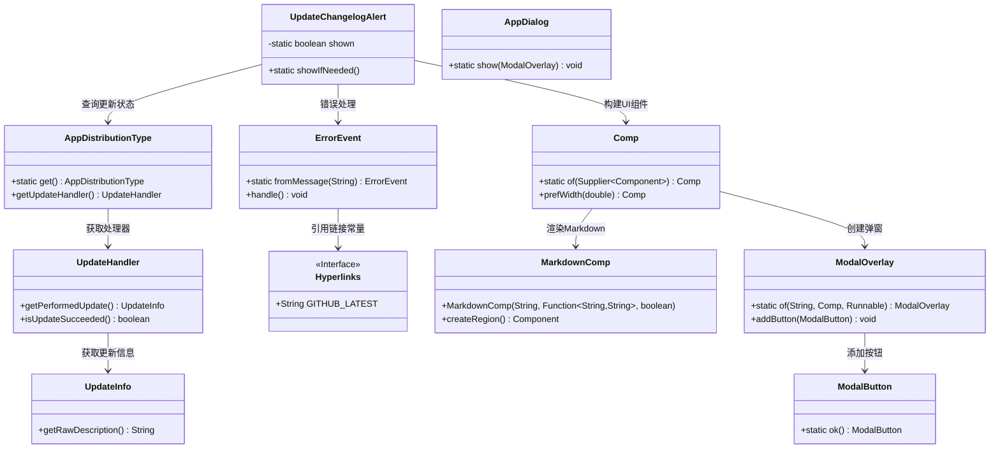
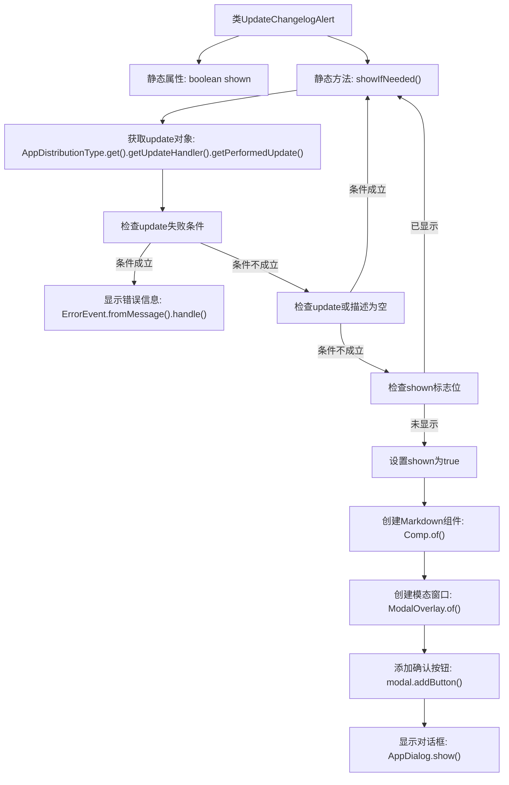

# 基础信息

|      |      |
|------|------|
| 名称 | UpdateChangelogAlert |
| 编码语言 | .java |
| 代码路径 | xpipe/app/src/main/java/io/xpipe/app/update/UpdateChangelogAlert.java |
| 包名 | io.xpipe.app.update |
| 依赖项 | ['io.xpipe.app.comp.Comp', 'io.xpipe.app.comp.base.MarkdownComp', 'io.xpipe.app.comp.base.ModalButton', 'io.xpipe.app.comp.base.ModalOverlay', 'io.xpipe.app.core.AppDistributionType', 'io.xpipe.app.core.window.AppDialog', 'io.xpipe.app.issue.ErrorEvent', 'io.xpipe.app.util.Hyperlinks'] |
| 概述说明 | 检查更新状态，失败时提示手动安装，成功则显示更新日志。 |

# 说明

该代码定义了一个名为UpdateChangelogAlert的类，用于处理更新后的变更日志提示。主要功能包括：检查更新是否成功，若失败则显示错误信息并提示手动安装；若更新成功且存在变更日志描述，则通过模态窗口展示变更日志内容。为避免重复显示，使用shown变量进行控制。模态窗口宽度设为600像素，包含确定按钮。整个过程通过静态方法showIfNeeded触发。

# 类列表 Class Summary

| 名称   | 类型  | 说明 |
|-------|------|-------------|
| UpdateChangelogAlert | class | 类UpdateChangelogAlert检查更新状态，失败时提示手动安装，成功则显示更新日志弹窗。 |

## 类 UpdateChangelogAlert

|      |      |
|------|------|
| 访问范围 | public |
| 类型 | class |
| 名称 | UpdateChangelogAlert |
| 说明 | 类UpdateChangelogAlert检查更新状态，失败时提示手动安装，成功则显示更新日志弹窗。 |

### UML类图

该类图展示了更新日志提示系统的核心结构。UpdateChangelogAlert作为入口类，通过AppDistributionType获取更新状态，根据结果执行三种分支逻辑：失败时通过ErrorEvent显示错误、无更新时直接返回、首次成功时通过Comp/MarkdownComp构建Markdown内容并借助ModalOverlay展示弹窗。系统涉及更新状态检查、错误处理、UI组件构建和弹窗控制等多个模块，通过静态方法调用实现松耦合交互。

### 内部方法调用关系图

这段代码实现了一个更新日志提示功能，主要逻辑是：首先检查是否有失败的更新操作，若有则显示错误信息；然后检查更新对象和更新描述是否存在；接着通过标志位防止重复显示；最后创建包含更新描述的Markdown组件并以模态窗口形式展示。流程图清晰展示了从初始化检查到最终界面渲染的完整控制流程，包含4个关键条件分支和3个组件构建步骤。

### 字段列表 Field List

| 名称  | 类型  | 说明 |
|-------|-------|------|
| shown = false | boolean | 私有静态布尔变量shown初始值为false |

### 方法列表 Method List

| 名称  | 类型  | 说明 |
|-------|-------|------|
| showIfNeeded | void | 检查更新状态，失败时提示手动安装；成功则显示更新日志弹窗。 |

