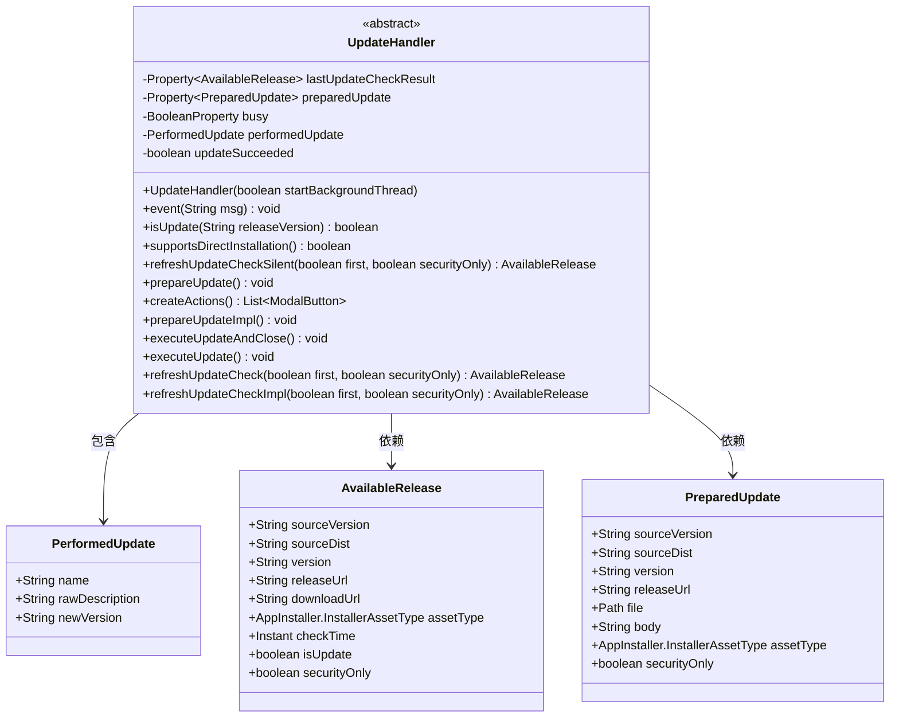

# 基础信息

|      |      |
|------|------|
| 名称 | UpdateHandler |
| 编码语言 | .java |
| 代码路径 | xpipe/app/src/main/java/io/xpipe/app/update/UpdateHandler.java |
| 包名 | io.xpipe.app.update |
| 依赖项 | ['io.xpipe.app.comp.base.ModalButton', 'io.xpipe.app.core.AppCache', 'io.xpipe.app.core.AppDistributionType', 'io.xpipe.app.core.AppProperties', 'io.xpipe.app.core.mode.OperationMode', 'io.xpipe.app.issue.ErrorEvent', 'io.xpipe.app.issue.TrackEvent', 'io.xpipe.app.prefs.AppPrefs', 'io.xpipe.app.util.BooleanScope', 'io.xpipe.app.util.ThreadHelper', 'javafx.beans.property.BooleanProperty', 'javafx.beans.property.Property', 'javafx.beans.property.SimpleBooleanProperty', 'javafx.beans.property.SimpleObjectProperty', 'lombok.Builder', 'lombok.Getter', 'lombok.Value', 'lombok.With', 'lombok.extern.jackson.Jacksonized', 'java.nio.file.Files', 'java.nio.file.Path', 'java.time.Duration', 'java.time.Instant', 'java.util.List'] |
| 概述说明 | 抽象类UpdateHandler处理更新检查、准备和执行，包含属性、后台线程和事件跟踪。 |

# 说明

该代码定义了一个抽象类UpdateHandler，用于处理应用程序更新流程。类中包含多个属性：lastUpdateCheckResult记录最近更新检查结果，preparedUpdate存储已准备的更新信息，busy表示是否正忙，performedUpdate记录已执行的更新，updateSucceeded标记更新是否成功。构造函数初始化这些属性，并处理可能的更新状态。类提供了后台更新线程启动、更新检查、更新准备和执行等功能，支持静默检查和直接安装。还定义了三个内部类PerformedUpdate、AvailableRelease和PreparedUpdate，分别表示已执行更新、可用更新和已准备更新的数据结构。整个类封装了更新流程的核心逻辑，包括版本检查、文件验证和状态管理。

# 类列表 Class Summary

| 名称   | 类型  | 说明 |
|-------|------|-------------|
| UpdateHandler | class | 抽象类UpdateHandler处理应用更新逻辑，包括检查、准备和执行更新操作。 |

## 类 UpdateHandler

|      |      |
|------|------|
| 访问范围 | @SuppressWarnings("InfiniteLoopStatement");@Getter;public abstract |
| 类型 | class |
| 名称 | UpdateHandler |
| 说明 | 抽象类UpdateHandler处理应用更新逻辑，包括检查、准备和执行更新操作。 |

### UML类图

这段代码定义了一个抽象类`UpdateHandler`，用于处理应用程序更新流程。它包含三个内部静态类：`PerformedUpdate`记录已执行的更新信息，`AvailableRelease`表示可用的更新版本，`PreparedUpdate`表示已准备好的更新包。主要功能包括后台自动检查更新、准备更新包、执行更新操作等，通过属性监听和线程管理实现异步更新流程。类之间的关系表现为`UpdateHandler`依赖这三个内部类来完成完整的更新功能。

### 内部方法调用关系图

```mermaid
graph TD
    A["抽象类UpdateHandler"]
    B["属性: Property<AvailableRelease> lastUpdateCheckResult"]
    C["属性: Property<PreparedUpdate> preparedUpdate"]
    D["属性: BooleanProperty busy"]
    E["属性: PerformedUpdate performedUpdate"]
    F["属性: boolean updateSucceeded"]
    G["构造方法: UpdateHandler(boolean startBackgroundThread)"]
    H["方法: startBackgroundUpdater()"]
    I["方法: event(String msg)"]
    J["方法: isUpdate(String releaseVersion)"]
    K["抽象方法: supportsDirectInstallation()"]
    L["方法: refreshUpdateCheckSilent(boolean first, boolean securityOnly)"]
    M["方法: prepareUpdate()"]
    N["抽象方法: createActions()"]
    O["方法: prepareUpdateImpl()"]
    P["方法: executeUpdateAndClose()"]
    Q["方法: executeUpdate()"]
    R["方法: refreshUpdateCheck(boolean first, boolean securityOnly)"]
    S["抽象方法: refreshUpdateCheckImpl(boolean first, boolean securityOnly)"]
    T["内部类: PerformedUpdate"]
    U["内部类: AvailableRelease"]
    V["内部类: PreparedUpdate"]

    A --> B
    A --> C
    A --> D
    A --> E
    A --> F
    A --> G
    G --> H
    A --> I
    A --> J
    A --> K
    A --> L
    A --> M
    M --> O
    A --> N
    A --> P
    P --> Q
    A --> R
    R --> S
    A --> T
    A --> U
    A --> V
```

这段代码定义了一个抽象类`UpdateHandler`，主要用于处理应用程序的更新逻辑。它包含多个属性和方法，用于检查更新、准备更新、执行更新等操作。类中定义了三个内部类`PerformedUpdate`、`AvailableRelease`和`PreparedUpdate`，分别表示已执行的更新、可用的更新和已准备的更新。构造方法`UpdateHandler`会根据参数决定是否启动后台更新线程，并初始化相关属性。方法`prepareUpdate`和`executeUpdateAndClose`分别用于准备更新和执行更新，而`refreshUpdateCheck`和`refreshUpdateCheckSilent`则用于检查更新。抽象方法`refreshUpdateCheckImpl`和`supportsDirectInstallation`需要子类实现。整个类的设计使得更新逻辑可以灵活扩展和定制。

### 字段列表 Field List

| 名称  | 类型  | 说明 |
|-------|-------|------|
| busy = new SimpleBooleanProperty() | BooleanProperty | 保护型布尔属性busy，初始化为简单布尔属性。 |
| performedUpdate | PerformedUpdate | 受保护的最终PerformedUpdate实例。 |
| preparedUpdate = new SimpleObjectProperty<>() | Property<PreparedUpdate> | 受保护的最终属性preparedUpdate，类型为Property<PreparedUpdate>，初始化为SimpleObjectProperty。 |
| updateSucceeded | boolean | 保护型布尔变量，表示更新是否成功。 |
| lastUpdateCheckResult = new SimpleObjectProperty<>() | Property<AvailableRelease> | 保护属性lastUpdateCheckResult，类型为Property<AvailableRelease>，初始化为SimpleObjectProperty。 |

### 方法列表 Method List

| 名称  | 类型  | 说明 |
|-------|-------|------|
| refreshUpdateCheckSilent | AvailableRelease | 静默检查更新方法：尝试刷新更新，失败返回null。 |
| isUpdate | boolean | 检查版本更新：开发者模式跳过检查或版本不同时返回真，否则返回假。 |
| supportsDirectInstallation | boolean | 抽象方法，检查是否支持直接安装。 |
| executeUpdateAndClose | void | 方法检查状态后执行更新：非忙、存在更新文件且版本最新时触发更新。 |
| prepareUpdate | void | 检查更新条件，下载更新并处理异常。 |
| prepareUpdateImpl | void | 准备更新实现：下载日志、构建更新对象并设置值。 |
| createActions | List<ModalButton> | 抽象方法，创建模态按钮列表。 |
| startBackgroundUpdater | void | 启动后台更新线程，每小时检查并执行静默更新，支持自动更新和安全更新检查。 |
| event | void | Java方法：记录info类型事件，传入消息msg并处理。 |
| executeUpdate | void | 方法executeUpdate抛出UnsupportedOperationException异常。 |
| refreshUpdateCheck | AvailableRelease | 方法检查更新状态，忙时返回上次结果，否则执行更新检查。 |
| refreshUpdateCheckImpl | AvailableRelease | 抽象方法refreshUpdateCheckImpl，检查更新，参数first和securityOnly，可能抛出异常。 |

