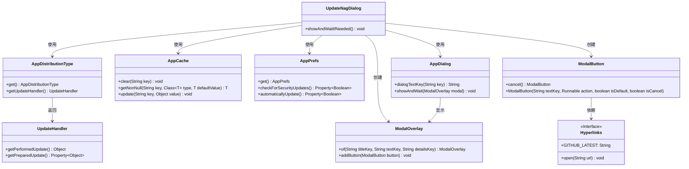
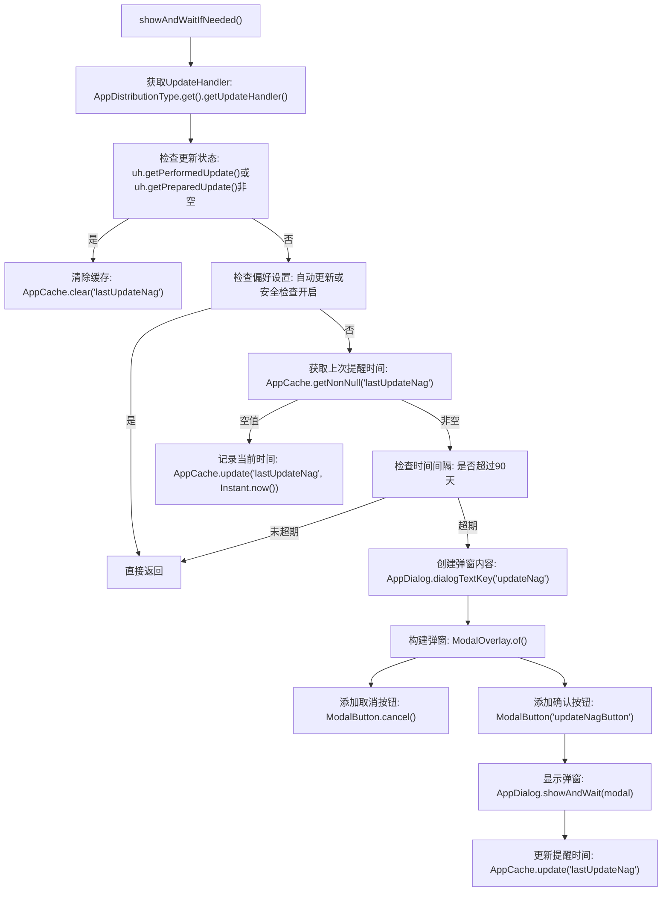

# 基础信息

|      |      |
|------|------|
| 名称 | UpdateNagDialog |
| 编码语言 | .java |
| 代码路径 | xpipe/app/src/main/java/io/xpipe/app/update/UpdateNagDialog.java |
| 包名 | io.xpipe.app.update |
| 依赖项 | ['io.xpipe.app.comp.base.ModalButton', 'io.xpipe.app.comp.base.ModalOverlay', 'io.xpipe.app.core.AppCache', 'io.xpipe.app.core.AppDistributionType', 'io.xpipe.app.core.window.AppDialog', 'io.xpipe.app.prefs.AppPrefs', 'io.xpipe.app.util.Hyperlinks', 'java.time.Duration', 'java.time.Instant'] |
| 概述说明 | 检查更新提示逻辑：无更新时显示提示，90天内不重复，含取消和跳转按钮。 |

# 说明

该代码定义了一个名为UpdateNagDialog的类，包含静态方法showAndWaitIfNeeded。该方法首先检查是否有已执行或准备的更新，若有则清除缓存并返回。接着检查用户偏好设置是否启用了自动更新或安全检查，若启用则直接返回。然后检查上次提示时间，若未超过90天则返回。最后创建一个包含取消按钮和跳转GitHub按钮的模态对话框，显示更新提示并更新最后提示时间。整个过程用于管理非强制性的更新提醒功能。

# 类列表 Class Summary

| 名称   | 类型  | 说明 |
|-------|------|-------------|
| UpdateNagDialog | class | 检查更新并显示提示对话框，条件包括：未更新、非自动更新、90天内未提示。含取消和跳转按钮。 |

## 类 UpdateNagDialog

|      |      |
|------|------|
| 访问范围 | public |
| 类型 | class |
| 名称 | UpdateNagDialog |
| 说明 | 检查更新并显示提示对话框，条件包括：未更新、非自动更新、90天内未提示。含取消和跳转按钮。 |

### UML类图

这段代码实现了一个更新提示对话框系统，主要功能是检查是否需要显示更新提示。当满足特定条件时（如90天内未检查更新、未启用自动更新等），会创建一个包含取消和跳转按钮的模态对话框。系统通过AppCache记录最后检查时间，通过AppPrefs获取用户偏好设置，通过UpdateHandler获取更新状态。整个流程涉及多个组件的协同工作，包括缓存管理、偏好设置读取、对话框构建和超链接处理等。

### 内部方法调用关系图

该流程图描述了UpdateNagDialog类的核心逻辑，主要控制更新提醒弹窗的显示条件。首先检查系统更新状态和用户偏好设置，若未满足条件则检查上次提醒时间间隔，超过90天才构建包含GitHub跳转按钮的弹窗。整个过程包含6个条件分支和3个缓存操作，确保仅在符合业务规则时打扰用户，同时维护最后提醒时间的持久化记录。

### 字段列表 Field List

| 名称  | 类型  | 说明 |
|-------|-------|------|

### 方法列表 Method List

| 名称  | 类型  | 说明 |
|-------|-------|------|
| showAndWaitIfNeeded | void | 检查更新状态，若无需更新则返回；否则显示更新提示并记录时间。 |

