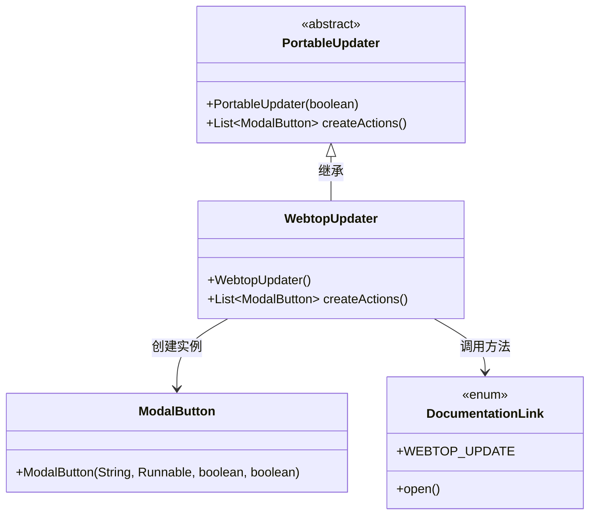
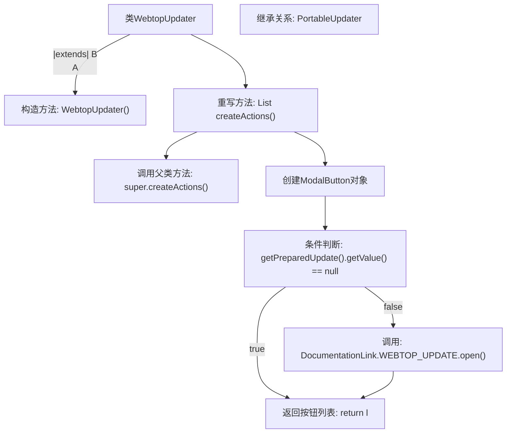

# 基础信息

|      |      |
|------|------|
| 名称 | WebtopUpdater |
| 编码语言 | .java |
| 代码路径 | xpipe/app/src/main/java/io/xpipe/app/update/WebtopUpdater.java |
| 包名 | io.xpipe.app.update |
| 依赖项 | ['io.xpipe.app.comp.base.ModalButton', 'io.xpipe.app.util.DocumentationLink', 'java.util.List'] |
| 概述说明 | WebtopUpdater类扩展PortableUpdater，添加升级说明按钮操作。 |

# 说明

WebtopUpdater类继承PortableUpdater，构造函数调用父类并传入true参数。重写createActions方法，先获取父类按钮列表，再添加一个ModalButton实例。该按钮触发时检查preparedUpdate值非空则打开WEBTOP_UPDATE文档链接，按钮不设置主要状态和禁用状态。最终返回包含新增按钮的列表。

# 类列表 Class Summary

| 名称   | 类型  | 说明 |
|-------|------|-------------|
| WebtopUpdater | class | WebtopUpdater类扩展PortableUpdater，添加升级说明按钮功能。 |

## 类 WebtopUpdater

|      |      |
|------|------|
| 访问范围 | public |
| 类型 | class |
| 名称 | WebtopUpdater |
| 说明 | WebtopUpdater类扩展PortableUpdater，添加升级说明按钮功能。 |

### UML类图

这段类图展示了WebtopUpdater继承自抽象类PortableUpdater的关系，其中WebtopUpdater重写了createActions方法，该方法会创建ModalButton实例并调用DocumentationLink枚举的方法。WebtopUpdater通过添加特定按钮扩展了基础更新功能，用于处理Webtop更新场景，体现了对父类功能的扩展和特定业务逻辑的实现。

### 内部方法调用关系图

流程图描述了WebtopUpdater类的结构和工作流程。该类继承自PortableUpdater，通过构造方法初始化父类。核心逻辑在重写的createActions方法中：首先调用父类方法获取基础按钮列表，然后添加一个自定义ModalButton。该按钮触发时检查更新状态，若存在有效更新则打开文档链接，最后返回完整的按钮列表。流程清晰展现了条件分支和对象创建过程。

### 字段列表 Field List

| 名称  | 类型  | 说明 |
|-------|-------|------|

### 方法列表 Method List

| 名称  | 类型  | 说明 |
|-------|-------|------|
| createActions | List<ModalButton> | 重写方法创建操作列表，添加升级按钮并检查更新状态后打开文档链接。 |

