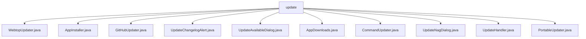

# 基础信息

|      |      |
|------|------|
| 名称 | update |
| 编码语言 | .java |
| 代码路径 | xpipe/app/src/main/java/io/xpipe/app/update |
| 包名 | xpipe.app.src.main.java.io.xpipe.app.update |
| 概述说明 | WebtopUpdater添加模态按钮。AppInstaller支持多平台安装。GitHubUpdater处理更新操作。UpdateChangelogAlert显示变更日志。UpdateAvailableDialog条件显示更新。AppDownloads管理下载。CommandUpdater执行脚本更新。UpdateNagDialog非强制提醒。UpdateHandler抽象更新流程。PortableUpdater便携版更新处理。 |

# 说明

```markdown
## 概述
该代码模块是一个跨平台的应用程序更新系统，主要处理软件版本更新、安装包管理、变更日志展示等核心功能。模块采用分层设计，包含基础抽象类、具体平台实现类以及用户交互组件，支持Windows、Linux和macOS三大操作系统。系统通过GitHub作为更新源，提供自动检测新版本、下载安装包、执行静默安装、展示更新内容等完整更新流程，同时兼顾便携版和安装版两种部署方式的更新需求。

## 主要业务场景
1. **自动更新检测与安装**
   - 通过`GitHubUpdater`和`PortableUpdater`定期检查GitHub发布的新版本
   - 使用`AppInstaller`根据操作系统类型自动选择对应格式的安装包（MSI/Deb/RPM/PKG）
   - 支持静默安装和交互式安装两种模式，包含完整的错误处理和日志记录

2. **用户交互流程**
   - `UpdateAvailableDialog`条件性显示更新提醒对话框
   - `UpdateChangelogAlert`展示更新成功后的变更日志内容
   - `UpdateNagDialog`实现非强制性的更新提示功能（90天周期）
   - 提供"忽略"、"查看详情"、"立即安装"等标准操作按钮

3. **便携版更新处理**
   - `WebtopUpdater`和`CommandUpdater`扩展便携版特定逻辑
   - 通过Shell脚本或直接打开发布页面的方式完成更新
   - 不支持直接安装，需用户手动操作

4. **后台服务支持**
   - `AppDownloads`处理与GitHub API的通信，获取版本信息和下载资源
   - `UpdateHandler`抽象类封装核心更新状态机和流程控制
   - 支持并发安全检查和版本验证机制

5. **跨平台适配**
   - 自动识别操作系统类型（Windows/Linux/macOS）
   - 为不同平台分配合适的安装命令（msiexec/apt/rpm/installer）
   - 统一处理安装后的重启操作
```


### 包内部结构视图



该流程图展示了xpipe项目中update模块下的文件结构关系。根节点"update"直接连接10个Java类文件，包括WebtopUpdater、AppInstaller等更新相关功能实现类。这些类文件均位于同一层级，没有更深层次的嵌套结构，完整呈现了项目更新模块的扁平化文件组织方式。每个文件都承担不同的更新功能职责，如GitHub更新、便携版更新等。

# 文件列表 File List

| 名称   | 类型  | 说明 |
|-------|------|-------------|
| [AppDownloads.java](AppDownloads.md) | file | 下载安装程序和变更日志，查询最新版本信息。 |
| [UpdateAvailableDialog.java](UpdateAvailableDialog.md) | file | 检查更新并显示对话框，包含版本信息和操作按钮。 |
| [UpdateChangelogAlert.java](UpdateChangelogAlert.md) | file | 检查更新状态，失败时提示手动安装，成功则显示更新日志。 |
| [GitHubUpdater.java](GitHubUpdater.md) | file | GitHubUpdater类处理更新，支持直接安装，提供忽略、查看、安装按钮，检查并下载最新版本，执行本地安装。 |
| [WebtopUpdater.java](WebtopUpdater.md) | file | WebtopUpdater类扩展PortableUpdater，添加升级说明按钮操作。 |
| [PortableUpdater.java](PortableUpdater.md) | file | 便携更新器类，继承UpdateHandler，不支持直接安装，提供忽略和检查更新按钮，可查询最新发布版本。 |
| [UpdateHandler.java](UpdateHandler.md) | file | 抽象类UpdateHandler处理更新检查、准备和执行，包含属性、后台线程和事件跟踪。 |
| [UpdateNagDialog.java](UpdateNagDialog.md) | file | 检查更新提示逻辑：无更新时显示提示，90天内不重复，含取消和跳转按钮。 |
| [CommandUpdater.java](CommandUpdater.md) | file | CommandUpdater类扩展PortableUpdater，支持直接安装，提供忽略、检查更新和安装按钮，执行更新后运行脚本。 |
| [AppInstaller.java](AppInstaller.md) | file | 根据操作系统选择安装包类型并执行安装。 |


