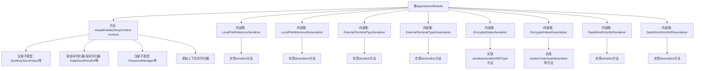

# 基础信息

|      |      |
|------|------|
| 名称 | AppJacksonModule |
| 编码语言 | .java |
| 代码路径 | xpipe/app/src/main/java/io/xpipe/app/util/AppJacksonModule.java |
| 包名 | io.xpipe.app.util |
| 依赖项 | ['io.xpipe.app.ext.LocalStore', 'io.xpipe.app.password.PasswordManager', 'io.xpipe.app.storage', 'io.xpipe.app.terminal.ExternalTerminalType', 'io.xpipe.app.terminal.TerminalMultiplexer', 'io.xpipe.app.terminal.TerminalPrompt', 'io.xpipe.core.util.InPlaceSecretValue', 'io.xpipe.core.util.JacksonMapper', 'com.fasterxml.jackson.core.JsonGenerator', 'com.fasterxml.jackson.core.JsonParser', 'com.fasterxml.jackson.databind', 'com.fasterxml.jackson.databind.deser.ContextualDeserializer', 'com.fasterxml.jackson.databind.jsontype.TypeDeserializer', 'com.fasterxml.jackson.databind.jsontype.TypeSerializer', 'com.fasterxml.jackson.databind.jsontype.impl.AsPropertyTypeDeserializer', 'com.fasterxml.jackson.databind.module.SimpleModule', 'com.fasterxml.jackson.databind.node.ObjectNode', 'com.fasterxml.jackson.databind.type.SimpleType', 'java.io.CharArrayReader', 'java.io.IOException', 'java.util.UUID'] |
| 概述说明 | 自定义Jackson模块，注册子类型及序列化器，处理加密值和文件引用等。 |

# 说明

该内容描述了一个名为AppJacksonModule的Java类，继承自SimpleModule，主要用于配置Jackson库的序列化和反序列化行为。该类注册了多个子类型，包括VaultKeySecretValue和PasswordLockSecretValue等，并为多种数据类型（如DataStoreEntryRef、ContextualFileReference、ExternalTerminalType和EncryptedValue等）添加了自定义的序列化器和反序列化器。这些序列化器和反序列化器处理特定类型的对象转换，例如将对象转换为JSON格式或从JSON格式还原对象。此外，还包含了对加密值的特殊处理逻辑，确保数据在序列化和反序列化过程中的安全性。整体上，该类是一个用于复杂数据处理的Jackson模块配置。

# 类列表 Class Summary

| 名称   | 类型  | 说明 |
|-------|------|-------------|
| AppJacksonModule | class | 自定义Jackson模块，注册子类型及序列化器，处理加密值和文件引用等。 |


## 类 AppJacksonModule

|      |      |
|------|------|
| 访问范围 | public |
| 类型 | class |
| 名称 | AppJacksonModule |
| 说明 | 自定义Jackson模块，注册子类型及序列化器，处理加密值和文件引用等。 |


### UML类图

```mermaid
classDiagram
    class SimpleModule {
        <<Interface>>
    }

    class AppJacksonModule {
        +setupModule(SetupContext context) void
    }

    class SetupContext {
        <<Interface>>
        +registerSubtypes(Class... classes) void
        +addSerializers(Serializers serializers) void
        +addDeserializers(Deserializers deserializers) void
    }

    class JsonSerializer~T~ {
        <<Interface>>
        +serialize(T value, JsonGenerator gen, SerializerProvider provider) void
    }

    class JsonDeserializer~T~ {
        <<Interface>>
        +deserialize(JsonParser p, DeserializationContext ctxt) T
    }

    class ContextualDeserializer {
        <<Interface>>
        +createContextual(DeserializationContext ctxt, BeanProperty property) JsonDeserializer~?~
    }

    AppJacksonModule --> SimpleModule : 继承
    AppJacksonModule --> SetupContext : 依赖
    AppJacksonModule ..|> JsonSerializer~ContextualFileReference~ : 实现
    AppJacksonModule ..|> JsonDeserializer~ContextualFileReference~ : 实现
    AppJacksonModule ..|> JsonSerializer~ExternalTerminalType~ : 实现
    AppJacksonModule ..|> JsonDeserializer~ExternalTerminalType~ : 实现
    AppJacksonModule ..|> JsonSerializer~EncryptedValue~ : 实现
    AppJacksonModule ..|> JsonDeserializer~EncryptedValue~ : 实现
    AppJacksonModule ..|> JsonSerializer~DataStoreEntryRef~ : 实现
    AppJacksonModule ..|> JsonDeserializer~DataStoreEntryRef~ : 实现
    JsonDeserializer~EncryptedValue~ ..|> ContextualDeserializer : 实现

    // 序列化相关类
    class LocalFileReferenceSerializer {
        +serialize(ContextualFileReference value, JsonGenerator gen, SerializerProvider provider) void
    }

    class LocalFileReferenceDeserializer {
        +deserialize(JsonParser p, DeserializationContext ctxt) ContextualFileReference
    }

    class ExternalTerminalTypeSerializer {
        +serialize(ExternalTerminalType value, JsonGenerator gen, SerializerProvider provider) void
    }

    class ExternalTerminalTypeDeserializer {
        +deserialize(JsonParser p, DeserializationContext ctxt) ExternalTerminalType
    }

    class EncryptedValueSerializer {
        +serialize(EncryptedValue value, JsonGenerator gen, SerializerProvider provider) void
        +serializeWithType(EncryptedValue value, JsonGenerator gen, SerializerProvider serializers, TypeSerializer typeSer) void
    }

    class EncryptedValueDeserializer~T~ {
        -boolean useCurrentSecretKeyIfPossible
        -boolean forceCurrentSecretKey
        -Class~?~ type
        +createContextual(DeserializationContext ctxt, BeanProperty property) JsonDeserializer~?~
        +deserialize(JsonParser p, DeserializationContext ctxt) T
        +deserializeWithType(JsonParser jp, DeserializationContext ctxt, TypeDeserializer typeDeserializer) Object
    }

    class DataStoreEntryRefSerializer {
        +serialize(DataStoreEntryRef value, JsonGenerator gen, SerializerProvider provider) void
    }

    class DataStoreEntryRefDeserializer {
        +deserialize(JsonParser p, DeserializationContext ctxt) DataStoreEntryRef~?~
    }
```

这段代码是AppJacksonModule类，继承自SimpleModule，主要用于配置Jackson JSON序列化和反序列化规则。它注册了多种自定义序列化器/反序列化器，包括VaultKeySecretValue、PasswordLockSecretValue等子类型，以及处理DataStoreEntryRef、ContextualFileReference等复杂类型的转换逻辑。核心是通过setupModule方法集中管理所有序列化配置，内部实现了8个静态序列化类，覆盖加密值、终端类型等特殊场景。类图展示了模块与Jackson核心接口的继承关系，以及各序列化组件之间的协作方式，体现了高度模块化的JSON处理架构。


### 内部方法调用关系图



这段代码是Jackson库的自定义模块实现，主要用于注册多种类型的序列化器和反序列化器。核心类AppJacksonModule继承自SimpleModule，通过setupModule方法注册了VaultKeySecretValue等子类型，并为DataStoreEntryRef、ContextualFileReference等类型配置了专用的序列化/反序列化器。模块包含6个静态内部类，分别处理不同数据类型的序列化逻辑，其中EncryptedValueDeserializer实现了上下文感知的反序列化功能。整个模块通过统一的配置入口(setupModule)整合了多种数据类型的处理逻辑，为复杂对象的JSON转换提供了完整支持。

### 字段列表 Field List

| 名称  | 类型  | 说明 |
|-------|-------|------|

### 方法列表 Method List

| 名称  | 类型  | 说明 |
|-------|-------|------|
| setupModule | void | 注册子类型并配置序列化与反序列化器。 |


