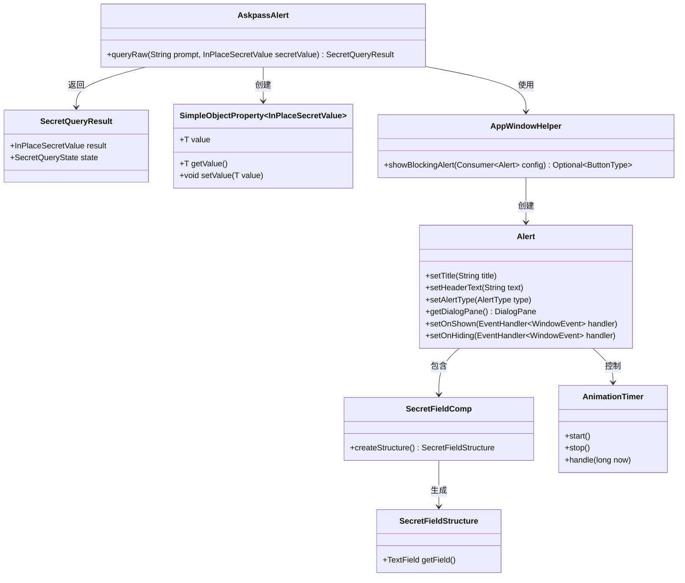
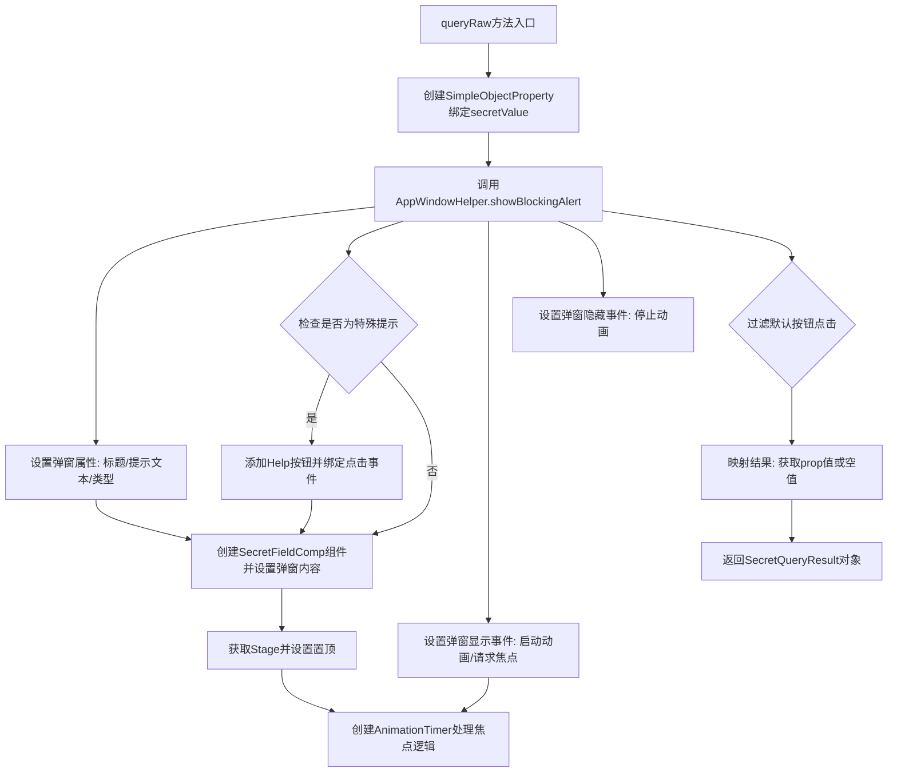

# 基础信息

|      |      |
|------|------|
| 名称 | AskpassAlert |
| 编码语言 | .java |
| 代码路径 | xpipe/app/src/main/java/io/xpipe/app/util/AskpassAlert.java |
| 包名 | io.xpipe.app.util |
| 依赖项 | ['io.xpipe.app.comp.base.SecretFieldComp', 'io.xpipe.app.core.AppI18n', 'io.xpipe.app.core.window.AppWindowHelper', 'io.xpipe.core.util.InPlaceSecretValue', 'javafx.animation.AnimationTimer', 'javafx.application.Platform', 'javafx.beans.property.SimpleObjectProperty', 'javafx.scene.control.Alert', 'javafx.scene.control.ButtonBar', 'javafx.scene.control.ButtonType', 'javafx.scene.input.MouseEvent', 'javafx.scene.layout.StackPane', 'javafx.stage.Modality', 'javafx.stage.Stage', 'javafx.stage.Window'] |
| 概述说明 | 显示密码输入弹窗，支持特殊提示帮助链接，自动聚焦处理，返回输入结果或取消状态。 |

# 说明

AskpassAlert类中的queryRaw方法用于显示一个阻塞式对话框，提示用户输入密码。该方法接收提示信息和初始密码值作为参数。对话框标题和提示文本通过国际化资源获取，类型为确认对话框。若提示信息为特殊类型，会添加帮助按钮并链接到文档页面。对话框内容包含一个密码输入框，窗口置顶显示。方法通过动画计时器确保窗口在失去焦点时重新获取焦点，最多尝试3次。对话框显示时自动聚焦到输入框并选中文本。用户确认后返回输入的密码值，取消则返回null。最终返回包含密码值和状态的结果对象。

# 类列表 Class Summary

| 名称   | 类型  | 说明 |
|-------|------|-------------|
| AskpassAlert | class | 显示密码输入弹窗，支持帮助链接和自动聚焦，返回用户输入或取消状态。 |

## 类 AskpassAlert

|      |      |
|------|------|
| 访问范围 | public |
| 类型 | class |
| 名称 | AskpassAlert |
| 说明 | 显示密码输入弹窗，支持帮助链接和自动聚焦，返回用户输入或取消状态。 |

### UML类图

这段代码展示了一个密码询问对话框的实现，主要涉及AskpassAlert类通过AppWindowHelper创建Alert对话框，使用SecretFieldComp生成密码输入字段，并通过AnimationTimer处理窗口焦点逻辑。代码结构清晰地分离了UI控制、业务逻辑和状态管理，体现了良好的模块化设计。SecretQueryResult用于封装查询结果和状态，SimpleObjectProperty则用于管理密码值的双向绑定。

### 内部方法调用关系图

这段代码实现了一个带密码输入框的交互式弹窗系统。主要流程包括：初始化弹窗属性，根据提示类型动态添加帮助按钮，创建安全密码输入组件，通过AnimationTimer实现智能焦点管理（包括自动重获焦点和防干扰逻辑），最后处理用户交互结果。特别处理了特殊提示场景的文档链接跳转，并确保密码输入框始终获得初始焦点，最终返回包含用户输入或取消状态的查询结果对象。

### 字段列表 Field List

| 名称  | 类型  | 说明 |
|-------|-------|------|

### 方法列表 Method List

| 名称  | 类型  | 说明 |
|-------|-------|------|
| queryRaw | SecretQueryResult | 

静态方法queryRaw显示密码输入弹窗，处理焦点逻辑并返回结果。 |

