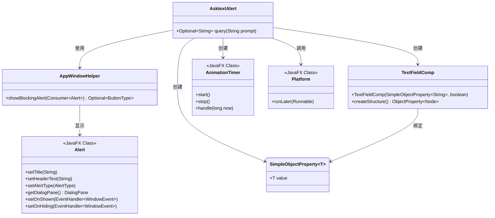
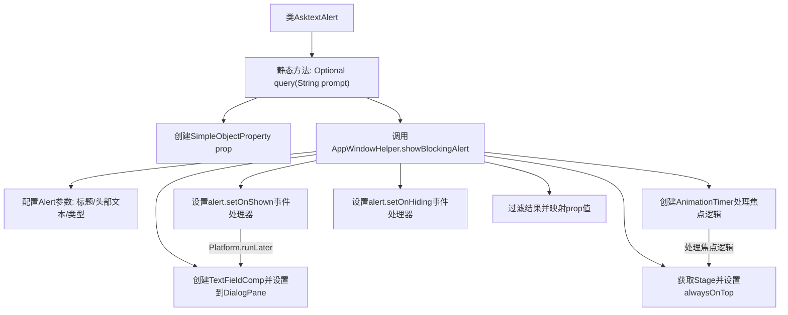

# 基础信息

|      |      |
|------|------|
| 名称 | AsktextAlert |
| 编码语言 | .java |
| 代码路径 | xpipe/app/src/main/java/io/xpipe/app/util/AsktextAlert.java |
| 包名 | io.xpipe.app.util |
| 依赖项 | ['io.xpipe.app.comp.base.TextFieldComp', 'io.xpipe.app.core.AppI18n', 'io.xpipe.app.core.window.AppWindowHelper', 'javafx.animation.AnimationTimer', 'javafx.application.Platform', 'javafx.beans.property.SimpleObjectProperty', 'javafx.scene.control.Alert', 'javafx.scene.layout.StackPane', 'javafx.stage.Stage', 'java.util.Optional'] |
| 概述说明 | Java类AsktextAlert提供静态方法query，显示带输入框的确认弹窗，返回用户输入文本。 |

# 说明

AsktextAlert类包含一个静态方法query，用于显示阻塞式确认对话框。该方法接收提示文本参数，创建包含文本输入框的对话框，并设置对话框标题和类型为CONFIRMATION。通过AnimationTimer确保对话框获得焦点，并在显示时自动聚焦到文本输入框。用户确认后返回输入文本值，否则返回空。该方法处理了焦点管理、动画计时器启停及输入值获取等逻辑。

# 类列表 Class Summary

| 名称   | 类型  | 说明 |
|-------|------|-------------|
| AsktextAlert | class | 显示确认弹窗，获取用户输入文本并返回。 |

## 类 AsktextAlert

|      |      |
|------|------|
| 访问范围 | public |
| 类型 | class |
| 名称 | AsktextAlert |
| 说明 | 显示确认弹窗，获取用户输入文本并返回。 |

### UML类图

这段代码展示了一个基于JavaFX的文本输入对话框实现。AsktextAlert类通过AppWindowHelper显示阻塞式弹窗，使用TextFieldComp组件绑定到SimpleObjectProperty来获取用户输入，并通过AnimationTimer实现窗口焦点管理。整个流程涉及JavaFX平台的多线程处理（Platform.runLater）和动画定时器控制，最终返回用户输入的Optional结果。类图清晰地展示了各组件间的协作关系，包括属性绑定、UI组件创建和事件处理机制。

### 内部方法调用关系图

这段代码实现了一个带文本输入框的确认对话框，主要流程包括：创建属性绑定对象、配置对话框参数、添加文本输入组件、处理窗口焦点逻辑、设置显示/隐藏事件处理器，最后返回用户输入结果。特别值得注意的是它通过AnimationTimer实现了复杂的焦点管理逻辑，确保对话框能正确获取焦点并处理用户输入，最终返回Optional包装的字符串结果。

### 字段列表 Field List

| 名称  | 类型  | 说明 |
|-------|-------|------|

### 方法列表 Method List

| 名称  | 类型  | 说明 |
|-------|-------|------|
| query | Optional<String> | 静态方法query显示确认弹窗，含输入框，返回用户输入或空。 |

