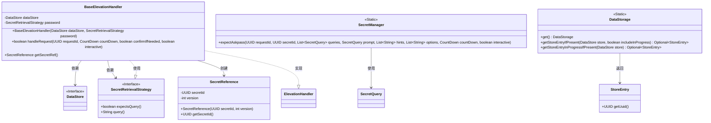
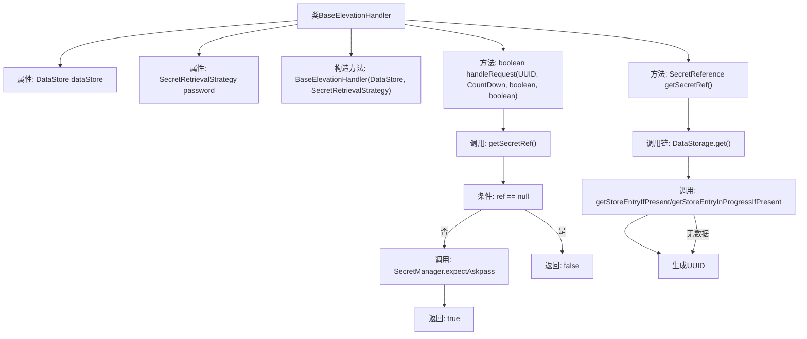

# 基础信息

|      |      |
|------|------|
| 名称 | BaseElevationHandler |
| 编码语言 | .java |
| 代码路径 | xpipe/app/src/main/java/io/xpipe/app/util/BaseElevationHandler.java |
| 包名 | io.xpipe.app.util |
| 依赖项 | ['io.xpipe.app.storage.DataStorage', 'io.xpipe.core.process.CountDown', 'io.xpipe.core.process.ElevationHandler', 'io.xpipe.core.store.DataStore', 'io.xpipe.core.util.SecretReference', 'java.util.List', 'java.util.UUID'] |
| 概述说明 | BaseElevationHandler类实现ElevationHandler接口，处理请求和获取密钥引用。 |

# 说明

BaseElevationHandler是一个实现了ElevationHandler接口的类，用于处理权限提升请求。它包含两个私有成员变量：dataStore和password，分别通过构造函数初始化。handleRequest方法处理请求，首先调用getSecretRef获取密钥引用，若为空则返回false；否则通过SecretManager.expectAskpass执行权限提升操作。getSecretRef方法从DataStorage获取存储条目ID，若password非空且需要查询则返回包含ID和0的SecretReference，否则返回null。

# 类列表 Class Summary

| 名称   | 类型  | 说明 |
|-------|------|-------------|
| BaseElevationHandler | class | BaseElevationHandler类实现ElevationHandler接口，处理请求和获取密钥引用。 |

## 类 BaseElevationHandler

|      |      |
|------|------|
| 访问范围 | public |
| 类型 | class |
| 名称 | BaseElevationHandler |
| 说明 | BaseElevationHandler类实现ElevationHandler接口，处理请求和获取密钥引用。 |

### UML类图

这段代码展示了一个基础权限提升处理器`BaseElevationHandler`的实现，它通过`DataStore`和`SecretRetrievalStrategy`来处理权限提升请求。类图清晰地呈现了各个组件之间的关系：处理器依赖数据存储和密钥检索策略，通过静态类`SecretManager`和`DataStorage`完成密钥管理和数据访问操作，同时实现了`ElevationHandler`接口的核心功能。整个设计体现了职责分离原则，密钥引用创建、存储条目查询和权限确认流程被封装在独立的模块中。

### 内部方法调用关系图

该流程图展示了BaseElevationHandler类的核心结构和逻辑流程。类包含两个主要方法：handleRequest处理权限提升请求，通过getSecretRef获取密钥引用；若引用无效则返回false，否则调用SecretManager.expectAskpass进行验证。getSecretRef方法通过DataStorage获取存储条目，若不存在则生成随机UUID，最终根据password状态返回SecretReference或null。整个流程体现了权限验证的完整控制链和异常处理机制。

### 字段列表 Field List

| 名称  | 类型  | 说明 |
|-------|-------|------|
| password | SecretRetrievalStrategy | 私有密码检索策略 |
| dataStore | DataStore | 私有数据存储对象dataStore |

### 方法列表 Method List

| 名称  | 类型  | 说明 |
|-------|-------|------|
| handleRequest | boolean | 重写方法处理请求，检查密钥引用，调用SecretManager执行操作，返回结果。 |
| getSecretRef | SecretReference | 重写方法获取密钥引用，优先从数据存储获取ID，否则生成随机UUID，根据密码条件返回引用或null。 |

