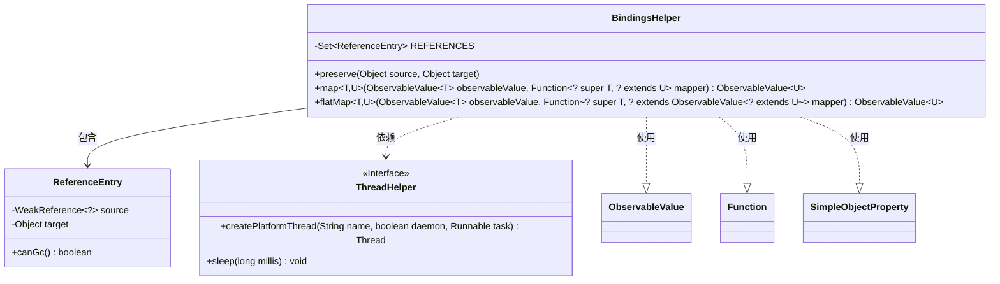
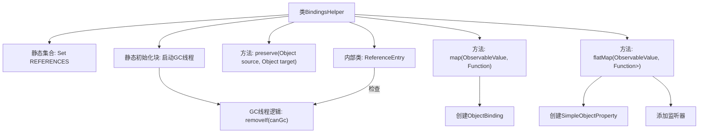
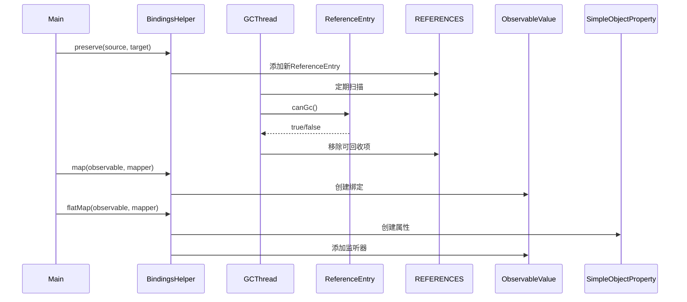

# 基础信息

|      |      |
|------|------|
| 名称 | BindingsHelper |
| 编码语言 | .java |
| 代码路径 | xpipe/app/src/main/java/io/xpipe/app/util/BindingsHelper.java |
| 包名 | io.xpipe.app.util |
| 依赖项 | ['javafx.beans.binding.Bindings', 'javafx.beans.property.SimpleObjectProperty', 'javafx.beans.value.ObservableValue', 'lombok.Value', 'java.lang.ref.WeakReference', 'java.util.HashSet', 'java.util.Set', 'java.util.function.Function'] |
| 概述说明 | BindingsHelper类提供对象绑定和弱引用管理功能，包含映射、扁平映射及自动垃圾回收机制。 |

# 说明

BindingsHelper类是一个用于管理对象绑定和引用的工具类。它包含静态集合REFERENCES用于跟踪弱引用对象，并通过后台线程定期清理可回收的引用。提供了preserve方法用于保存对象关系，map方法用于创建简单的对象绑定转换，flatMap方法用于处理嵌套的可观察值绑定转换。内部类ReferenceEntry用于封装弱引用和目标对象，并提供判断可回收状态的方法。整个类通过同步块保证线程安全，并包含注释掉的测试代码。

# 类列表 Class Summary

| 名称   | 类型  | 说明 |
|-------|------|-------------|
| BindingsHelper | class | BindingsHelper类提供对象绑定和弱引用管理功能，含GC线程和映射方法。 |

## 类 BindingsHelper

|      |      |
|------|------|
| 访问范围 | @SuppressWarnings("InfiniteLoopStatement");public |
| 类型 | class |
| 名称 | BindingsHelper |
| 说明 | BindingsHelper类提供对象绑定和弱引用管理功能，含GC线程和映射方法。 |

### UML类图

这段代码展示了一个`BindingsHelper`工具类，主要用于处理对象绑定和弱引用管理。核心功能包括：1) 通过`preserve()`方法维护源对象与目标对象的弱引用关系；2) 提供`map()`和`flatMap()`方法实现观察值(ObservableValue)的转换操作；3) 使用静态内部类`ReferenceEntry`和后台线程实现自动垃圾回收检测。类图清晰地呈现了与`ThreadHelper`接口的依赖关系，以及内部`ReferenceEntry`的组成结构，同时反映了对JavaFX中`ObservableValue`和函数式接口`Function`的使用。

### 内部方法调用关系图

该流程图展示了BindingsHelper类的核心结构和功能，包含静态资源管理、对象绑定映射和弱引用回收机制。时序图则详细描述了preserve方法的内存管理流程和map/flatMap方法的响应式数据绑定过程，其中GC线程会定期清理失效的弱引用，而映射操作会创建相应的数据绑定关系并自动更新。整个设计实现了高效的内存管理和响应式数据转换功能。

### 字段列表 Field List

| 名称  | 类型  | 说明 |
|-------|-------|------|
| REFERENCES = new HashSet<>() | Set<ReferenceEntry> | 私有静态常量引用集合 |

### 方法列表 Method List

| 名称  | 类型  | 说明 |
|-------|-------|------|
| preserve | void | 同步弱引用保存源对象到目标对象。 |
| map | ObservableValue<U> | 静态方法`map`将`ObservableValue<T>`的值通过`mapper`函数转换为`ObservableValue<U>`，并绑定依赖关系。 |
| flatMap | ObservableValue<U> | 将ObservableValue的值通过mapper转换为新的ObservableValue并绑定到属性。 |

