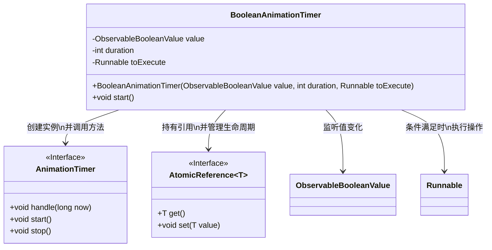
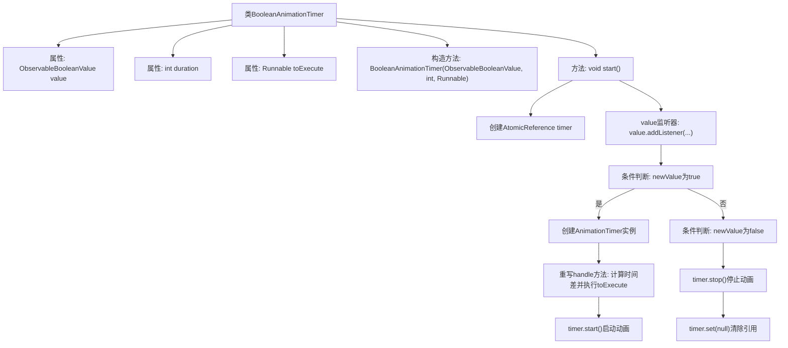

# 基础信息

|      |      |
|------|------|
| 名称 | BooleanAnimationTimer |
| 编码语言 | .java |
| 代码路径 | xpipe/app/src/main/java/io/xpipe/app/util/BooleanAnimationTimer.java |
| 包名 | io.xpipe.app.util |
| 依赖项 | ['javafx.animation.AnimationTimer', 'javafx.beans.value.ObservableBooleanValue', 'java.util.concurrent.atomic.AtomicReference'] |
| 概述说明 | 布尔动画计时器，监听布尔值变化，触发延时执行任务。 |

# 说明

BooleanAnimationTimer类用于基于布尔值变化触发定时动画。构造函数接收一个可观察布尔值、持续时间和一个Runnable任务。当布尔值变为true时，启动一个AnimationTimer，在指定持续时间后执行任务；若布尔值变为false则立即停止计时器。内部使用AtomicReference管理计时器实例，通过时间差计算确保精确触发。

# 类列表 Class Summary

| 名称   | 类型  | 说明 |
|-------|------|-------------|
| BooleanAnimationTimer | class | 布尔动画计时器，根据布尔值变化启动或停止动画，超时执行任务。 |

## 类 BooleanAnimationTimer

|      |      |
|------|------|
| 访问范围 | public |
| 类型 | class |
| 名称 | BooleanAnimationTimer |
| 说明 | 布尔动画计时器，根据布尔值变化启动或停止动画，超时执行任务。 |

### UML类图

这段代码展示了一个布尔值动画计时器类`BooleanAnimationTimer`，它通过监听`ObservableBooleanValue`的值变化来控制动画计时器的启停。当值为`true`时启动内部`AnimationTimer`，在指定持续时间后执行`Runnable`操作；当值变为`false`时立即停止计时器。类图中清晰地展示了它与`AnimationTimer`接口、`AtomicReference`泛型类、`ObservableBooleanValue`和`Runnable`之间的依赖关系，体现了基于观察者模式的时间控制机制。

### 内部方法调用关系图

这段代码实现了一个基于布尔值变化的动画计时器。当ObservableBooleanValue变为true时，启动一个AnimationTimer，在指定duration时间后执行Runnable任务；若值变为false则立即停止计时器。流程图清晰展示了从类结构到监听器触发、条件分支、动画创建和时间控制的完整逻辑链，重点突出了基于布尔状态切换的异步任务调度机制。

### 字段列表 Field List

| 名称  | 类型  | 说明 |
|-------|-------|------|
| value | ObservableBooleanValue | 私有不可变布尔值可观察对象。 |
| toExecute | Runnable | 私有可执行任务 |
| duration | int | 私有整型变量duration |

### 方法列表 Method List

| 名称  | 类型  | 说明 |
|-------|-------|------|
| start | void | Java方法：监听布尔值变化，启动/停止动画计时器，超时执行任务。 |

