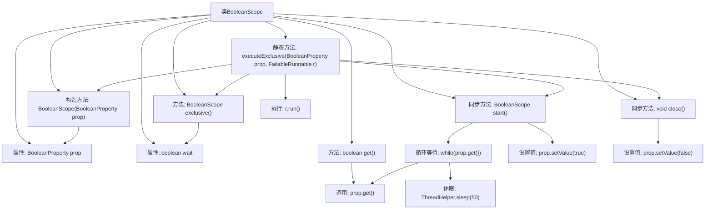

# 基础信息

|      |      |
|------|------|
| 名称 | BooleanScope |
| 编码语言 | .java |
| 代码路径 | xpipe/app/src/main/java/io/xpipe/app/util/BooleanScope.java |
| 包名 | io.xpipe.app.util |
| 依赖项 | ['io.xpipe.core.util.FailableRunnable', 'javafx.beans.property.BooleanProperty'] |
| 概述说明 | BooleanScope类实现AutoCloseable，用于布尔属性线程安全操作，支持独占执行和自动关闭。 |

# 说明

BooleanScope类实现了AutoCloseable接口，用于管理布尔属性的作用域。它包含一个BooleanProperty对象和wait标志。构造函数接收BooleanProperty参数。get方法返回当前属性值。exclusive方法设置wait标志为true，表示需要等待。start方法在wait为true时会循环检查属性值，直到为false才设置为true。close方法将属性重置为false。静态方法executeExclusive使用BooleanScope执行排他性操作，确保线程安全。

# 类列表 Class Summary

| 名称   | 类型  | 说明 |
|-------|------|-------------|
| BooleanScope | class | BooleanScope类实现AutoCloseable，用于布尔属性线程安全操作，支持独占执行和自动关闭。 |


## 类 BooleanScope

|      |      |
|------|------|
| 访问范围 | public |
| 类型 | class |
| 名称 | BooleanScope |
| 说明 | BooleanScope类实现AutoCloseable，用于布尔属性线程安全操作，支持独占执行和自动关闭。 |


### UML类图

```mermaid
classDiagram
    class BooleanScope {
        -BooleanProperty prop
        -boolean wait
        +BooleanScope(BooleanProperty prop)
        +boolean get()
        +BooleanScope exclusive()
        +synchronized BooleanScope start()
        +synchronized void close()
    }

    class BooleanProperty {
        <<Interface>>
        +boolean get()
        +void setValue(boolean value)
    }

    interface FailableRunnable~E~ {
        <<Interface>>
        +void run() throws E
    }

    BooleanScope --> BooleanProperty : 依赖
    BooleanScope ..|> AutoCloseable : 实现
    BooleanScope ..> FailableRunnable~E~ : 使用
```

这段代码展示了一个资源管理类`BooleanScope`，它实现了`AutoCloseable`接口用于try-with-resources语法。核心功能是通过`BooleanProperty`接口控制布尔值状态，支持独占模式（通过`exclusive()`和`start()`实现等待机制），并确保资源释放（通过`close()`）。类图中包含三个主要元素：主类与接口的依赖关系、泛型接口`FailableRunnable`的定义，以及`AutoCloseable`的标准实现。该设计特别适用于需要线程安全布尔状态控制的场景，如资源锁管理。


### 内部方法调用关系图



该流程图展示了BooleanScope类的完整结构和工作流程。类通过BooleanProperty实现线程安全的布尔值作用域管理，核心功能包括：构造时绑定属性、获取当前值(get)、独占模式设置(exclusive)、同步启动(start)和自动关闭(close)。executeExclusive静态方法封装了完整的独占执行流程，通过try-with-resources确保资源释放。start方法实现带等待机制的同步锁获取，close方法负责释放锁。整个过程体现了线程安全的布尔标志位管理机制。

### 字段列表 Field List

| 名称  | 类型  | 说明 |
|-------|-------|------|
| prop | BooleanProperty | 私有布尔属性prop。 |
| wait | boolean | 私有布尔变量wait |

### 方法列表 Method List

| 名称  | 类型  | 说明 |
|-------|-------|------|
| exclusive | BooleanScope | 布尔作用域设置独占模式并返回自身。 |
| executeExclusive | void | 静态方法executeExclusive：用BooleanProperty和FailableRunnable执行独占操作，异常抛出。 |
| get | boolean | 获取布尔属性值。 |
| start | BooleanScope | 同步方法start()：若wait为真则循环等待prop为假，随后设置prop为真并返回自身。 |
| close | void | 重写close方法，同步设置prop值为false。 |


