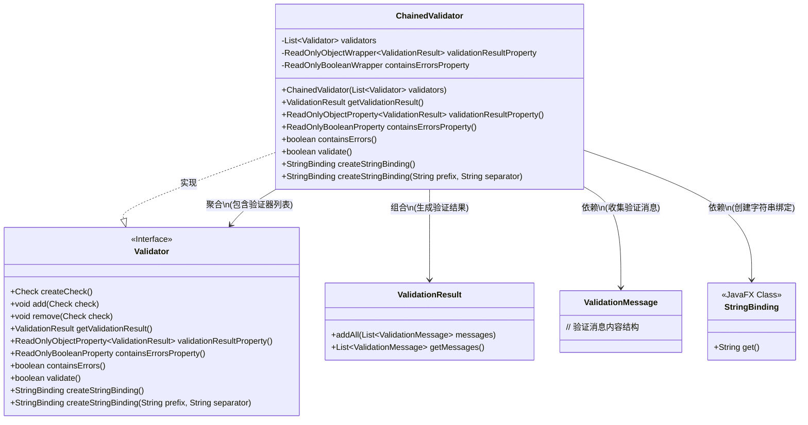
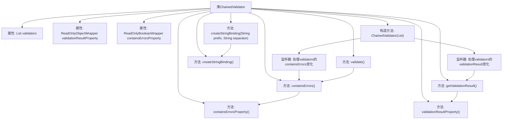

# 基础信息

|      |      |
|------|------|
| 名称 | ChainedValidator |
| 编码语言 | .java |
| 代码路径 | xpipe/app/src/main/java/io/xpipe/app/util/ChainedValidator.java |
| 包名 | io.xpipe.app.util |
| 依赖项 | ['javafx.beans.Observable', 'javafx.beans.binding.Bindings', 'javafx.beans.binding.StringBinding', 'javafx.beans.property.ReadOnlyBooleanProperty', 'javafx.beans.property.ReadOnlyBooleanWrapper', 'javafx.beans.property.ReadOnlyObjectProperty', 'javafx.beans.property.ReadOnlyObjectWrapper', 'net.synedra.validatorfx.Check', 'net.synedra.validatorfx.ValidationMessage', 'net.synedra.validatorfx.ValidationResult', 'java.util.ArrayList', 'java.util.List', 'java.util.stream.Collectors'] |
| 概述说明 | 链式验证器类，管理多个验证器，聚合验证结果和错误状态。 |

# 说明

ChainedValidator是一个实现Validator接口的类，用于链式验证多个验证器。它包含一个验证器列表和两个只读属性：validationResultProperty用于存储验证结果，containsErrorsProperty表示是否存在错误。构造函数初始化验证器并设置监听器以更新属性。主要方法包括获取验证结果、检查错误、执行验证以及创建字符串绑定。其中getValidationResult汇总所有验证器的消息，validate方法执行所有验证器的验证逻辑，createStringBinding生成格式化字符串输出。

# 类列表 Class Summary

| 名称   | 类型  | 说明 |
|-------|------|-------------|
| ChainedValidator | class | 链式验证器类，聚合多个验证器结果，监听错误状态，提供验证结果绑定功能。 |

## 类 ChainedValidator

|      |      |
|------|------|
| 访问范围 | public |
| 类型 | class |
| 名称 | ChainedValidator |
| 说明 | 链式验证器类，聚合多个验证器结果，监听错误状态，提供验证结果绑定功能。 |

### UML类图

该类图展示了ChainedValidator作为Validator接口的实现类，通过聚合多个Validator实例实现链式验证功能。核心包含三个主要部分：1) 维护验证器列表并监听其状态变化；2) 聚合各验证器的ValidationResult和错误状态；3) 提供基于JavaFX的字符串绑定功能。其设计特点是通过组合模式实现验证逻辑的扩展性，同时利用观察者模式实现验证状态的实时同步，最后通过工厂方法模式生成可动态更新的字符串表示。

### 内部方法调用关系图

流程图描述：该流程图展示了ChainedValidator类的结构和主要方法调用关系。该类通过组合多个Validator实现链式验证，核心功能包括维护验证结果状态、错误状态监听、批量验证执行和字符串绑定生成。构造方法初始化验证器列表并设置双重监听器（错误状态和验证结果），各方法间通过属性变更形成联动，如validate()会触发containsErrors()检查，而getValidationResult()会聚合所有验证器的消息。字符串绑定方法支持自定义前缀和分隔符，最终输出所有验证器的组合结果。

### 字段列表 Field List

| 名称  | 类型  | 说明 |
|-------|-------|------|
| validators | List<Validator> | 私有验证器列表 |
| containsErrorsProperty = new ReadOnlyBooleanWrapper() | ReadOnlyBooleanWrapper | 私有只读布尔属性包含错误标志。 |
| validationResultProperty =            new ReadOnlyObjectWrapper<>(new ValidationResult()) | ReadOnlyObjectWrapper<ValidationResult> | 私有只读属性validationResultProperty，初始化为新的ValidationResult对象。 |

### 方法列表 Method List

| 名称  | 类型  | 说明 |
|-------|-------|------|
| remove | void | 重写remove方法，抛出不支持操作异常。 |
| validationResultProperty | ReadOnlyObjectProperty<ValidationResult> | 重写方法返回验证结果的只读属性对象。 |
| containsErrorsProperty | ReadOnlyBooleanProperty | 重写containsErrorsProperty方法，返回只读布尔属性。 |
| add | void | 重写add方法，抛出不支持操作异常。 |
| getValidationResult | ValidationResult | 重写方法，合并多个验证器的消息到单一结果。 |
| createCheck | Check | 重写createCheck方法，抛出未支持操作异常。 |
| containsErrors | boolean | 检查验证器列表中是否存在错误。 |
| validate | boolean | 重写validate方法，遍历验证器列表，全部通过返回true，否则false。 |
| createStringBinding | StringBinding | 重写方法，返回带前缀和换行的字符串绑定。 |
| createStringBinding | StringBinding | 创建字符串绑定，组合验证器结果，用换行符连接。 |

