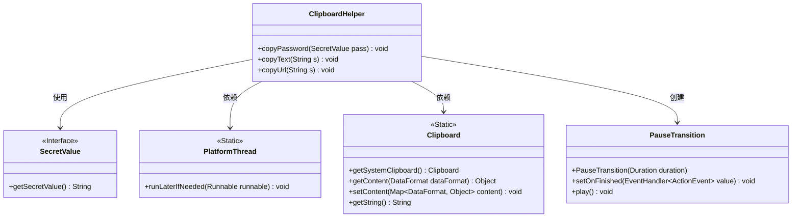
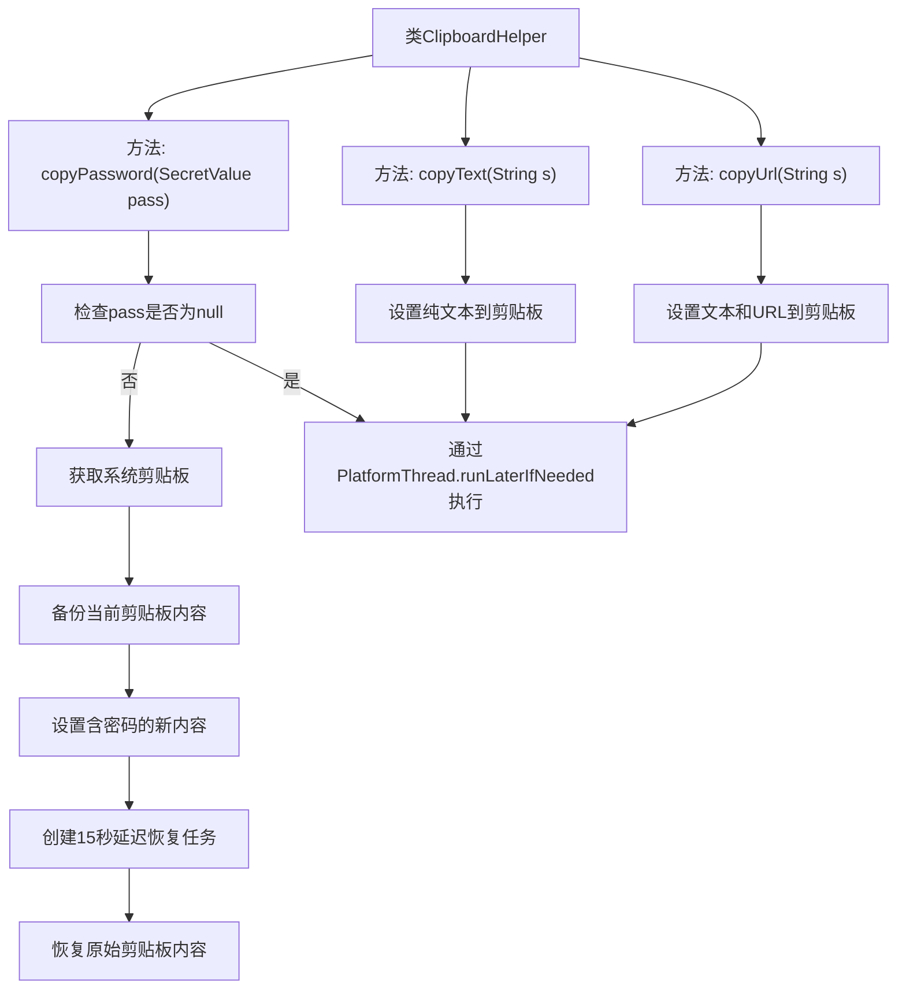

# 基础信息

|      |      |
|------|------|
| 名称 | ClipboardHelper |
| 编码语言 | .java |
| 代码路径 | xpipe/app/src/main/java/io/xpipe/app/util/ClipboardHelper.java |
| 包名 | io.xpipe.app.util |
| 依赖项 | ['io.xpipe.core.util.SecretValue', 'javafx.animation.PauseTransition', 'javafx.scene.input.Clipboard', 'javafx.scene.input.DataFormat', 'javafx.util.Duration', 'java.util.AbstractMap', 'java.util.HashMap', 'java.util.Map', 'java.util.stream.Stream'] |
| 概述说明 | 复制密码和文本到剪贴板，15秒后自动清除密码。 |

# 说明

ClipboardHelper类提供了三个静态方法用于处理剪贴板操作。copyPassword方法将密码安全地复制到剪贴板，保存当前剪贴板内容，15秒后自动恢复原始内容。copyText方法将纯文本复制到剪贴板。copyUrl方法同时将文本和URL格式复制到剪贴板。所有操作都通过PlatformThread.runLaterIfNeeded确保在主线程执行。

# 类列表 Class Summary

| 名称   | 类型  | 说明 |
|-------|------|-------------|
| ClipboardHelper | class | 复制密码到剪贴板，15秒后自动清除。支持文本和URL复制。 |

## 类 ClipboardHelper

|      |      |
|------|------|
| 访问范围 | public |
| 类型 | class |
| 名称 | ClipboardHelper |
| 说明 | 复制密码到剪贴板，15秒后自动清除。支持文本和URL复制。 |

### UML类图

这段代码描述了一个剪贴板工具类ClipboardHelper，提供了三种复制功能：密码、文本和URL。核心功能copyPassword()会先备份系统剪贴板内容，设置新密码后启动15秒计时器，到期后自动恢复原始内容。该类依赖于SecretValue接口获取密码值，通过PlatformThread确保UI线程安全操作，使用Clipboard类进行剪贴板交互，并创建PauseTransition实现延时恢复功能。所有方法均为静态，体现了工具类的设计特点。

### 内部方法调用关系图

流程图描述了ClipboardHelper类的三个核心方法。copyPassword方法实现安全密码复制功能，包含空值检查、剪贴板内容备份、15秒自动恢复机制；copyText/copyUrl分别处理纯文本和URL的复制操作。所有操作都通过PlatformThread.runLaterIfNeeded在UI线程异步执行，确保线程安全。密码处理方法特别设计了临时存储和自动清理机制，防止密码长期驻留剪贴板。

### 字段列表 Field List

| 名称  | 类型  | 说明 |
|-------|-------|------|

### 方法列表 Method List

| 名称  | 类型  | 说明 |
|-------|-------|------|
| copyUrl | void | Java方法：复制URL到剪贴板，支持纯文本和URL格式。 |
| copyPassword | void | 复制密码到剪贴板，15秒后恢复原内容。 |
| copyText | void | 静态方法复制文本到剪贴板，使用平台线程确保线程安全。 |

