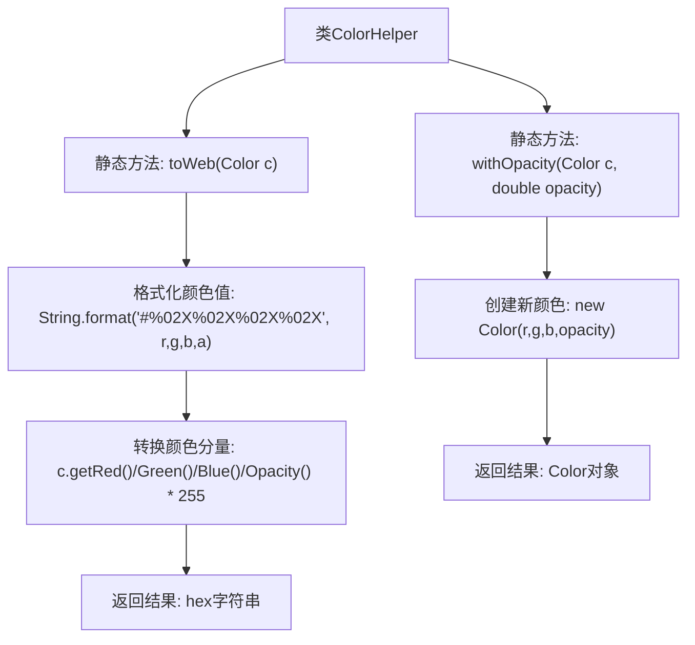

# 基础信息

|      |      |
|------|------|
| 名称 | ColorHelper |
| 编码语言 | .java |
| 代码路径 | xpipe/app/src/main/java/io/xpipe/app/util/ColorHelper.java |
| 包名 | io.xpipe.app.util |
| 依赖项 | ['javafx.scene.paint.Color'] |
| 概述说明 | ColorHelper类提供颜色转换和透明度调整功能。 |

# 说明

这是一个名为ColorHelper的工具类，提供了两个静态方法用于颜色处理。第一个方法toWeb将Color对象转换为网页格式的十六进制字符串，包含红绿蓝和透明度四个通道的值，每个通道值转换为两位十六进制表示。第二个方法withOpacity基于输入颜色创建一个新颜色对象，保留原始的红绿蓝通道值，但替换为指定的透明度值。这两个方法简化了颜色格式转换和透明度调整的操作。

# 类列表 Class Summary

| 名称   | 类型  | 说明 |
|-------|------|-------------|
| ColorHelper | class | ColorHelper类提供颜色转换和透明度调整功能。 |


## 类 ColorHelper

|      |      |
|------|------|
| 访问范围 | public |
| 类型 | class |
| 名称 | ColorHelper |
| 说明 | ColorHelper类提供颜色转换和透明度调整功能。 |


### UML类图

```mermaid
classDiagram
    class ColorHelper {
        <<static>>
        +String toWeb(Color c)
        +Color withOpacity(Color c, double opacity)
    }

    class Color {
        <<Interface>>
        +double getRed()
        +double getGreen()
        +double getBlue()
        +double getOpacity()
    }

    ColorHelper --> Color : 依赖
    // ColorHelper工具类提供颜色格式转换和透明度调整功能
    // 通过静态方法操作Color接口实现RGBA与Web十六进制互转
```

这段代码展示了一个颜色处理工具类ColorHelper，包含两个核心静态方法：toWeb()将Color对象转换为Web格式的十六进制字符串（含透明度），withOpacity()创建具有新透明度的Color对象。类图清晰地反映了ColorHelper对Color接口的依赖关系，其中Color接口定义了获取RGBA值的方法。该设计实现了颜色数据与Web格式间的解耦转换，适用于需要前端颜色处理的场景。


### 内部方法调用关系图



这段代码的流程图展示了ColorHelper类的两个核心静态方法。toWeb方法将Color对象转换为Web格式的十六进制字符串，通过提取RGBA分量并转换为0-255整数值后格式化输出。withOpacity方法则基于输入颜色创建新Color对象，仅修改其透明度分量。两个方法均保持输入颜色的RGB分量不变，体现了颜色处理的原子性和可组合性。

### 字段列表 Field List

| 名称  | 类型  | 说明 |
|-------|-------|------|

### 方法列表 Method List

| 名称  | 类型  | 说明 |
|-------|-------|------|
| withOpacity | Color | 静态方法：根据颜色和透明度生成新颜色。 |
| toWeb | String | 将颜色对象转换为十六进制Web格式字符串。 |


