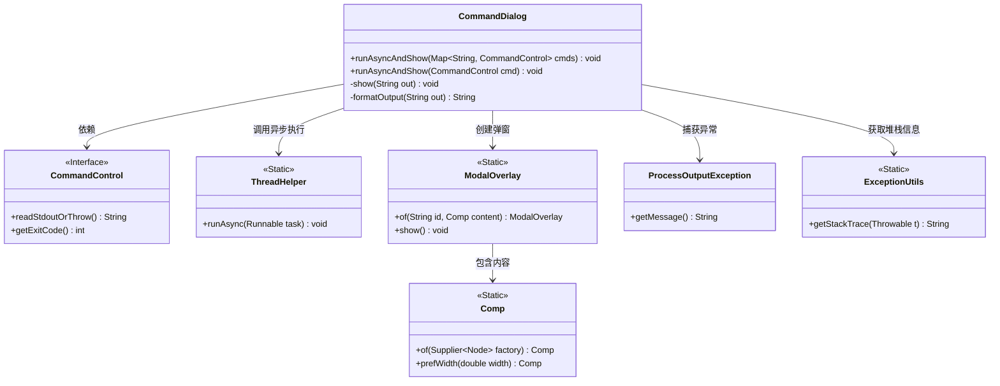
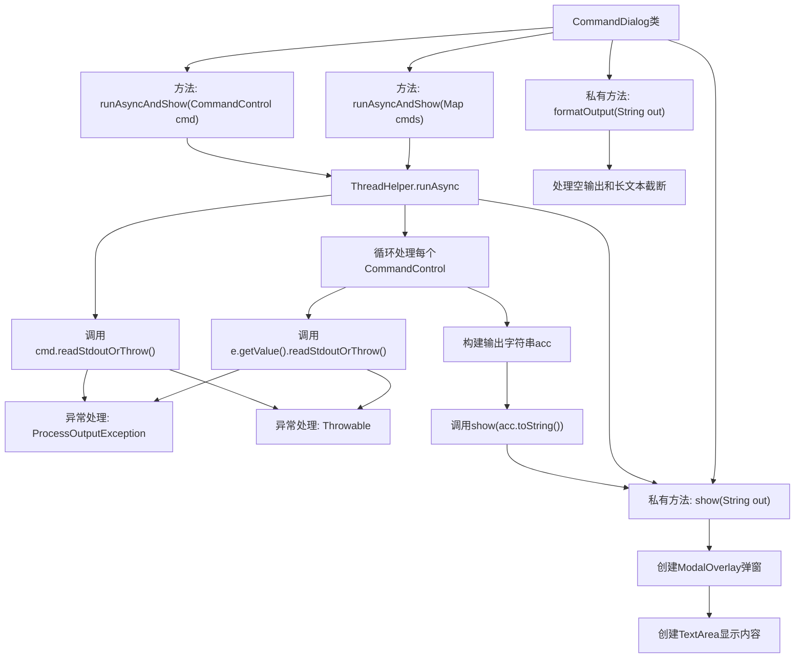

# 基础信息

|      |      |
|------|------|
| 名称 | CommandDialog |
| 编码语言 | .java |
| 代码路径 | xpipe/app/src/main/java/io/xpipe/app/util/CommandDialog.java |
| 包名 | io.xpipe.app.util |
| 依赖项 | ['io.xpipe.app.comp.Comp', 'io.xpipe.app.comp.base.ModalOverlay', 'io.xpipe.core.process.CommandControl', 'io.xpipe.core.process.ProcessOutputException', 'javafx.scene.control.TextArea', 'javafx.scene.layout.StackPane', 'org.apache.commons.lang3.exception.ExceptionUtils', 'java.util.Map', 'java.util.concurrent.atomic.AtomicInteger', 'java.util.stream.Collectors'] |
| 概述说明 | 异步执行命令并显示输出，支持单命令和批量处理，格式化长文本，异常捕获和模态框展示。 |

# 说明

CommandDialog类提供了异步执行命令并显示输出的功能。包含两个主要方法：runAsyncAndShow可处理单个或多个命令控制对象，捕获命令输出、退出码及异常信息。输出处理逻辑包括格式化空输出为"<empty>"，限制超长输出为前100行并提示剩余行数。显示功能通过ModalOverlay实现，使用可滚动的不可编辑文本区域，自动调整高度，宽度固定为650像素。异常处理涵盖ProcessOutputException和其他未捕获异常，分别显示错误消息和堆栈跟踪。

# 类列表 Class Summary

| 名称   | 类型  | 说明 |
|-------|------|-------------|
| CommandDialog | class | 异步执行命令并显示输出，支持单命令和批量处理，格式化输出并处理异常。 |

## 类 CommandDialog

|      |      |
|------|------|
| 访问范围 | public |
| 类型 | class |
| 名称 | CommandDialog |
| 说明 | 异步执行命令并显示输出，支持单命令和批量处理，格式化输出并处理异常。 |

### UML类图

这段代码展示了一个命令对话框工具类，主要功能是异步执行命令并显示输出结果。CommandDialog类提供了两种运行方式：处理单个命令或命令映射表，通过ThreadHelper异步执行，使用ModalOverlay展示格式化后的输出。代码包含异常处理、输出截断逻辑（超过10000字符时）和响应式UI构建。类图中清晰地展示了与命令控制接口、线程工具、模态窗口组件和异常工具类的关系。

### 内部方法调用关系图

这段代码流程图展示了CommandDialog类的核心功能结构。该类提供了两种异步执行命令并显示结果的方法，支持批量命令和单个命令处理。主要流程包括：通过ThreadHelper异步执行命令、捕获命令输出或异常、格式化输出内容（处理空值和长文本截断）、最后通过ModalOverlay弹窗展示结果。异常处理机制覆盖了ProcessOutputException和其他Throwable情况，确保程序健壮性。图形化展示部分使用JavaFX组件实现可滚动的文本区域，自动调整显示行数。

### 字段列表 Field List

| 名称  | 类型  | 说明 |
|-------|-------|------|

### 方法列表 Method List

| 名称  | 类型  | 说明 |
|-------|-------|------|
| runAsyncAndShow | void | 异步执行命令并格式化输出后显示。 |
| runAsyncAndShow | void | 异步执行命令并显示结果，包括退出码和输出。 |
| show | void | 私有方法显示文本输出，创建模态窗口展示不可编辑文本区域，宽度650，行数至少8。 |
| formatOutput | String | 格式化输出字符串，空值转"<empty>"，超万字符截断并提示剩余行数。 |

