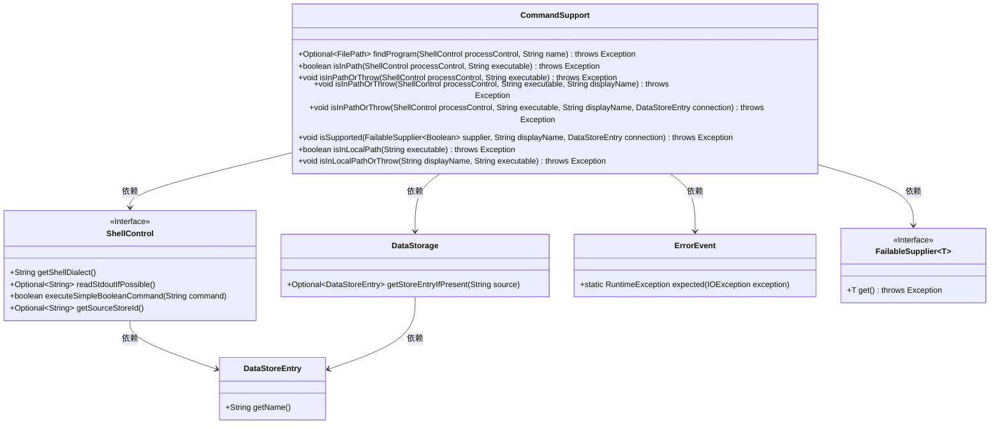
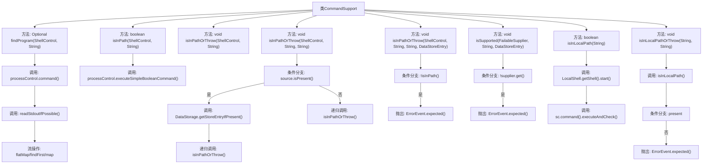

# 基础信息

|      |      |
|------|------|
| 名称 | CommandSupport |
| 编码语言 | .java |
| 代码路径 | xpipe/app/src/main/java/io/xpipe/app/util/CommandSupport.java |
| 包名 | io.xpipe.app.util |
| 依赖项 | ['io.xpipe.app.issue.ErrorEvent', 'io.xpipe.app.storage.DataStorage', 'io.xpipe.app.storage.DataStoreEntry', 'io.xpipe.core.process.ShellControl', 'io.xpipe.core.store.FilePath', 'io.xpipe.core.util.FailableSupplier', 'java.io.IOException', 'java.util.Optional'] |
| 概述说明 | CommandSupport类提供查找程序路径、检查程序是否在PATH中及相关异常处理功能。 |

# 说明

该代码定义了一个CommandSupport类，提供了一系列与命令行程序路径查找和验证相关的实用方法。主要功能包括：通过ShellControl查找指定名称的程序路径（findProgram）；检查程序是否在系统PATH中（isInPath）；若程序不在PATH中则抛出异常（isInPathOrThrow）；支持自定义显示名称和数据存储连接信息；验证本地Shell中程序是否存在（isInLocalPath）；以及相应的异常抛出版本（isInLocalPathOrThrow）。这些方法封装了不同场景下的路径检查逻辑，并提供了友好的错误提示信息。

# 类列表 Class Summary

| 名称   | 类型  | 说明 |
|-------|------|-------------|
| CommandSupport | class | CommandSupport类提供查找程序路径、检查程序是否在PATH中及抛出异常的方法。 |

## 类 CommandSupport

|      |      |
|------|------|
| 访问范围 | public |
| 类型 | class |
| 名称 | CommandSupport |
| 说明 | CommandSupport类提供查找程序路径、检查程序是否在PATH中及抛出异常的方法。 |

### UML类图

这段代码展示了一个`CommandSupport`工具类，主要用于在Shell环境中查找和验证程序路径。它提供了多种方法来检查程序是否存在于PATH环境变量中，包括基本检查、带错误提示的检查以及本地路径检查。类图中清晰地展示了`CommandSupport`与`ShellControl`接口、`DataStorage`数据存储、`DataStoreEntry`数据条目、`ErrorEvent`错误处理以及`FailableSupplier`函数式接口之间的依赖关系。这些组件协同工作，为系统提供了可靠的命令行程序路径验证功能。

### 内部方法调用关系图

该流程图展示了CommandSupport类的8个核心方法及其调用关系。主要功能包括：通过ShellControl查找程序路径、检查程序是否在PATH环境变量中、支持链式调用的异常抛出机制、本地路径检查等。关键流程涉及条件分支处理、递归调用、流式操作和异常抛出，其中isInPathOrThrow方法通过多态实现不同参数组合的调用，最终统一处理路径检查失败的异常场景。本地路径检查方法则通过try-with-resources确保Shell资源释放。

### 字段列表 Field List

| 名称  | 类型  | 说明 |
|-------|-------|------|

### 方法列表 Method List

| 名称  | 类型  | 说明 |
|-------|-------|------|
| isInPathOrThrow | void | 检查可执行文件是否在PATH中，不在则抛出异常。 |
| isInPath | boolean | 检查指定可执行文件是否在系统路径中。 |
| isInPathOrThrow | void | 检查可执行文件是否在路径中，否则抛出异常。 |
| isInPathOrThrow | void | 检查可执行文件路径，存在则验证，否则抛出异常。 |
| isSupported | void | 检查支持性，不支持则抛异常。 |
| isInLocalPath | boolean | 检查本地路径是否存在指定可执行文件。 |
| findProgram | Optional<FilePath> | 查找指定名称的程序路径，返回首个结果或空。 |
| isInLocalPathOrThrow | void | 检查可执行文件是否在本地PATH中，不在则抛出异常提示安装或添加PATH。 |

