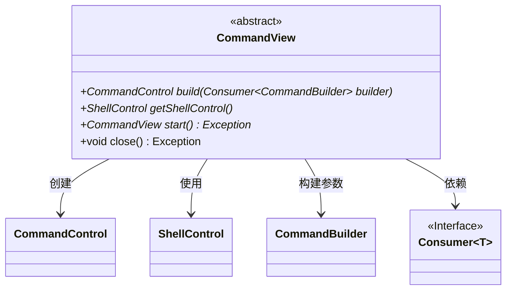
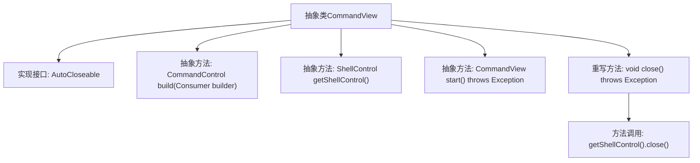

# 基础信息

|      |      |
|------|------|
| 名称 | CommandView |
| 编码语言 | .java |
| 代码路径 | xpipe/app/src/main/java/io/xpipe/app/util/CommandView.java |
| 包名 | io.xpipe.app.util |
| 依赖项 | ['io.xpipe.core.process.CommandBuilder', 'io.xpipe.core.process.CommandControl', 'io.xpipe.core.process.ShellControl', 'java.util.function.Consumer'] |
| 概述说明 | 抽象类CommandView实现AutoCloseable，含构建命令、获取Shell控制及启动方法，关闭时自动释放Shell资源。 |

# 说明

这是一个名为CommandView的抽象类，实现了AutoCloseable接口。它定义了三个核心抽象方法：build方法接收一个Consumer参数用于构建命令，getShellControl方法获取Shell控制对象，start方法启动命令视图。类还重写了close方法，通过调用ShellControl的close方法实现资源释放。该类作为命令视图的基类，提供了命令构建、Shell控制和生命周期管理的基本框架。

# 类列表 Class Summary

| 名称   | 类型  | 说明 |
|-------|------|-------------|
| CommandView | class | 抽象类CommandView实现AutoCloseable，定义构建命令、获取Shell控制及启动关闭方法。 |

## 类 CommandView

|      |      |
|------|------|
| 访问范围 | public abstract |
| 类型 | class |
| 名称 | CommandView |
| 说明 | 抽象类CommandView实现AutoCloseable，定义构建命令、获取Shell控制及启动关闭方法。 |

### UML类图

这段代码描述了一个抽象类CommandView，实现了AutoCloseable接口，主要用于构建和执行命令视图。它包含构建命令控制对象、获取Shell控制核心、启动视图及关闭资源等核心方法，通过泛型Consumer接口接收CommandBuilder参数。类图中清晰展示了与CommandControl、ShellControl等组件的依赖关系，体现了命令模式中构建器与执行器的分离设计。

### 内部方法调用关系图

该流程图展示了抽象类CommandView的结构，该类实现了AutoCloseable接口，包含三个抽象方法和一个重写的close方法。close方法通过调用getShellControl().close()来关闭ShellControl资源。类设计用于构建命令视图，通过build方法配置命令，start方法启动视图，并自动管理资源关闭。

### 字段列表 Field List

| 名称  | 类型  | 说明 |
|-------|-------|------|

### 方法列表 Method List

| 名称  | 类型  | 说明 |
|-------|-------|------|
| start | CommandView | 抽象方法start()，返回CommandView，可能抛出异常。 |
| close | void | 重写close方法，调用ShellControl的close方法。 |
| build | CommandControl | 构建命令控制的抽象方法，接收命令构建器消费者。 |
| getShellControl | ShellControl | 获取ShellControl的抽象保护方法。 |

