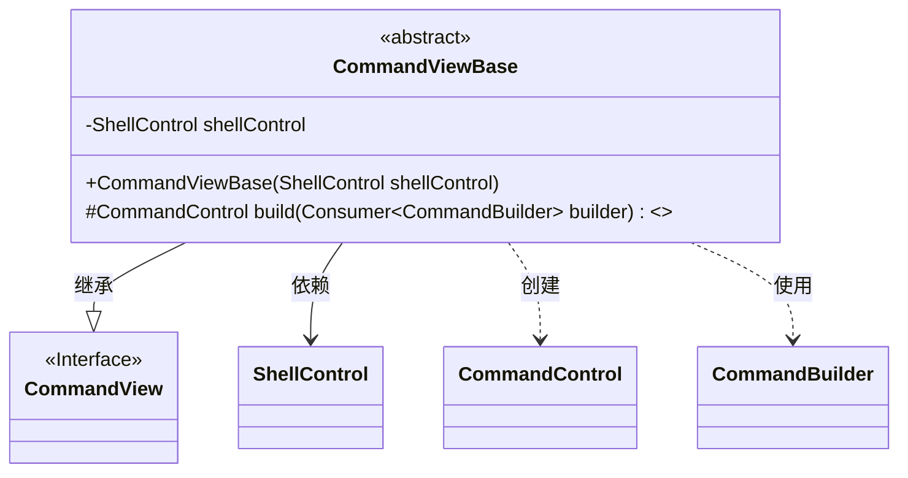
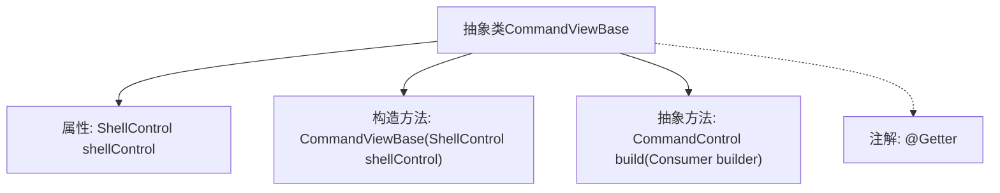

# 基础信息

|      |      |
|------|------|
| 名称 | CommandViewBase |
| 编码语言 | .java |
| 代码路径 | xpipe/app/src/main/java/io/xpipe/app/util/CommandViewBase.java |
| 包名 | io.xpipe.app.util |
| 依赖项 | ['io.xpipe.core.process.CommandBuilder', 'io.xpipe.core.process.CommandControl', 'io.xpipe.core.process.ShellControl', 'lombok.Getter', 'java.util.function.Consumer'] |
| 概述说明 | 抽象类CommandViewBase继承CommandView，含ShellControl成员和构造方法，定义抽象方法build。 |

# 说明

这是一个名为CommandViewBase的抽象类，继承自CommandView类。该类包含一个受保护的final类型ShellControl成员变量shellControl，并通过构造函数初始化该变量。类中定义了一个抽象方法build，该方法接受一个Consumer<CommandBuilder>类型的参数，返回类型为CommandControl。该类使用@Getter注解，表明会自动生成getter方法。

# 类列表 Class Summary

| 名称   | 类型  | 说明 |
|-------|------|-------------|
| CommandViewBase | class | 抽象类CommandViewBase继承CommandView，含ShellControl成员，提供构建CommandControl的抽象方法。 |

## 类 CommandViewBase

|      |      |
|------|------|
| 访问范围 | @Getter;public abstract |
| 类型 | class |
| 名称 | CommandViewBase |
| 说明 | 抽象类CommandViewBase继承CommandView，含ShellControl成员，提供构建CommandControl的抽象方法。 |

### UML类图

这段类图描述了一个抽象基类CommandViewBase，它实现了CommandView接口并包含一个ShellControl依赖项。该类提供了受保护的抽象方法build()，该方法接收一个Consumer<CommandBuilder>参数并返回CommandControl对象。图中清晰展示了继承关系（CommandViewBase继承CommandView）、组合关系（持有ShellControl）以及方法参数涉及的CommandBuilder和返回类型CommandControl的关联关系。整体结构体现了命令模式的设计思想，通过抽象方法让子类实现具体构建逻辑。

### 内部方法调用关系图

这段流程图描述了抽象类CommandViewBase的结构，包含一个受保护的ShellControl属性、一个构造方法、一个抽象build方法以及Lombok的@Getter注解。该类继承自CommandView（图中未展开），主要职责是作为命令视图的基类，通过build方法让子类实现具体的命令构建逻辑，同时通过@Getter自动生成getter方法。构造方法接收ShellControl参数用于控制台交互，体现了命令模式与控制反转的设计思想。

### 字段列表 Field List

| 名称  | 类型  | 说明 |
|-------|-------|------|
| shellControl | ShellControl | 受保护的最终ShellControl实例shellControl。 |

### 方法列表 Method List

| 名称  | 类型  | 说明 |
|-------|-------|------|
| build | CommandControl | 构建命令控制的抽象方法，接收构建器消费者参数。 |

