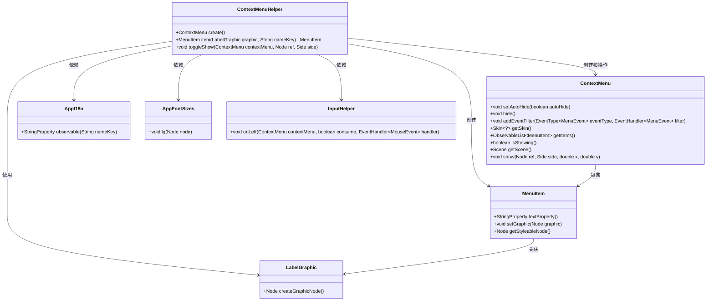
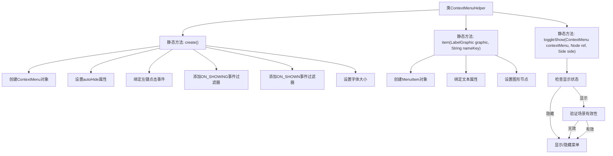

# 基础信息

|      |      |
|------|------|
| 名称 | ContextMenuHelper |
| 编码语言 | .java |
| 代码路径 | xpipe/app/src/main/java/io/xpipe/app/util/ContextMenuHelper.java |
| 包名 | io.xpipe.app.util |
| 依赖项 | ['io.xpipe.app.core.AppFontSizes', 'io.xpipe.app.core.AppI18n', 'javafx.application.Platform', 'javafx.geometry.Side', 'javafx.scene.Node', 'javafx.scene.control.ContextMenu', 'javafx.scene.control.Menu', 'javafx.scene.control.MenuItem', 'javafx.scene.layout.Region'] |
| 概述说明 | ContextMenuHelper类提供创建、配置和切换上下文菜单的方法，包括自动隐藏、宽度限制和焦点控制。 |

# 说明

ContextMenuHelper类提供创建和操作上下文菜单的静态方法。create方法构建一个自动隐藏的ContextMenu，设置左键点击隐藏事件，并限制菜单最大宽度为500像素。显示时自动聚焦首项，并应用大号字体。item方法生成带图标和本地化文本的菜单项。toggleShow方法控制菜单显示/隐藏，避免空指针异常。所有方法均支持场景图节点操作。

# 类列表 Class Summary

| 名称   | 类型  | 说明 |
|-------|------|-------------|
| ContextMenuHelper | class | ContextMenuHelper类提供创建、配置和切换上下文菜单的方法，包括自动隐藏、尺寸限制和焦点管理。 |

## 类 ContextMenuHelper

|      |      |
|------|------|
| 访问范围 | public |
| 类型 | class |
| 名称 | ContextMenuHelper |
| 说明 | ContextMenuHelper类提供创建、配置和切换上下文菜单的方法，包括自动隐藏、尺寸限制和焦点管理。 |

### UML类图

该类图展示了`ContextMenuHelper`工具类的核心结构和关联关系。该类主要提供三个静态方法：创建可自动隐藏的上下文菜单、创建带本地化文本的菜单项，以及切换菜单显示状态。图中清晰地显示了与`ContextMenu`、`MenuItem`等GUI组件的交互，以及依赖的辅助类如`AppI18n`（国际化）和`InputHelper`（输入处理）。所有关联关系都通过箭头标注，体现了菜单创建、配置和事件处理的完整流程。

### 内部方法调用关系图

流程图描述：该流程图展示了ContextMenuHelper类的三个核心静态方法。create()方法构建ContextMenu并配置自动隐藏、鼠标事件和尺寸样式；item()方法创建带图标和本地化文本的菜单项；toggleShow()方法智能切换菜单显示状态，包含场景有效性检查。所有方法均采用防御式编程处理边缘情况，如空指针检查和异步UI操作。

### 字段列表 Field List

| 名称  | 类型  | 说明 |
|-------|-------|------|

### 方法列表 Method List

| 名称  | 类型  | 说明 |
|-------|-------|------|
| create | ContextMenu | 创建自动隐藏的上下文菜单，设置最大宽度500，显示时聚焦首项，并应用大字体样式。 |
| item | MenuItem | 创建菜单项，绑定文本和图形。 |
| toggleShow | void | 切换上下文菜单显示状态：未显示时检查场景和引用节点后显示，否则隐藏。 |

