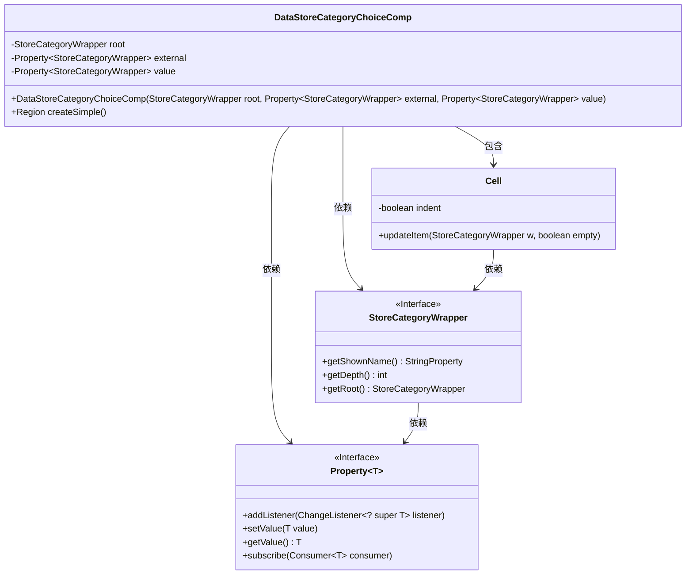
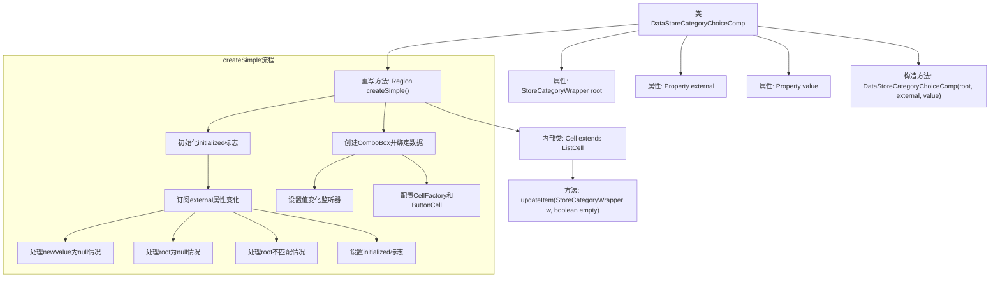
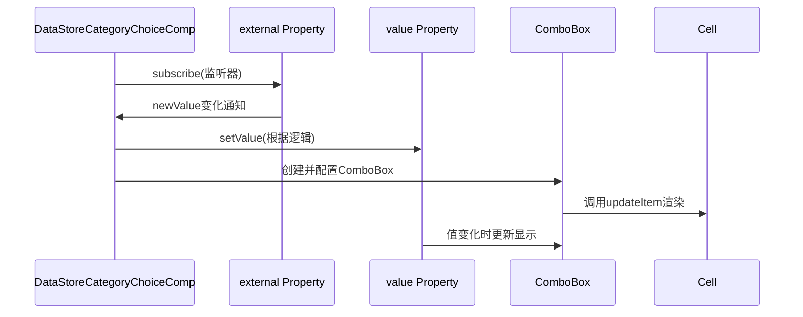

# 基础信息

|      |      |
|------|------|
| 名称 | DataStoreCategoryChoiceComp |
| 编码语言 | .java |
| 代码路径 | xpipe/app/src/main/java/io/xpipe/app/util/DataStoreCategoryChoiceComp.java |
| 包名 | io.xpipe.app.util |
| 依赖项 | ['io.xpipe.app.comp.SimpleComp', 'io.xpipe.app.comp.store.StoreCategoryWrapper', 'io.xpipe.app.comp.store.StoreViewState', 'javafx.beans.property.Property', 'javafx.beans.property.SimpleBooleanProperty', 'javafx.geometry.Insets', 'javafx.scene.control.ComboBox', 'javafx.scene.control.ListCell', 'javafx.scene.layout.Region', 'lombok.EqualsAndHashCode', 'lombok.Value'] |
| 概述说明 | 数据存储分类选择组件，含根节点、外部属性和值属性，使用组合框展示分类并处理值变更。 |

# 说明

DataStoreCategoryChoiceComp是一个继承SimpleComp的组件，用于管理商店分类选择。它包含root、external和value三个属性，分别表示根分类、外部传入分类和当前值。createSimple方法创建了一个ComboBox，根据root获取分类列表并绑定value值。当external变化时，会更新value值。ComboBox使用自定义Cell显示分类名称，支持缩进显示层级关系。组件通过监听器确保UI与数据同步。

# 类列表 Class Summary

| 名称   | 类型  | 说明 |
|-------|------|-------------|
| DataStoreCategoryChoiceComp | class | 数据存储分类选择组件，含根节点、外部和值属性，创建组合框并处理值变更。 |

## 类 DataStoreCategoryChoiceComp

|      |      |
|------|------|
| 访问范围 | public |
| 类型 | class |
| 名称 | DataStoreCategoryChoiceComp |
| 说明 | 数据存储分类选择组件，含根节点、外部和值属性，创建组合框并处理值变更。 |

### UML类图

这段代码展示了一个数据存储类别选择组件`DataStoreCategoryChoiceComp`，它继承自`SimpleComp`类，主要用于处理存储类别的选择逻辑。组件包含一个根类别`root`、外部属性`external`和值属性`value`，通过`createSimple()`方法创建组合框界面。内部类`Cell`用于自定义列表项的显示方式，包括缩进和名称绑定。`StoreCategoryWrapper`接口定义了获取类别名称、深度和根节点的方法，`Property`接口提供了属性监听和值操作功能。整个设计实现了类别选择的动态响应和界面更新。

### 内部方法调用关系图

这段代码实现了一个基于ComboBox的商店分类选择组件，主要功能包括：1) 通过external属性监听外部分类变化；2) 根据业务逻辑自动更新value属性；3) 使用自定义Cell实现带缩进的分类显示。流程图展示了类结构和createSimple()方法的核心处理流程，时序图则描述了属性变化与UI更新的交互过程。该组件特别处理了根分类匹配、初始化状态等边界情况，并通过PlatformThread保证线程安全的UI更新。

### 字段列表 Field List

| 名称  | 类型  | 说明 |
|-------|-------|------|
| external | Property<StoreCategoryWrapper> | 私有属性external，类型为Property<StoreCategoryWrapper>。 |
| root | StoreCategoryWrapper | 私有根目录存储分类包装器 |
| value | Property<StoreCategoryWrapper> | 私有属性，类型为Property<StoreCategoryWrapper>。 |

### 方法列表 Method List

| 名称  | 类型  | 说明 |
|-------|-------|------|
| createSimple | Region | 重写createSimple方法，监听外部值变化更新组合框，双向绑定值并自定义单元格。 |

