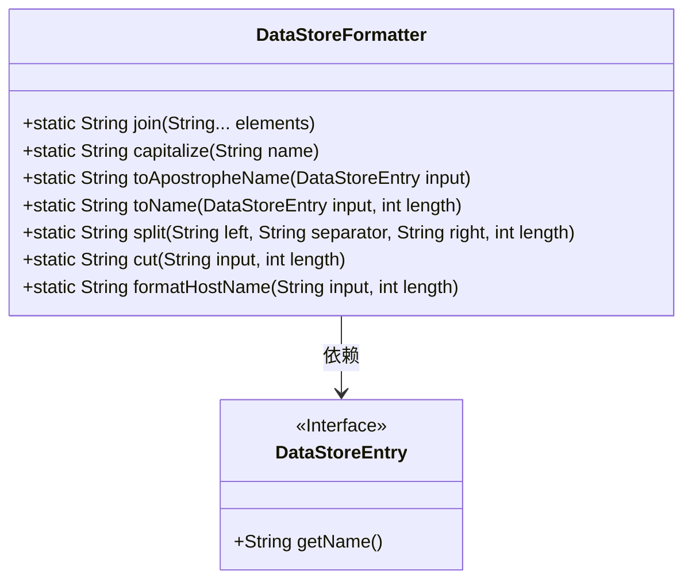
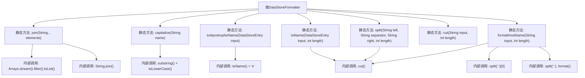

# 基础信息

|      |      |
|------|------|
| 名称 | DataStoreFormatter |
| 编码语言 | .java |
| 代码路径 | xpipe/app/src/main/java/io/xpipe/app/util/DataStoreFormatter.java |
| 包名 | io.xpipe.app.util |
| 依赖项 | ['io.xpipe.app.storage.DataStoreEntry', 'java.util.Arrays'] |
| 概述说明 | DataStoreFormatter类提供字符串格式化工具，包括连接、截断、大小写转换等功能。 |

# 说明

DataStoreFormatter类提供多种字符串格式化方法：join方法连接非空字符串；capitalize方法将字符串首字母大写；toApostropheName和toName方法处理DataStoreEntry对象名称，支持截断和添加所有格；cut方法截断字符串并添加省略号；split方法按指定分隔符分割字符串；formatHostName方法处理主机名，特别针对AWS服务，移除端口并格式化区域和名称。所有方法均考虑空值和长度限制。

# 类列表 Class Summary

| 名称   | 类型  | 说明 |
|-------|------|-------------|
| DataStoreFormatter | class | DataStoreFormatter类提供字符串处理工具，包括连接、截断、格式化AWS主机名等功能。 |

## 类 DataStoreFormatter

|      |      |
|------|------|
| 访问范围 | public |
| 类型 | class |
| 名称 | DataStoreFormatter |
| 说明 | DataStoreFormatter类提供字符串处理工具，包括连接、截断、格式化AWS主机名等功能。 |

### UML类图

这段代码展示了一个`DataStoreFormatter`工具类，提供了多种静态方法用于字符串格式化处理。主要功能包括：连接多个字符串并过滤空值、字符串首字母大写转换、处理`DataStoreEntry`接口对象的名称（包括添加所有格后缀）、字符串截断与拼接、以及针对AWS主机名的特殊格式化处理。类图中清晰地显示了`DataStoreFormatter`与`DataStoreEntry`接口的依赖关系，所有方法均为静态公有方法，体现了工具类的设计特点。

### 内部方法调用关系图

该流程图展示了DataStoreFormatter类的7个核心静态方法及其内部调用关系。主要功能包括字符串连接(join)、首字母大写(capitalize)、带所有格格式转换(toApostropheName)、带长度限制的名称转换(toName)、分隔字符串处理(split)、字符串截断(cut)以及主机名格式化(formatHostName)。其中cut()方法被多个方法复用，formatHostName包含最复杂的AWS域名处理逻辑。所有方法都包含空值处理和边界条件控制，体现了健壮的设计思想。

### 字段列表 Field List

| 名称  | 类型  | 说明 |
|-------|-------|------|

### 方法列表 Method List

| 名称  | 类型  | 说明 |
|-------|-------|------|
| toApostropheName | String | 静态方法将输入转为名称并添加所属格符号's。 |
| toName | String | 静态方法将DataStoreEntry名称截断至指定长度，若输入为空返回"?"。 |
| join | String | 静态方法join合并非空字符串，用空格分隔。 |
| capitalize | String | 将字符串首字母大写其余小写，处理null和空字符串。 |
| split | String | 静态方法分割字符串，左半加分隔符接右半，长度控制。 |
| cut | String | Java方法：截断字符串至指定长度，超长加省略号。 |
| formatHostName | String | 格式化主机名：移除端口，处理AWS域名，按长度截取。 |

